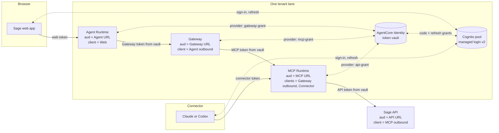
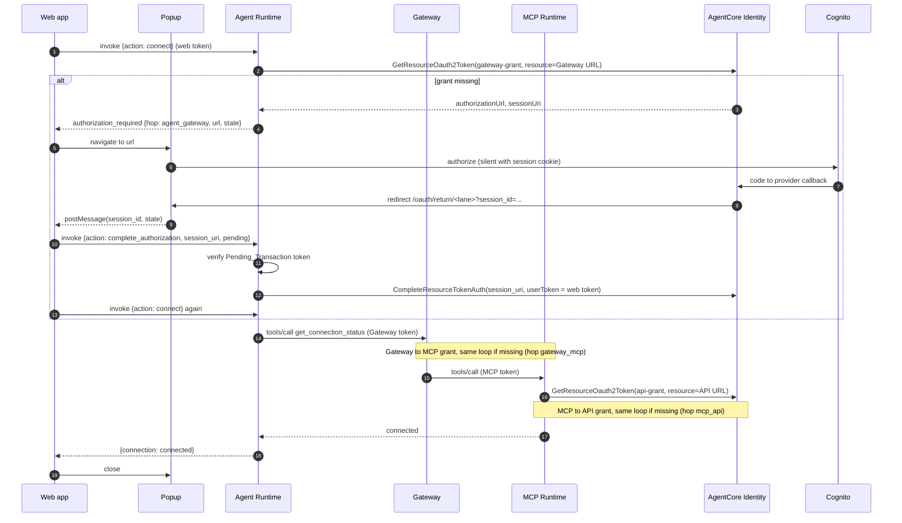
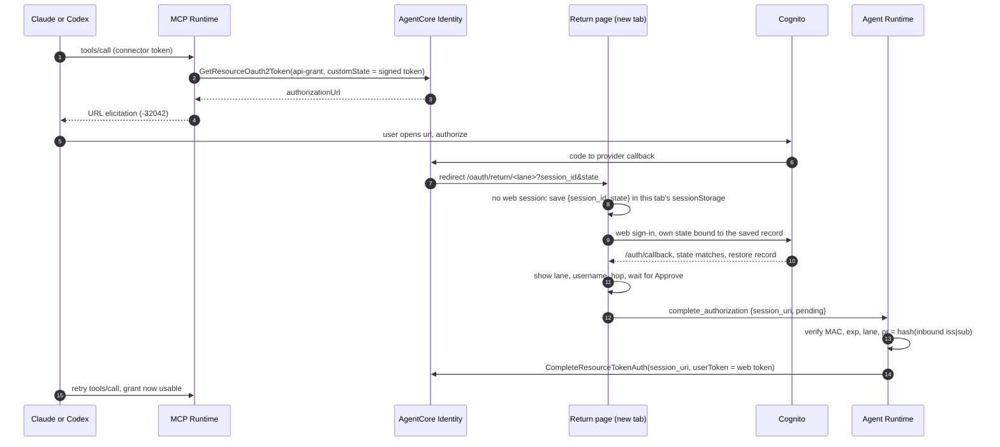

# Design Document: Downstream User Grants

## Overview

Every hop gets its own Cognito user access token, bound by `aud` to its
receiver. The browser signs in once with Cognito managed login. AgentCore
Identity holds one grant per downstream hop, per user, and refreshes it. The
Agent and MCP workloads fetch the grant they need for the user they received,
check that it belongs to the same Principal, and use it. Nothing forwards a
received bearer.

The design keeps everything Route C got right: two fixed lanes, one pool per
lane, the signed `custom:tenant_id` claim, managed authorizers in front of all
application code, and the Sage API as the independent final boundary.

### Decisions taken

| Decision | Choice | Source |
| --- | --- | --- |
| Paths | Both, phased. Phase 1 direct connector path, Phase 2 agent path | User, 8 Oct 2026 |
| Relationship to Route C | Replace it. Build new resources, cut over, then delete Route C | User, 8 Oct 2026 |
| Consent experience | One-time Connect_Step, silent thereafter | User, 8 Oct 2026 |
| Callback host | Sage web app `/oauth/return/<lane>` page plus the Agent `complete_authorization` action | This design |
| Resource_URLs | Each receiver's real endpoint URL | This design |
| Gateway listing | DEFAULT with explicit `mcpToolSchema` | AWS: DYNAMIC is incompatible with outbound 3LO |
| Browser login | Managed login code grant with S256 PKCE, replacing SRP | Resource binding is managed-login only |
| Completion verification | Sage-signed Pending_Transaction token (per-lane KMS HMAC key), verified by the Agent before `CompleteResourceTokenAuth` | Needed for direct-path returns that start with no browser state |
| Direct-path onboarding | MCP URL elicitation only. No web Connect fallback in Phase 1 | Web Connect ships in Phase 2 and S6 may not share grants |
| Spike isolation | Phase 0 runs in a scratch Cognito pool. Shared lane resources change only in Phase 1, per the shared-resource table | A domain branding change ends all hosted-login sessions |
| Spike failure rule | A fallback that changes a requirement blocks the design until requirements are revised | Review, 8 Oct 2026 |

The managed consent portal was rejected because it attaches to one Gateway and
lists only Gateway targets. It cannot complete the Agent to Gateway grant or
the MCP to API grant, so Sage would still need its own callback.

Completion runs in the Agent Runtime rather than a new service because the
Agent door already validates the web user's token, and `CompleteResourceTokenAuth`
needs exactly that token. This avoids a new endpoint, a new audience and a new
token in the browser. Spike S3 must confirm it.

### What one-time consent means

Cognito managed login shows no consent page for first-party clients. A grant
is an authorize redirect. While the browser holds a managed-login session
cookie (one hour after sign-in), that redirect completes with no input. The
Connect_Step runs right after sign-in, so the user sees a popup open, step
through up to three redirects, and close.

After that, AgentCore Identity refreshes each grant from its stored refresh
token. The user is asked again only when:

- the Outbound_Client refresh token expires (approved value, Cognito default
  30 days, maximum 10 years),
- the grant is revoked (global sign-out, token revocation, user disabled), or
- a deployment change invalidates stored grants (provider or client replaced).

That is the ceiling. It is "once per refresh-token lifetime", not "once ever".

| Path | Grants the user needs | How the downstream grant is obtained |
| --- | --- | --- |
| Direct connector | Connector sign-in (Claude/Codex own it) and MCP to API | URL elicitation from the MCP tool, always |
| Web agent | Web sign-in, Agent to Gateway, Gateway to MCP, MCP to API | Connect_Step |

If S6 shows grants are shared across inbound clients, a web Connect_Step also
pre-authorizes the direct path and the connector sees no elicitation. Nothing
depends on that.

## Architecture



### Lane resources

Resource_URLs (one per Door per lane):

| Door | Resource_URL | Known after |
| --- | --- | --- |
| Agent Runtime | Agent Runtime invocation URL | Runtime creation |
| Gateway | Gateway `/mcp` URL | Gateway creation |
| MCP Runtime | MCP Runtime invocation URL, identical to its protected-resource metadata `resource` | Runtime creation |
| Sage API | Sage API base URL | API deployment |

Every Resource_URL is known only after its receiver exists, so each deploy
step creates the receiver, reads its URL, then updates its authorizer with
`allowedAudience`. The plan renderer orders these steps.

App clients (five per lane, all new, named `sage-<lane>-<role>`):

| Role | Type | Grant | Scope ceiling | Refresh rotation | Callback |
| --- | --- | --- | --- | --- | --- |
| `web` | Public, PKCE | Code, refresh | `sage-agent/invoke` | Enabled (required) | `<web origin>/auth/callback` |
| `connector` | Public, PKCE | Code, refresh | `sage-mcp/invoke` | Enabled (required) | Claude callback, Codex loopback |
| `agent-outbound` | Confidential | Code, refresh | `sage-gateway/invoke` | Disabled unless S8 | `gateway-grant` provider callback |
| `gateway-outbound` | Confidential | Code, refresh | `sage-mcp/invoke` | Disabled unless S8 | `mcp-grant` provider callback |
| `mcp-outbound` | Confidential | Code, refresh | `sage-api/read` | Disabled unless S8 | `api-grant` provider callback |

The MCP specification requires authorization servers to rotate refresh tokens
for public clients. Cognito rotation is incompatible with the
`REFRESH_TOKEN_AUTH` flow, so the public clients drop it and the web app
refreshes through the token endpoint. S9 confirms the token-endpoint refresh
grant actually rotates, for the web app and for Claude and Codex. Rotation
reissues within the original validity window, so it does not extend sessions.

`openid` is added to a client only where a spike shows the flow needs it.
Existing resource servers and scope names (`sage-agent/invoke` and so on) are
kept. Cognito allows `resource` to be any URL, so `aud` binding needs no new
resource servers.

Credential providers (three per lane, vendor `CognitoOauth2`):

| Provider | Owning client | Used by | Scope | `resource` |
| --- | --- | --- | --- | --- |
| `sage-<lane>-gateway-grant` | `agent-outbound` | Agent Runtime | `sage-gateway/invoke` | Gateway URL |
| `sage-<lane>-mcp-grant` | `gateway-outbound` | Gateway target | `sage-mcp/invoke` | MCP URL (S5, no fallback) |
| `sage-<lane>-api-grant` | `mcp-outbound` | MCP Runtime | `sage-api/read` | API URL |

Doors:

| Door | `allowedAudience` | `allowedClients` | `allowedScopes` | Custom claims |
| --- | --- | --- | --- | --- |
| Agent Runtime | Agent URL | `web` | `sage-agent/invoke` | `token_use=access`, lane tenant |
| Gateway | Gateway URL | `agent-outbound` | `sage-gateway/invoke` | `token_use=access`, lane tenant |
| MCP Runtime | MCP URL | `gateway-outbound`, `connector` | `sage-mcp/invoke` | `token_use=access`, lane tenant |
| Sage API (code) | API URL | `mcp-outbound` | `sage-api/read` | `token_use=access`, lane tenant |

AgentCore verifies every configured field when more than one is set, so each
managed door enforces audience, client, scope and claims together.

Workload return URLs: the Agent Runtime, Gateway and MCP Runtime workload
identities each register exactly `<web origin>/oauth/return/<lane>`. The
Gateway target sets the same value as `defaultReturnUrl`.

## Connect_Step



Rules:

- On app load, the web app calls `connect` without a popup. If it returns
  `connected`, chat is enabled and nothing is shown.
- If it returns `authorization_required`, the app shows a Connect button. The
  click opens one popup (user gesture), which is reused for every hop.
- The loop is bounded to four iterations (three hops plus one). Exceeding it
  fails with `authorization_required` and a hop code.
- Each `authorization_required` event carries a Pending_Transaction token. The
  web app keeps it in memory with the popup reference and the hop, and sends
  it back with `complete_authorization`. At most one is active at a time. It is
  cleared on completion, failure, popup close or expiry.
- `/oauth/return/<lane>` in the popup posts `{session_id, state}` to its opener
  with the web app origin as target. The opener first requires
  `event.source` to be the popup it opened and `event.origin` to be the web
  app origin, then applies the rule for the held hop:

  | Held hop | Returned `state` | Accepted when | Token sent to `complete_authorization` |
  | --- | --- | --- | --- |
  | `agent_gateway`, `mcp_api` | Required | `state` equals the held token | The held token (identical to `state`) |
  | `gateway_mcp` | Not required, ignored if present | Popup source, origin and an active unexpired held token for `gateway_mcp` | The held token |

  Anything else is discarded without calling the Agent.

## Pending transactions and the return page

A Pending_Transaction token is
`base64url(payload) "." base64url(mac)`, where the payload is

```json
{"v": 1, "lane": "Tenant_A", "hop": "mcp_api", "pr": "<sha256(iss|sub)>",
 "iat": 1791000000, "exp": 1791000600, "n": "<128-bit random>"}
```

and `mac` is KMS `GenerateMac` (`HMAC_SHA_256`) over the payload bytes with the
lane's HMAC key. The MCP and Agent roles may call `GenerateMac`. Only the
Agent role may call `VerifyMac`. Keys are lane-specific, so a Tenant_B token
fails verification in Tenant_A.

| Hop | Initiator | How the token reaches the return page |
| --- | --- | --- |
| `agent_gateway` | Agent | `customState` on `GetResourceOauth2Token`, returned by AgentCore in the redirect |
| `mcp_api` | MCP | `customState` on `GetResourceOauth2Token`, returned by AgentCore in the redirect |
| `gateway_mcp` | Gateway | Not controllable. The Agent mints the token and puts it in its `authorization_required` event. Popup flow only |

Because the token for `agent_gateway` and `mcp_api` arrives in the redirect,
the return page needs no prior browser state. That is what makes a first-time
direct connector authorization work in a fresh tab.

Direct connector flow (first use, fresh browser tab):



Return page rules:

- The saved record lives only in the tab that received the redirect
  (`sessionStorage` survives same-tab navigation through sign-in). It holds the
  session URI and Pending_Transaction token, never a credential, and is deleted
  on completion, cancel or expiry.
- The web sign-in `state` is a fresh random value stored with the record. A
  callback with a different `state` discards the record.
- Without an opener, the page always shows the confirmation (lane display
  name, username, hop) and completes only on Approve.
- The page never decides validity itself. The Agent verifies the token, and
  AgentCore verifies the user match.
- When the redirect carries no `state`, the page treats it as a possible
  `gateway_mcp` return. Inside the web app popup it posts to the opener, which
  applies the popup rule above. Outside the popup (no opener) it is rejected,
  because no held token exists to correlate it. This is why `gateway_mcp` is
  popup-only.
- For `gateway_mcp`, the Agent still verifies the held token's MAC, expiry,
  lane, hop and Principal hash, and AgentCore still checks the user match. The
  missing `state` removes one correlation check, which the popup source and
  origin checks replace.

## Components

### `sage_identity/`

- `models.py`: `TenantLaneConfiguration` gains the four Resource_URLs, the five
  client IDs by role, the three provider names and the return URL. The single
  `frontend_client_ids` field is removed. `ApiIssuerConfiguration` gains
  `audience`, and `trusted_client_ids` becomes the lane's `mcp-outbound` client.
- `managed_authorizers.py`: renders `allowedAudience` and per-door
  `allowedClients` from the door table. `allowedWorkloadConfiguration` and its
  Route C rationale are removed.
- `cognito.py`: `AccessTokenCustomizerConfiguration` gains
  `client_scope_ceilings: Mapping[str, frozenset[str]]`. Its keys replace
  `trusted_client_ids`. Emitted scopes are the user's grants intersected with
  the issuing client's ceiling. Grants move to group grants so one group covers
  every client.
- `downstream.py` (new, shared by Agent and MCP):

  ```python
  @dataclass(frozen=True, slots=True)
  class DownstreamGrant:
      token: AuthenticationArtifact | None   # present when usable
      authorization_url: str | None          # present when consent is needed
      state: str | None

  def obtain_user_grant(workload_token: str, provider: str, scope: str,
                        resource: str, return_url: str, *,
                        force: bool = False) -> DownstreamGrant: ...

  def require_same_principal(inbound: RequestIdentity, token: AuthenticationArtifact,
                             *, issuer: str, audience: str, tenant_claim: str) -> None: ...
  ```

  `obtain_user_grant` makes one `bedrock-agentcore:GetResourceOauth2Token` call
  with `oauth2Flow=USER_FEDERATION`, `resources=[resource]`,
  `resourceOauth2ReturnUrl` and `customState` set to a new Pending_Transaction
  token for the inbound Principal. It does not poll. The SDK
  `requires_access_token` decorator is not used because it blocks the
  invocation while polling for the user.

  `require_same_principal` decodes the vault token (it arrived from AgentCore
  over TLS, and the receiving Door verifies the signature) and requires issuer,
  subject and tenant equal to the inbound Principal and `aud` equal to the
  requested resource. Any mismatch raises a stable error and the token is
  dropped.

  `issue_pending(lane, hop, principal)` and `verify_pending(token, lane,
  principal, now)` build and check Pending_Transaction tokens with KMS
  `GenerateMac` and `VerifyMac`. Verification rejects a bad MAC, wrong version,
  wrong lane, unknown hop, expiry, an issue time in the future, and a Principal
  hash mismatch.
- `transport.py`: adds `IdentityErrorCode.AUTHORIZATION_REQUIRED`.

### `mcp_server/`

- `tools/data_tools.py`: `_get_request` also reads the platform
  `WorkloadAccessToken` header (S4). Each tool calls `obtain_user_grant` for
  `api-grant`. A missing grant raises the MCP URL elicitation error
  (code -32042) carrying the URL, with the Pending_Transaction nonce as
  `elicitationId` (S7). The error is built as a JSON-RPC error directly if the
  installed mcp SDK lacks a helper. A usable grant passes
  `require_same_principal`, then goes to `SageApiClient`.
- Adds `get_connection_status`, which obtains the API grant and returns
  `{"connected": true}` without calling the Sage API.
- `sage_api_client.py`: signature unchanged in shape, but the artifact passed
  in is the API grant token. The docstring "Same-bearer" is removed.
- `identity.py`: unchanged. It still reads subject and tenant from the
  managed-validated inbound token and enforces hosting-lane equality.

### `agent/agent.py`

- Payload `action` is one of `chat` (default), `connect` and
  `complete_authorization`. Any other value fails with `request_failed`.
- `complete_authorization` accepts only `session_uri` (bounded string, fixed
  prefix checked in S3) and `pending` (bounded string). It calls
  `verify_pending` against the hosting lane and the inbound Principal, and
  only then calls `CompleteResourceTokenAuth` with `userIdentifier.userToken`
  set to the inbound bearer. It returns `{"authorization": "completed"}` or a
  stable error, and never retries.
- `connect` and `chat` obtain the `gateway-grant` token, check the Principal,
  open the Gateway MCP client with it, and call `get_connection_status`. A URL
  elicitation from the Gateway or MCP becomes an `authorization_required`
  event with `hop` set to `gateway_mcp` or `mcp_api`. For `gateway_mcp` the
  Agent mints the Pending_Transaction token itself. For `mcp_api` it relays the
  token the MCP put in `customState`, which the return page also receives in
  the redirect.
- `chat` then runs the model with the Gateway tool list minus
  `get_connection_status`.

  ```python
  # ponytail: one extra Gateway call per chat turn to detect missing grants
  # before the model runs. Upgrade path: cache "connected" per runtime session
  # for a few minutes if latency matters.
  ```
- The module docstring and the "decorators are deliberately absent" text are
  rewritten for the new model.

### `sage_api/`

- `identity.py`: `jwt.decode` runs with `audience=configuration.audience` and
  `verify_aud` enabled, plus the existing explicit checks. The trusted client
  is the lane's `mcp-outbound` client only.
- `http.py`, `lambda_handler.py`: unchanged apart from configuration loading
  the audience per issuer.

### `frontend/`

- `lib/auth/cognito.ts`: replaced by managed login. `beginSignIn(lane)` builds
  the authorize URL with `response_type=code`, `scope=openid sage-agent/invoke`,
  `resource=<Agent URL>`, S256 PKCE (WebCrypto) and `state`. `/auth/callback`
  exchanges the code at the token endpoint and validates issuer, client,
  `token_use`, tenant and `aud`. Renewal uses the refresh grant at the token
  endpoint and stores the rotated refresh token it returns.
  `amazon-cognito-identity-js` is removed from `package.json`.
- `lib/auth/connect.ts` (new): the bounded Connect_Step loop above.
- `/oauth/return/<lane>` route: the popup and fresh-tab handling in "Pending
  transactions and the return page", including the confirmation screen.
- `lib/agentcore-client/client.ts`: parses `authorization_required`,
  `connection` and `authorization` events. The URL is handed only to the popup.
- Demo stage: the graph shows a distinct token per hop and labels each token by
  `aud` and `client_id`. "Same bearer" wording is removed. The cross-lane probe
  stays.

### `scripts/`

| Script | Change |
| --- | --- |
| `deploy_user_pool.py` | Five role clients per lane, managed login v2 on the lane domain (a Shared_Resource change, see the table below), refresh validity, rotation enabled on public clients, customizer ceilings |
| `deploy_credential_providers.py` (new) | Per lane: create provider, read its `callbackUrl`, add it to the owning client by read-modify-write. Create the lane KMS HMAC key. `--register-return-urls` later sets workload return URLs |
| `deploy_mcp.sh` | Authorizer from the door table (two-step `allowedAudience`), env for provider, resource, return URL and KMS key, role permissions including `kms:GenerateMac` |
| `deploy_gateway.py` | MCP-server target with `oauthCredentialProvider` (`AUTHORIZATION_CODE`, scope, `defaultReturnUrl`, `customParameters.resource`), rendered `mcpToolSchema`, Gateway authorizer. All `JWT_PASSTHROUGH` paths removed |
| `deploy_agent.sh` | Authorizer from the door table, env for Gateway URL, provider, resource, return URL and KMS key, role permissions including `CompleteResourceTokenAuth`, `kms:GenerateMac` and `kms:VerifyMac` |
| `deploy_sage_api.py` | Audience and trusted client per issuer, deployed as a new instance with distinct names |
| `render_identity_deployments.py`, `plan_identity_deployment.py` | New manifest schema and the create-then-bind-audience ordering |
| `configure_claude_oauth.py` | Targets the `connector` client |
| `validate_downstream_grants.py` (replaces `validate_route_c.py`) | Scripted negative checks, config readback, the authorization server metadata check and the public-client rotation check |
| `validate_route_c.py` | Kept until retirement as the Route C regression check for every Shared_Resource change |

Every script keeps `--render`, requires `--confirm` to mutate and keeps the
IPv4 workaround. Client secrets are read from Cognito in memory, passed to
`CreateOauth2CredentialProvider` and never printed or written.

### Manifest

`identity_deployment.json` drops `bearerTransport`, `gatewayTarget`,
`sourceSignalProofs` and the Sage API source-path fields. Each lane gains:

```json
"downstreamGrants": {
  "resources": {"agent": "", "gateway": "", "mcp": "", "api": ""},
  "clients": {"web": "", "connector": "", "agentOutbound": "", "gatewayOutbound": "", "mcpOutbound": ""},
  "providers": {"gateway": "sage-tenant-a-gateway-grant", "mcp": "sage-tenant-a-mcp-grant", "api": "sage-tenant-a-api-grant"},
  "returnUrl": "https://<web origin>/oauth/return/tenant-a",
  "pendingTransactionKeyArn": "",
  "outboundRefreshTokenValidity": {"value": 30, "unit": "days", "approvalReference": ""}
}
```

Renderers fail closed if any value is empty, duplicated across lanes, or if a
Resource_URL is reused across Doors.

### OAuth metadata check

`validate_downstream_grants.py` fetches the MCP Runtime protected-resource
metadata, follows its `authorization_servers` entry, and fetches both
`/.well-known/oauth-authorization-server` and
`/.well-known/openid-configuration` for that issuer. It records which documents
exist and whether each has `issuer`, `authorization_endpoint`,
`token_endpoint` and `code_challenge_methods_supported` with `S256`.

On 8 October 2026 the Tenant_A pool's OpenID discovery document lacked
`code_challenge_methods_supported`, and the OAuth metadata path returned an
error. Sage cannot add fields to Cognito's issuer metadata, because RFC 8414
locates it under the issuer URL that AWS hosts. A spec-compliant MCP client
must therefore refuse this server today. Claude's earlier success shows Claude
did not enforce the rule, not that the server complies. Requirement 9.8
governs the outcome: the gate records the failure, and connector use beyond
isolated testing needs the user's recorded risk acceptance. S10 rechecks after
the managed login v2 switch.

## Stable outcomes

| Code | Meaning | Client action |
| --- | --- | --- |
| `authorization_required` | A grant is missing or unusable. Carries `hop` | Run the Connect_Step |
| `tenant_identity_invalid` | Inbound or downstream Principal mismatch | Sign out and in again |
| `not_authorized` | A Door or the API rejected the token | Show a generic error |
| `request_failed` | Any other failure | Retry or show a generic error |

`hop` is one of `agent_gateway`, `gateway_mcp`, `mcp_api`.

## Spikes

Phase 0 runs every spike in a scratch Cognito pool on the Essentials plan, with
its own prefix domain on managed login v2, a scratch user, a scratch alias of
the same pre-token Lambda code with scratch configuration, and scratch
AgentCore resources. No Shared_Resource or Route C resource is touched.
Outcomes go in the Decision log before Phase 1 starts.

A fallback marked "within requirements" may be used after the user approves
it. Every other failure blocks the design until the requirements and security
analysis are revised and approved.

| ID | Question | Pass | On failure |
| --- | --- | --- | --- |
| S1 | Does managed login v2 set `aud` from `resource`, keep it on refresh, keep the tenant claim, apply client ceilings, and redirect silently with a live session? Is a branding style required per client? Are the real endpoint URLs accepted as `resource`? | All yes, branding requirement recorded | Within requirements: if a non-MCP URL is rejected, use a lane-scoped logical URL for that Door. An unusable MCP URL blocks |
| S2 | Does `GetResourceOauth2Token` with `resources` on a Cognito provider yield `aud`, store a refresh token and return silently on the second call? Which IAM actions are required? | Yes, IAM recorded | Blocks |
| S3 | Return URL parameter names, and is `customState` returned on the return URL? What does the Gateway target's return carry (record whether any `state` is present)? Does `CompleteResourceTokenAuth` accept the web token (different client and `aud`, same issuer and subject) for a session started by another workload? Can the Agent role complete Gateway and MCP sessions? Is a different user rejected? | All yes | Blocks. A separate completion service would change Requirement 7.6 |
| S4 | Does an MCP-protocol Runtime deliver `WorkloadAccessToken` to FastMCP headers? | Yes | Blocks |
| S5 | Does the Gateway target pass `customParameters.resource` so the MCP token gets `aud` equal to the MCP URL? Is `mcpToolSchema` accepted for a Runtime MCP URL? | Yes | Blocks. Accepting a Gateway token without `aud` would break Requirements 1.3 and 10.3 |
| S6 | Is the MCP to API grant shared when the same user arrives at MCP through `gateway-outbound` and through `connector`? | Recorded either way | Within requirements: each path keeps its own one-time grant |
| S7 | Does the Gateway pass a target's -32042 to the Agent? Do Claude and Codex open URL elicitations from a direct MCP server? | Gateway passes it, and at least one connector opens it | Within requirements for the Agent path only: `get_connection_status` returns the URL in `_meta`, read only by the Agent's `connect`. A connector without URL elicitation is unsupported. If neither connector supports it, blocks |
| S8 | Does Cognito return a refresh token for the code grant without `openid`? Does AgentCore refresh after access expiry (five-minute access tokens)? After revocation, does `forceAuthentication` return a new URL? Does AgentCore store a rotated refresh token? | First three yes. Fourth recorded | Within requirements: add `openid`. Non-silent refresh blocks (Requirement 8.1) |
| S9 | With rotation enabled on a public client, does the token-endpoint refresh grant return a new refresh token and reject reuse of the old one after the grace period? Do Claude, Codex and the web app store the rotated token? | Yes for the web app and for each connector claimed as supported | A connector that fails is unsupported. If the token endpoint does not rotate, blocks (Requirement 2.8) |
| S10 | After the switch to managed login v2, does the issuer metadata advertise `code_challenge_methods_supported` with `S256`, and is `/.well-known/oauth-authorization-server` served? | Recorded either way | Requirement 9.8 applies. Not a blocker for building, but a blocker for any compliance claim |

### Decision log

| Date | Spike | Outcome | Decision |
| --- | --- | --- | --- |
| 2026-10-08 | Pre-spike check | Tenant_A OpenID discovery lacks `code_challenge_methods_supported`. `/.well-known/oauth-authorization-server` returns an error | Requirement 9.8 currently fails. Recheck in S10 |

## Shared-resource changes

These are the only changes to resources Route C also uses. Each runs in
Phase 1, per lane, Tenant_A first, as: snapshot, Route C regression check,
change, Route C regression check, and rollback on any failure before
continuing. The regression check is `validate_route_c.py` for that lane.

| Change | Effect on Route C | Snapshot | Rollback | Extra check |
| --- | --- | --- | --- | --- |
| Lane domain branding: hosted UI (classic) to managed login v2 | Cognito ends every hosted-login browser session in the pool, and the new pages can take up to four minutes to appear. Route C web sign-in uses SRP through the SDK, so it is not affected. The Tenant_A Claude test client must sign in again and sees the new page | `DescribeUserPoolDomain` output | `UpdateUserPoolDomain` back to version 1. This also ends sessions | Claude test client sign-in on Tenant_A |
| Pre-token Lambda: publish a version with client scope ceilings and move the lane alias | Route C tokens are issued by the new version. Its frontend client keeps its current four-scope ceiling, so claims and scopes are unchanged | Alias target version and configuration SHA-256 | Move the alias back to the previous version | Compare a Route C access token's scope set and tenant claim before and after (names and values only, never the token) |
| New app clients in the lane pool | Additive. Route C clients are not modified | Client list | Delete the new clients | None |

Resource servers, pool tier, the trigger version (`V2_0`) and Route C clients
are not changed.

## Security analysis

| Threat | Control |
| --- | --- |
| Token replay at another hop | `aud`, client and scope all checked at every Door. Each client has one scope and one trusting Door. No Door accepts a token without its `aud` |
| Incoming token reaches the API | MCP no longer forwards it. Unit test asserts outbound bearer differs from inbound |
| Stolen authorization link | Completion needs the same user's web session, a valid Pending_Transaction token for that user, and AgentCore's own user match. Session URIs and tokens expire in ten minutes |
| Forged or replayed return, including a fresh-tab return on the direct path | Pending_Transaction MAC with a lane key, expiry, lane and Principal hash, verified by the Agent before completion. Confirmation screen for any return not opened by the web app popup |
| CSRF on the return page | Same-origin postMessage in the popup flow. In the fresh-tab flow, the sign-in `state` is bound to the saved record, and completion still needs the signed token |
| Vault token for the wrong user | `require_same_principal` before use. API revalidates everything |
| Tenant crossover | Lane-specific pools, clients, providers, return URLs, KMS keys and workload identities. Tenant claim checked at every Door |
| Prompt-driven provider or tenant choice | Provider, scope and resource come only from deployment configuration |
| Authorization URL in model context | `connect` bypasses the model. Chat runs the status preflight first and strips the status tool. Elicitation data never goes into tool text |
| Client accepts an authorization server without PKCE support | Scripted metadata check (Requirement 9.7). The current Cognito gap is recorded, not hidden, and blocks compliance claims (Requirement 9.8) |
| Stolen public-client refresh token | Rotation required on `web` and `connector` (Requirement 2.7), verified in S9 and at the Phase 1 gate |
| Client secret exposure | Secrets live only in AgentCore Identity. Scripts hold them in memory only |
| Long-lived confidential refresh tokens | Approved validity with reference. Revocation forces reconnection. Rotation decision in S8 |
| Refresh token in browser storage | Same storage class as the current SDK session. Rotation limits replay of a stolen one |
| Shared-resource change breaks Route C | Snapshot, regression check before and after, rollback on failure |

The Sage API endpoint stays internet-reachable without a gateway authorizer.
Route C recorded its source control as `unavailable`. Here the API accepts
only `mcp-outbound` tokens with its own `aud`, which only the MCP workload can
obtain through its provider secret. That replaces the source-path assertion,
but reserved concurrency and a WAF are still advised before non-demo use.

## Testing strategy

Unit and property tests (pytest, Hypothesis, Vitest, fast-check, all existing):

- Authorizer rendering: every Door has its own `aud`, clients and scope, and
  no two Doors share a Resource_URL or a client.
- Customizer: emitted scopes equal grants intersected with the client ceiling,
  for generated grants and clients. The Route C client's scope set is
  unchanged.
- `require_same_principal` property: any difference in issuer, subject, tenant
  or `aud` rejects.
- Pending_Transaction property (KMS stubbed): any change to payload or MAC,
  another lane's key, expiry, a future issue time or another Principal
  rejects.
- MCP and Agent: outbound Authorization never equals inbound. Missing grant
  yields an elicitation or `authorization_required`, never a model-visible URL.
  The status tool is absent from the model tool list.
- Agent `complete_authorization`: bounded input, unknown action rejected,
  `CompleteResourceTokenAuth` not called when verification fails, AgentCore
  errors mapped to stable codes.
- Sage API: missing or wrong `aud`, wrong client, ID token, wrong tenant,
  expired and wrong-scope tokens rejected.
- Frontend: PKCE verifier and challenge, callback state check, Connect loop
  bound, popup origin check, fresh-tab record save and restore across sign-in,
  mismatched sign-in `state` discards the record, confirmation required
  without an opener.
- Frontend return acceptance, per hop:
  - `agent_gateway` and `mcp_api` with matching `state` complete. Missing or
    different `state` is rejected without calling the Agent.
  - `gateway_mcp` without returned `state` completes using the held token,
    and the Agent receives exactly that token.
  - `gateway_mcp` is rejected when the message source is another window, the
    origin differs, no token is held, the held token is for another hop, or it
    has expired.
  - A return with no `state` and no opener is rejected.
- Metadata check: fixture documents with and without
  `code_challenge_methods_supported` produce pass and fail.

Live verification (`validate_downstream_grants.py` plus operator runs):

- Scripted: config readback of every Door, client and provider. Rejection of
  cross-lane, wrong-client and no-`aud` tokens at every Door. Metadata check.
  Public-client rotation check.
- Operator: native Claude and Codex connector runs from a fresh browser
  profile, web Connect_Step, next-day silent session, revoked-grant recovery,
  second-user completion attempt, tampered and expired Pending_Transaction.
- Evidence JSON holds only allowlisted claim names, hashes of `jti`, and
  outcomes, as Route C evidence does today.

## Rollout, cutover and rollback

1. Phase 0: spikes in the scratch pool. Decision log filled in. Scratch
   resources deleted.
2. Phase 1: shared-resource changes per the table above, then both lanes get
   new clients, providers, KMS keys, a new Sage API instance, new MCP Runtimes
   and a new Agent Runtime that serves only `complete_authorization`. Gate:
   Requirements 16.1, 16.2, 16.4 and 16.5.
3. Phase 2: new Gateways with MCP-server targets and the full Agent. Gate:
   Requirements 16.3, 16.4 and 16.5.
4. Cutover: switch the frontend lane records to the new Agent endpoints and
   `web` clients. Rollback is restoring the previous frontend env values and
   build. Route C stays deployed throughout.
5. Retirement, after acceptance and explicit operator confirmation: delete
   Route C runtimes, Gateways, targets, its Sage API instance and its frontend
   and Claude test clients, and drop the Route C client from the customizer
   ceilings. Remove Route C code and tests, update steering, README and the old
   spec. Tag the last Route C commit first.

The Sage API code serves both designs, but each runs its own deployed instance.
Phase 1 deploys a new Sage API instance (distinct function and API names)
configured with the new audience and `mcp-outbound` clients. The Route C
instance is untouched and is deleted at retirement.

## Open questions

- Which refresh-token validity is approved for Outbound_Clients. This sets the
  real reconnection cadence.
- Whether the user accepts the Cognito PKCE-metadata gap (Requirement 9.8) for
  connector use beyond isolated testing, or waits for AWS to advertise it.
- Whether Codex supports URL elicitation, rotated refresh tokens and custom
  OAuth client entry (S7, S9).
- Whether Emil can host an equivalent return page in its own app. This decides
  how the pattern transfers, and is outside Sage. Passing Sage's gates does not
  authorize removing Emil's proxy.
