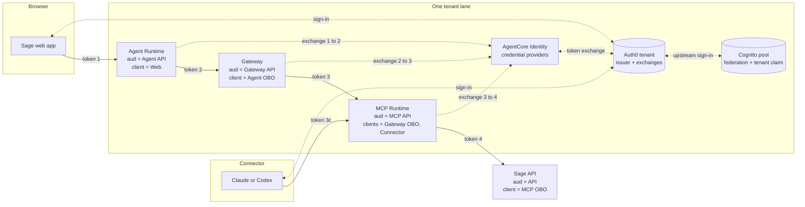
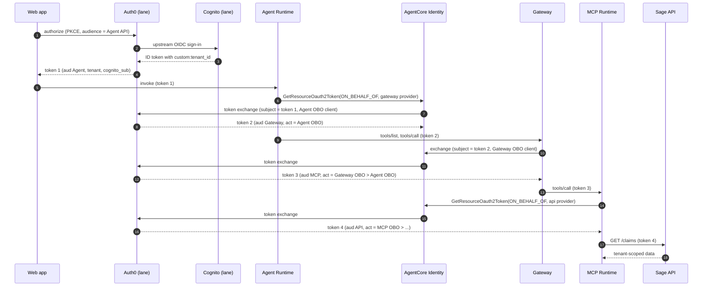

# Design Document: OBO Token Exchange (Option B1)

## Overview

Every hop gets its own Auth0 access token, bound by `aud` to its receiver and
issued for the same user. The user signs in once through Auth0, which signs
them in through the lane's Cognito pool, which still federates to the
customer's IdP. Each workload then asks AgentCore Identity to exchange the
token it received for the next hop's token. Auth0 performs the exchange and
records the delegation chain in `act`. Nothing forwards a received bearer, and
nothing asks the user to approve anything after sign-in.

The design keeps what Route C got right: two fixed lanes, one identity silo per
lane, the signed `custom:tenant_id` claim, managed authorizers in front of all
application code, and the Sage API as the independent final boundary.

### Decisions taken

| Decision | Choice | Source |
| --- | --- | --- |
| Pattern | OBO token exchange, AWS's documented pattern for this chain | User, 8 to 9 Oct 2026 |
| Issuer | Auth0, one tenant per lane | User, 9 Oct 2026. Matches Emil's per-tenant silos |
| Sign-in | B1: through Auth0, with Cognito as the upstream connection | B2 breaks the MCP door, which can trust one issuer only |
| MCP | Same code, one deployment per lane | One shared MCP needs a shared issuer and weakens isolation |
| Paths | Both, phased. Phase 1 direct connector, Phase 2 agent | User, 8 Oct 2026 |
| Route C | Replace it. Build new, cut over, then delete | User, 8 Oct 2026 |
| Token profile | RFC 9068 on every Auth0 API | AgentCore `allowedClients` reads `client_id`, which Auth0's default profile omits |
| Token type check | `aud` plus `typ: at+jwt`, not `token_use` | Auth0 tokens have no `token_use`. Auth0 ID tokens carry the client ID as `aud`, so no Door accepts them |
| Gateway listing | DYNAMIC | Keeps machine tokens away from the MCP. DEFAULT would sync tools with a client-credentials token |
| Browser library | `@auth0/auth0-spa-js`, pinned exact version | Replaces `amazon-cognito-identity-js`. Handles PKCE and rotated refresh tokens |
| Option A | Archived in `archive/option-a/` as fallback | Agreed 8 Oct 2026 |
| Exchange client | AgentCore SDK `IdentityClient.get_token(auth_flow="ON_BEHALF_OF_TOKEN_EXCHANGE")`, not a hand-written boto3 call | Use AgentCore Identity's own client. Pinned `bedrock-agentcore==1.18.1` supports this flow |
| OBO client authentication | `PRIVATE_KEY_JWT` with a per-client KMS signing key. Client secrets only if S12 fails | AgentCore documents Private Key JWT with `TOKEN_EXCHANGE`. Removes every shared secret |

### Use of AgentCore Identity

AgentCore Identity does every job it offers for this pattern. Sage code does
only what AgentCore Identity cannot.

| Job | Done by |
| --- | --- |
| Validate inbound tokens at Agent Runtime, Gateway and MCP Runtime | AgentCore managed `customJWTAuthorizer` |
| Workload identity for Agent, Gateway and MCP | Created by AgentCore Runtime and Gateway |
| Workload access token carrying user and workload identity | Delivered by AgentCore Runtime and Gateway to the workload |
| Hold OBO client credentials | AgentCore credential providers. With `PRIVATE_KEY_JWT`, AgentCore holds only a KMS key reference, and the private key never leaves KMS |
| Perform each token exchange with Auth0 | AgentCore Identity, through `GetResourceOauth2Token` |
| Gateway to MCP exchange | AgentCore Gateway itself, through its `TOKEN_EXCHANGE` target. No Sage code |
| Call AgentCore Identity from Agent and MCP | AgentCore SDK `IdentityClient` |
| Same-principal check on the exchanged token, stable error mapping | Sage `downstream.py`. AgentCore does not compare the exchanged token with the inbound principal |
| Final API validation and tenant isolation | Sage API. It is not an AgentCore resource |

AgentCore's token vault is not used for user tokens, and that is the expected
OBO behaviour. AWS describes OBO as needing "no per-user token storage". The
vault's stored-grant and refresh features belong to the authorization-code
pattern (the archived Option A). Each request exchanges the token it received,
so a blocked or revoked user is refused at the next fresh exchange that Auth0
performs. Tokens already issued (the web or connector token, and any exchanged
token AgentCore reuses within its lifetime, measured in S8) stay valid until
they expire. That residual window is bounded by the approved access token
lifetimes (Requirement 8.6), not eliminated.

Not adopted: replacing the Sage MCP server with a Gateway OpenAPI target that
calls the Sage API directly. AgentCore would then perform the last hop as
well, but Emil runs its own MCP server, and the proof must match that shape.

### What the user experiences

- **Web app:** one sign-in (Auth0 redirects to Cognito, which may redirect to
  the customer IdP, all on the familiar screen). Chat works immediately. No
  popup, no Connect step, no approval later.
- **Claude or Codex:** one connector sign-in through the same chain. Tools work
  immediately. The MCP exchanges for the API token itself.
- **Later sessions:** silent refresh until the approved session or refresh
  lifetime ends, then a normal sign-in.
- **Sign-out:** revokes the web app's refresh token and ends the Auth0
  session. There are no stored grants to lose, so the next sign-in has no
  extra step.

## Architecture



### Request flow (agent path)



The direct connector path is steps 10 to 17, with Claude or Codex holding
token 3c (issued to the Connector_Client) instead of the Gateway.

## Lane resources

### Auth0 tenant (one per lane, named `sage-<lane>`)

APIs (one per Door, RFC 9068 profile, skip-consent enabled):

| API | Identifier | Scope | Token lifetime |
| --- | --- | --- | --- |
| Agent | Agent Runtime invocation URL | `sage-agent/invoke` | Approved value |
| Gateway | Gateway `/mcp` URL | `sage-gateway/invoke` | Approved value |
| MCP | MCP Runtime invocation URL, equal to its protected-resource `resource` | `sage-mcp/invoke` | Approved value |
| Sage API | Sage API base URL | `sage-api/read` | Approved value |

Identifiers are known only after each receiver exists, so each deploy step
creates the receiver, reads its URL, creates the Auth0 API, then binds the
authorizer's `allowedAudience`. The plan renderer orders these steps. Spike S4
confirms Auth0 accepts these URLs and scope names.

Applications:

| Role | Type | Grants | May obtain tokens for | Callback |
| --- | --- | --- | --- | --- |
| `web` | SPA, public | Code with PKCE, refresh (rotating) | Agent API | `<web origin>/auth/callback` |
| `connector` | Native, public | Code with PKCE, refresh (rotating) | MCP API | Claude callback, Codex loopback |
| `agent-obo` | Custom API client | Token exchange (OBO) | Gateway API | None |
| `gateway-obo` | Custom API client | Token exchange (OBO) | MCP API | None |
| `mcp-obo` | Custom API client | Token exchange (OBO) | Sage API | None |

OBO clients follow Auth0's documented OBO prerequisites. Each is a Custom API
client bound to the API that receives its incoming token, and holds a
user-delegated client grant for the one API it exchanges into:

| Client | `app_type` | `resource_server_identifier` (incoming `aud`) | `token_exchange.allow_any_profile_of_type` | Client grant (`subject_type: user`) |
| --- | --- | --- | --- | --- |
| `agent-obo` | `resource_server` | Agent API | `["on_behalf_of_token_exchange"]` | Gateway API, scope `sage-gateway/invoke` |
| `gateway-obo` | `resource_server` | Gateway API | `["on_behalf_of_token_exchange"]` | MCP API, scope `sage-mcp/invoke` |
| `mcp-obo` | `resource_server` | MCP API | `["on_behalf_of_token_exchange"]` | Sage API, scope `sage-api/read` |

Auth0 validates the incoming token against the client's
`resource_server_identifier` before exchanging, so `mcp-obo` accepts tokens for
the MCP API (from both the Gateway and the connector) and nothing else. A token
for any other API presented to an OBO client is refused by Auth0.

Application access to APIs: Auth0's default user-delegated policy for a new
API is "All apps allowed". Every Sage API is set explicitly to:

```json
"subject_type_authorization": {
  "user":   {"policy": "require_client_grant"},
  "client": {"policy": "deny_all"}
}
```

So only applications with a user-delegated client grant can obtain a token for
an API, and no client-credentials token can be issued for any Sage API. The
public applications get these grants:

| Client | Client grant (`subject_type: user`) |
| --- | --- |
| `web` | Agent API, scope `sage-agent/invoke` |
| `connector` | MCP API, scope `sage-mcp/invoke` |

With per-app authorization, scopes must be named in each token request.
AgentCore passes the provider's scope, and the web app and connector request
their scope explicitly. Refresh requests keep the originally granted scopes.
Dynamic client registration is off.

Connection: one OIDC enterprise connection, `cognito-<lane>`, to the lane's
Cognito pool through its hosted-login domain, using a new confidential Cognito
client `sage-<lane>-auth0` with the code grant and the Auth0 callback. It maps
the Cognito ID token claims `custom:tenant_id`, `sub` and `cognito:groups` onto
the Auth0 user profile. It is enabled only for `web` and `connector`. Auth0 does not forward
the RFC 8707 `resource` parameter upstream while the Resource Parameter
Compatibility Profile is on, so Cognito never sees it.

Tenant settings: Resource Parameter Compatibility Profile on, all other
connections off, refresh token rotation with reuse detection, approved session
lifetimes. The session and refresh token absolute lifetime is capped at an
approved ceiling of at most 12 hours (Requirement 18.8). The connection's
"sync user profile attributes at each login" setting is on.

### User permissions

Membership of a lane does not grant every permission in that lane.

- **Trusted source:** Cognito group membership in the lane pool, assigned by
  administrators. This is the source Sage's Cognito customizer already uses
  (`groupGrants` in `sage_identity/cognito.py`). Users cannot change their own
  groups. For Emil, the equivalent is whatever administrative entitlement
  source feeds its Cognito pools today (an open question for Emil).
- **Carried:** Cognito emits `cognito:groups` in the ID token Auth0 receives.
  The connection maps it to a profile attribute users cannot edit.
- **Mapping:** a lane permission map, deployed from the manifest as Action
  configuration, gives each group the scopes it may hold per API:

  ```json
  "permissionMap": {
    "sage-full":      {"agent": ["sage-agent/invoke"], "gateway": ["sage-gateway/invoke"],
                       "mcp": ["sage-mcp/invoke"], "api": ["sage-api/read"]},
    "sage-chat-only": {"agent": ["sage-agent/invoke"], "gateway": ["sage-gateway/invoke"],
                       "mcp": ["sage-mcp/invoke"]}
  }
  ```

- **Enforcement:** the post-login Action runs on every sign-in, refresh and
  exchange. It reads the target API from `event.resource_server.identifier`,
  computes the union of scopes the user's groups allow for that API, removes
  every other scope with `api.accessToken.removeScope`, and denies the request
  with `permission_denied` if the API's required scope is not allowed. A user in
  no mapped group is denied. Each receiver still checks its own scope.
- **Effective permission** is the intersection of three things: the
  application's client grant (which application may ask), the user's groups
  (what this user may do), and the scope the receiver requires.

Auth0 RBAC (`enforce_policies`) is deliberately not enabled. Auth0 documents
that Actions which change access token scopes override RBAC, so enabling both
would leave RBAC decorative. RBAC would also need roles assigned to each
federated Auth0 user after first sign-in, creating a second copy of the
entitlement data that could drift from Cognito. If Emil already keeps
entitlements in Auth0 roles, the alternative is RBAC alone with no scope
changes in the Action, which is a separately approved design change.

Propagation of changes (POC limitation). Auth0 copies groups and the tenant
claim from Cognito only on an interactive sign-in through the connection.
Refreshes and exchanges reuse the stored copy, so if an administrator removes
a user's group, Auth0 keeps issuing the old permissions until the user's next
sign-in.

| Event | When the removed permission stops being granted |
| --- | --- |
| User signs in again | Immediately: the new tokens reflect current Cognito groups |
| No sign-in | When the Auth0 session and refresh token ceiling (at most 12 hours) forces one |
| Already-issued access tokens | At their own expiry, after the above |

Worst case: the ceiling plus the longest access token lifetime. This is
accepted for the POC, which has only demo users. Production needs
event-driven revocation, recorded below as an Emil handoff item.

### Post-login Action (one per lane)

```javascript
// Runs on sign-in, refresh and every OBO token exchange in this tenant.
exports.onExecutePostLogin = async (event, api) => {
  const lane = event.secrets.LANE_TENANT;             // "Tenant_A" or "Tenant_B"
  const tenant = event.user.tenant_id_from_cognito;   // mapped by the connection, not user-editable
  const cognitoSub = event.user.cognito_sub;          // mapped by the connection
  const groups = event.user.cognito_groups ?? [];     // mapped by the connection
  if (event.connection?.name && event.connection.name !== event.secrets.CONNECTION) {
    return api.access.deny("connection_not_allowed");
  }
  if (typeof tenant !== "string" || tenant !== lane || typeof cognitoSub !== "string") {
    return api.access.deny("tenant_identity_invalid");
  }
  if (event.user.app_metadata?.sage_access_revoked === true) {
    return api.access.deny("access_revoked");         // offboarding flag, see Requirement 8.5
  }
  const api_key = API_KEY_BY_IDENTIFIER[event.resource_server?.identifier];
  const allowed = new Set(groups.flatMap((g) => PERMISSION_MAP[g]?.[api_key] ?? []));
  if (!api_key || !allowed.has(REQUIRED_SCOPE[api_key])) {
    return api.access.deny("permission_denied");
  }
  for (const scope of event.transaction?.requested_scopes ?? []) {
    if (!allowed.has(scope)) api.accessToken.removeScope(scope);
  }
  api.accessToken.setCustomClaim("custom:tenant_id", tenant);
  api.accessToken.setCustomClaim("cognito_sub", cognitoSub);
};
```

`PERMISSION_MAP`, `API_KEY_BY_IDENTIFIER` and `REQUIRED_SCOPE` are rendered
from the manifest into the deployed Action.

The exact profile attribute names depend on the connection mapping and are
fixed in S1. The Action never reads `user_metadata`. It is the only code that
sets the tenant claim, so its source lives in this repository under
`auth0/actions/post_login.js` and is deployed by script.

### AgentCore resources (per lane)

Credential providers (`CustomOauth2`, discovery URL of the lane Auth0 tenant):

| Provider | Client | Used by | Target API |
| --- | --- | --- | --- |
| `sage-<lane>-gateway-obo` | `agent-obo` | Agent Runtime | Gateway |
| `sage-<lane>-mcp-obo` | `gateway-obo` | Gateway target | MCP |
| `sage-<lane>-api-obo` | `mcp-obo` | MCP Runtime | Sage API |

Each sets `onBehalfOfTokenExchangeConfig.grantType = TOKEN_EXCHANGE` and the
actor setting proven in S3 (`actorTokenContent = NONE` expected, since Auth0
identifies the actor from client authentication). Auth0's OBO documentation
uses `subject_token_type=urn:ietf:params:oauth:token-type:access_token` and
`requested_token_type=urn:ietf:params:oauth:token-type:access_token`, while
AgentCore's default subject token type is
`urn:ietf:params:oauth:token-type:jwt`. The override goes in `customParameters`,
and S3 confirms whether Auth0 accepts the default or needs it.

Client authentication is `PRIVATE_KEY_JWT`, as in AWS's documented Okta OBO
example:

```json
"clientAuthenticationMethod": "PRIVATE_KEY_JWT",
"privateKeyJwtConfig": {
  "privateKeySource": {"kmsKeySource": {"kmsKeyArn": "<per-client KMS key>"}},
  "signingAlgorithm": "RS256",
  "additionalPayloadClaims": {"aud": "https://<lane auth0 domain>/"}
},
"onBehalfOfTokenExchangeConfig": {
  "grantType": "TOKEN_EXCHANGE",
  "tokenExchangeGrantTypeConfig": {"actorTokenContent": "NONE"}
}
```

- One asymmetric KMS key (`RSA_2048`, `SIGN_VERIFY`) per OBO client, in the
  provider's Region. The key policy grants `kms:Sign` and `kms:DescribeKey`
  only through `bedrock-agentcore-identity.*.amazonaws.com`.
- The public key from `kms:GetPublicKey` is registered as the OBO client's
  credential in Auth0. Auth0 never receives or issues a secret for these
  clients.
- Auth0 expects the assertion `aud` to be its tenant URL with a trailing
  slash, while AgentCore defaults to the token endpoint, hence the override.
  S12 confirms the exact value.
- Key rotation: create a new key, register it as a second Auth0 credential,
  update the provider, then remove the old credential.
- If S12 fails, the providers fall back to `CLIENT_SECRET_BASIC` with the
  secret held only in Auth0 and AgentCore Identity.

Doors (`customJWTAuthorizer`, discovery URL of the lane Auth0 tenant):

| Door | `allowedAudience` | `allowedClients` | `allowedScopes` | Custom claim |
| --- | --- | --- | --- | --- |
| Agent Runtime | Agent API | `web` | `sage-agent/invoke` | `custom:tenant_id` = lane tenant |
| Gateway | Gateway API | `agent-obo` | `sage-gateway/invoke` | same |
| MCP Runtime | MCP API | `gateway-obo`, `connector` | `sage-mcp/invoke` | same |
| Sage API (code) | Sage API | `mcp-obo` | `sage-api/read` | same, plus `typ` and `act` |

The `token_use=access` rule used in Route C is removed, because Auth0 does not
emit that claim. An Auth0 ID token has the application's client ID as `aud`,
which never equals an API identifier, so every Door rejects it on `aud`.

Gateway target: MCP-server target to the lane MCP Runtime URL, outbound OAuth
with `sage-<lane>-mcp-obo`, grant `TOKEN_EXCHANGE`, scope `sage-mcp/invoke`,
audience or resource set to the MCP API identifier (parameter proven in S6),
DYNAMIC listing.

## Components

### `sage_identity/`

- `models.py`: `TenantLaneConfiguration` gains the Auth0 issuer and discovery
  URL, the four API identifiers, the five Auth0 client IDs by role, the three
  provider names and the Cognito upstream client ID. The Cognito issuer is kept
  only for the Upstream_Connection. `frontend_client_ids` is removed.
  `ApiIssuerConfiguration` gains `audience` and `obo_client_id`.
- `managed_authorizers.py`: renders the Door table above. The `token_use`
  claim rule and `allowedWorkloadConfiguration` are removed.
- `cognito.py`: the customizer's trusted clients include the lane's
  `sage-<lane>-auth0` client, so the Cognito ID token for Auth0 carries the
  tenant claim. Route C clients stay until retirement.
- `downstream.py` (new, shared by Agent and MCP), a thin wrapper over the
  AgentCore SDK:

  ```python
  from bedrock_agentcore.services.identity import IdentityClient

  async def exchange_for(workload_token: str, provider: str, scope: str,
                         audience: str) -> AuthenticationArtifact:
      """One IdentityClient.get_token call with ON_BEHALF_OF_TOKEN_EXCHANGE."""
      token = await IdentityClient(region).get_token(
          provider_name=provider,
          agent_identity_token=workload_token,
          scopes=[scope],
          audiences=[audience],      # or resources=[...], whichever S3 proves
          auth_flow="ON_BEHALF_OF_TOKEN_EXCHANGE",
      )
      ...

  def require_same_principal(inbound: RequestIdentity,
                             token: AuthenticationArtifact, *,
                             issuer: str, audience: str,
                             tenant_claim: str) -> None:
      """Issuer, sub, tenant and cognito_sub equal; aud contains audience."""
  ```

  The wrapper exists only to add `require_same_principal` and stable error
  mapping, which the SDK does not provide. It makes exactly one call and never
  retries with another provider. Failures map to `exchange_failed`,
  `exchange_rate_limited` or `permission_denied` (when Auth0 returns the
  Action's `permission_denied` reason). The Agent passes the workload token from
  `BedrockAgentCoreContext`, which `BedrockAgentCoreApp` populates. The MCP
  passes the `WorkloadAccessToken` request header, because FastMCP does not run
  inside `BedrockAgentCoreApp` (S5 confirms the header).
  The `requires_access_token` decorator is not used, because it hides the
  token from the same-principal check and its sync path starts a thread pool
  per call.
- `transport.py`: adds those three `IdentityErrorCode` values.

### `mcp_server/`

- `tools/data_tools.py`: `_get_request` also reads the platform
  `WorkloadAccessToken` header (S5). Each tool calls `exchange_for` with the
  API provider, checks the Principal, then calls `SageApiClient` with the
  exchanged token. The inbound bearer is used only by `identity.py`.
- `identity.py`: also reads `cognito_sub` and records the inbound `client_id`
  (Gateway OBO or Connector) for logs.
- `sage_api_client.py`: unchanged in shape. "Same-bearer" wording removed.

### `agent/agent.py`

- Obtains the Gateway token with `exchange_for`, checks the Principal, and
  opens the Gateway MCP client with it. The module docstring and the
  "decorators are deliberately absent" text are rewritten.
- No new payload actions. Chat remains the only action.

### `sage_api/`

- `identity.py`: the issuer map holds the two Auth0 issuers. `jwt.decode`
  verifies `aud` and requires header `typ` `at+jwt`. Explicit checks:
  `client_id` and outermost `act.sub` equal the lane `mcp-obo` client, scope,
  tenant claim equal to the issuer's lane. The `token_use` check is removed.
- `http.py`, `lambda_handler.py`: configuration loads audience, OBO client and
  `jwks_uri` per issuer.
- Signing keys are fetched at run time from the configured issuer's `jwks_uri`,
  never from a URL taken from the token:
  - PyJWT's installed `PyJWKClient`, one per issuer, cache lifetime 10 minutes
    (approved value, Requirement 11.5).
  - An unknown `kid` triggers at most one refresh per issuer per minute. If the
    `kid` is still unknown, the request fails with `not_authorized`.
  - If the JWKS cannot be fetched and the cache has expired, requests fail
    closed. A stale cache is never used past its lifetime.
  - Only `RS256` keys with `use` `sig` are accepted.
- Effect on rotation: Auth0 publishes the current and next key, so a rotation
  is picked up without redeploying. After Auth0 revokes a key, the API stops
  trusting it within one cache lifetime. Route C's deploy-time frozen keys are
  not carried forward.

### `frontend/`

- `lib/auth/auth0.ts` replaces `lib/auth/cognito.ts`. One `Auth0Client` per
  lane record (domain, `web` client ID, Agent API identifier). It validates
  issuer, `client_id`, tenant and `aud` on the received token before use.
- Lane records gain the Auth0 domain and client ID. Cognito pool settings leave
  the frontend.
- `lib/agentcore-client/client.ts`: unchanged transport. It sends token 1.
- Demo stage: shows four distinct tokens with their `aud`, `client_id` and
  `act` chain. "Same bearer" wording is removed. The cross-lane probe stays.

### `auth0/`

- `actions/post_login.js`: the Action above.
- `tenant.template.json`: the per-lane tenant settings, APIs, applications,
  grants and connection as data, rendered with lane values.

### `scripts/`

| Script | Change |
| --- | --- |
| `deploy_auth0_tenant.py` (new) | Per lane, through the Auth0 Management API: tenant settings, connection, APIs, applications, client grants, Action and binding. Read-modify-write with readback. Management credentials from the environment, in memory only |
| `deploy_user_pool.py` | Adds the `sage-<lane>-auth0` confidential Cognito client and the customizer change (Shared_Resource change table) |
| `deploy_credential_providers.py` (new) | Per OBO client: create the KMS signing key and key policy, register its public key in Auth0, create the `CustomOauth2` OBO provider with `PRIVATE_KEY_JWT`. No secret is read or written |
| `deploy_mcp.sh` | Door-table authorizer, provider env, role permission for `GetResourceOauth2Token` |
| `deploy_gateway.py` | MCP-server target with `TOKEN_EXCHANGE`, DYNAMIC listing, Gateway authorizer. All `JWT_PASSTHROUGH` paths removed |
| `deploy_agent.sh` | Door-table authorizer, provider env, role permission |
| `deploy_sage_api.py` | Auth0 issuers, audience, OBO client per issuer. New instance with distinct names |
| `render_identity_deployments.py`, `plan_identity_deployment.py` | New manifest schema and create-then-bind ordering |
| `configure_claude_oauth.py` | Targets the Auth0 `connector` client |
| `validate_obo.py` (new) | Config readback, metadata check, rotation check, negative token checks |
| `validate_route_c.py` | Kept until retirement as the Route C regression check |

Every script keeps `--render`, requires `--confirm` to mutate and keeps the
IPv4 workaround.

### Manifest

`identity_deployment.json` drops `bearerTransport`, `gatewayTarget`,
`sourceSignalProofs` and the Sage API source-path fields. Each lane gains:

```json
"obo": {
  "auth0": {"domain": "", "issuer": "", "discoveryUrl": "", "connection": "cognito-tenant-a"},
  "cognitoUpstreamClientId": "",
  "apis": {"agent": "", "gateway": "", "mcp": "", "api": ""},
  "clients": {"web": "", "connector": "", "agentObo": "", "gatewayObo": "", "mcpObo": ""},
  "providers": {"gateway": "sage-tenant-a-gateway-obo", "mcp": "sage-tenant-a-mcp-obo", "api": "sage-tenant-a-api-obo"},
  "lifetimes": {"accessToken": {"value": 0, "unit": "minutes"}, "refreshToken": {"value": 0, "unit": "days"}, "sessionCeiling": {"value": 12, "unit": "hours"}, "approvalReference": ""}
}
```

Renderers fail closed if a value is empty, duplicated across lanes, or if an
API identifier is reused across Doors.

## Stable outcomes

| Code | Meaning | Client action |
| --- | --- | --- |
| `tenant_identity_invalid` | Inbound or exchanged Principal mismatch, or tenant claim missing | Sign out and in again |
| `exchange_failed` | Auth0 refused the exchange | Show a generic error |
| `permission_denied` | The user's groups do not allow the next hop (Auth0 Action denial) | Tell the user they lack access to this data |
| `exchange_rate_limited` | Auth0 rate limit | Retry later |
| `not_authorized` | A Door or the API rejected the token | Show a generic error |
| `session_expired` | Token expired and refresh failed | Sign in again |
| `request_failed` | Any other failure | Retry or show a generic error |

## Shared-resource changes

These are the only changes to resources Route C also uses. Each runs in
Phase 1, per lane, Tenant_A first, as: snapshot, Route C regression check
(`validate_route_c.py`), change, regression check, and rollback on any failure
before continuing.

| Change | Effect on Route C | Snapshot | Rollback |
| --- | --- | --- | --- |
| New confidential client `sage-<lane>-auth0` in the lane pool | Additive. Route C clients unchanged | Client list | Delete the new client |
| Hosted-login domain on Tenant_B, if absent | Additive. Route C web sign-in uses SRP, not the domain | `DescribeUserPool` domain fields | Delete the new domain |
| Pre-token Lambda: publish a version that also trusts `sage-<lane>-auth0`, move the lane alias | Route C tokens issued by the new version, with unchanged claims and scopes | Alias target version and configuration SHA-256 | Move the alias back |

The domain branding version, resource servers, pool tier, trigger version and
Route C clients are not changed. The domain stays on the classic hosted UI,
because Auth0 needs only a standard code flow from Cognito.

## Spikes

Phase 0 runs every spike (S1 to S13) with a scratch Cognito Essentials pool (own domain,
scratch user with a tenant assignment, scratch alias of the pre-token Lambda
code), a scratch Auth0 tenant and scratch AgentCore resources. No
Shared_Resource or Route C resource is touched. Outcomes go in the Decision log
before Phase 1 starts. A fallback marked "within requirements" may be used
after the user approves it. Every other failure blocks the design until the
requirements and security analysis are revised and approved.

| ID | Question | Pass | On failure |
| --- | --- | --- | --- |
| S1 | Does the Auth0 OIDC connection sign in through Cognito, map `custom:tenant_id` and `sub` to profile attributes users cannot edit, and what `sub` format results? | Yes, attribute names and `sub` format recorded | Blocks |
| S2 | Does the Action set the exact claim `custom:tenant_id` and `cognito_sub` on access tokens at sign-in, refresh and every OBO exchange, with no silent drop? Does `event.resource_server` identify the target API, and does `removeScope` and `deny` take effect, on an exchange? | All yes, in all four token types | Blocks. A different claim name would break Requirement 4.6 and Emil's fixed claim schema, and needs a separately approved redesign |
| S3 | Does an AgentCore `CustomOauth2` provider complete an Auth0 OBO exchange with the documented Custom API client and client grant? Record subject token type (AgentCore default or `access_token` override), actor setting, audience or resource parameter, resulting `aud`, `client_id` and `act`. Does Auth0 refuse an exchange whose incoming token has the wrong `aud` for the client? | Exchange succeeds, wrong-audience exchange refused | Blocks |
| S4 | Does an AgentCore `customJWTAuthorizer` accept an Auth0 RFC 9068 token with `allowedAudience`, `allowedClients` on `client_id`, `allowedScopes` with slash scope names, and the `custom:tenant_id` rule? Does Auth0 accept URL identifiers and those scope names? | All yes | Within requirements: plain scope names (`invoke`, `read`) if slashes are rejected |
| S5 | Does an MCP-protocol Runtime deliver `WorkloadAccessToken` to FastMCP headers when the inbound token is from Auth0? Which IAM actions does the exchange need? | Yes, IAM recorded | Blocks |
| S6 | Does a Gateway MCP-server target with `TOKEN_EXCHANGE` and DYNAMIC listing exchange per user, list and call tools on a Runtime MCP URL, with `aud` equal to the MCP API? | Yes | Blocks |
| S7 | Can Claude and Codex connect with a pre-registered first-party Auth0 public client, send `resource`, complete PKCE, and store rotated refresh tokens? | At least one connector | A failing connector is unsupported. If neither passes, blocks |
| S8 | Exchanges per chat turn and per direct tool call, latency added per hop, and whether AgentCore reuses an exchanged token within its lifetime | Recorded | Capacity decision per Requirement 14 |
| S9 | With rotation on `web` and `connector`, does refresh return a new refresh token and reject reuse of the old one? | Yes | Blocks the affected client path |
| S10 | Auth0 authorization server metadata: `code_challenge_methods_supported` with `S256`, and whether the RFC 9207 `iss` response parameter is supported | Recorded | `S256` missing blocks. RFC 9207 is recorded as open |
| S11 | After blocking a user in Auth0: does the next fresh exchange fail, does refresh fail, and does the next sign-in fail? After disabling the user in Cognito, does the next sign-in fail? How long do already-issued tokens stay usable, including any exchanged token AgentCore reuses (S8)? After sign-out, is the old web refresh token rejected? | Fresh exchange, refresh and sign-in fail. Residual access ends within the approved window. Old refresh token rejected | Within requirements: if Auth0 does not refuse a blocked user's exchange, offboarding also sets `app_metadata.sage_access_revoked`, which the Action denies, and S11 is rerun. Anything else blocks |
| S12 | Does an AgentCore `PRIVATE_KEY_JWT` provider (KMS key, `RS256`) authenticate to Auth0 for the OBO exchange? Record the assertion `aud` Auth0 accepts and whether the Auth0 plan offers Private Key JWT | Exchange succeeds with no client secret | Within requirements: `CLIENT_SECRET_BASIC`, secret held only in Auth0 and AgentCore Identity |
| S13 | Rotate and then revoke the scratch tenant's signing key. Does the Sage API accept tokens signed with the new key without a redeploy, and reject tokens signed with the revoked key within one cache lifetime? Do the AgentCore managed authorizers do the same? | All yes | Blocks |

### Decision log

| Date | Spike | Outcome | Decision |
| --- | --- | --- | --- |
| 2026-10-09 | Pre-spike check | Auth0 public sample tenant metadata advertises `S256`, token-exchange and jwt-bearer grants, and a registration endpoint. `authorization_response_iss_parameter_supported` absent | Recheck on the scratch tenant in S10 |
| 2026-10-09 | Pre-spike check | Auth0 docs: non-namespaced custom claims allowed on custom APIs, colliding claims are dropped silently, `act` and `sub` are restricted | S2 must prove the claim is present |
| 2026-10-09 | Review (GPT Astra) | Auth0 docs: OBO needs Custom API clients (`app_type: resource_server`, `resource_server_identifier` = incoming `aud`) with user-delegated client grants. New APIs default to "All apps allowed" for user-delegated access. Post-login Actions can `removeScope`, and scope changes override RBAC. Auth0 JWKS holds current and next keys, and revoked keys stop validating | Custom API clients, per-app policies, Action-based permissions and run-time JWKS refresh specified |

## Security analysis

| Threat | Control |
| --- | --- |
| Token replay at another hop | `aud`, `client_id` and scope checked at every Door. Each client obtains tokens for one API only |
| Incoming token reaches the API | MCP and Agent never forward it. Unit test asserts outbound differs from inbound |
| Exchange for a different user | Auth0 issues the exchanged token for the subject token's user. `require_same_principal` checks before use. The API revalidates |
| Tenant crossover | Separate Auth0 tenant, keys, connection, clients and providers per lane. Tenant claim checked at every Door and must match the issuer's lane |
| Tenant claim forged or missing | Set only by the Action from the connection-mapped Cognito value, compared with the lane constant. Missing claim rejected at every Door |
| ID token used as a bearer | Auth0 ID token `aud` is a client ID, never an API identifier. The API also requires `typ: at+jwt` |
| Compromised OBO client credential | No shared secret: the private key stays in KMS and only AgentCore Identity can sign with it. Each client can exchange for one API only, and only for an existing user token |
| Machine token reaching MCP | DYNAMIC listing. Every Sage API sets the client-credentials policy to `deny_all` |
| Any application obtaining a token for a Sage API | User-delegated policy `require_client_grant` on every API. Only the five listed client grants exist |
| OBO client exchanging a token meant for another hop | Each Custom API client is bound to one incoming API. Auth0 refuses other audiences. Tested in S3 and Requirement 17.4 |
| A tenant member acting beyond their permissions | Cognito groups mapped to per-API scopes by the Action on every token, including exchanges. Receivers check their scope. Two-user test in Requirement 17.4 |
| Signing key rotated or revoked | Run-time JWKS from the configured issuer, bounded cache, fail closed. Tested in S13 |
| Offboarded user keeps access | Fresh exchange, refresh and sign-in refused immediately. Already-issued tokens end within the approved window |
| Removed group still granted during a session | Accepted POC limitation. Re-synced at next sign-in, bounded by the 12-hour session ceiling plus access token lifetime. Production needs event-driven revocation |
| Stolen public-client refresh token | Rotation with reuse detection (Requirement 3.6) |
| Exchange outage or rate limit | Fails closed with stable codes. Capacity sized in S8 |
| Prompt-driven provider or tenant choice | Provider, scope and audience come only from deployment configuration |
| Shared-resource change breaks Route C | Snapshot, regression check before and after, rollback on failure |
| New vendor dependency | Auth0 availability now gates every request. Recorded as an accepted operational risk for Emil's review |

The Sage API endpoint stays internet-reachable without a gateway authorizer.
It accepts only `mcp-obo` tokens with its own `aud` and a matching `act` chain,
which only the MCP workload can obtain through its provider. Reserved
concurrency and a WAF are still advised before non-demo use.

## Testing strategy

Unit and property tests (pytest, Hypothesis, Vitest, fast-check, all existing):

- Authorizer rendering: each Door has its own `aud`, clients and scope, and no
  `token_use` rule. No two Doors share an identifier or client.
- `require_same_principal` property: any difference in issuer, subject,
  tenant, `cognito_sub` or `aud` rejects.
- `exchange_for`: one call, no retry, error mapping.
- MCP and Agent: outbound Authorization never equals inbound.
- Sage API: missing or wrong `aud`, wrong `client_id`, wrong `act` head, `typ`
  other than `at+jwt`, Auth0 ID token, Cognito token, wrong tenant, tenant
  missing, expired and wrong-scope tokens rejected.
- Action: a small Node test runs `post_login.js` with stub `event` and `api`
  objects for missing tenant, wrong lane, wrong connection, revoked flag, a
  user in no mapped group, a user whose groups lack the target API's scope,
  removal of an unrequested-but-unallowed scope, an unknown target API, and the
  success path.
- Sage API JWKS: stubbed JWKS with key rotation (new `kid` accepted after one
  refresh), key removal (rejected after cache lifetime), fetch failure with an
  expired cache (fails closed), and refresh rate limiting.
- Frontend: token validation before use, lane isolation of `Auth0Client`
  instances.

Live verification (`validate_obo.py` plus operator runs): config readback of
every Auth0 tenant, Door and provider, metadata check, rotation check, the
negative token checks of Requirement 17.4, native Claude and Codex runs, web
chat with four observed tokens, blocked-user check, two users in one tenant
with different groups, wrong-audience exchanges, and sign-out refresh token
revocation. Evidence JSON holds only
allowlisted claim names, client IDs and outcomes.

## Rollout, cutover and rollback

1. Phase 0: spikes. Decision log filled in. Scratch resources deleted.
2. Phase 1: shared-resource changes, both Auth0 tenants, Cognito upstream
   clients, providers, a new Sage API instance and new MCP Runtimes. Gate:
   Requirements 17.1, 17.2, 17.4 and 17.5.
3. Phase 2: new Agent Runtimes, Gateways with `TOKEN_EXCHANGE` targets, and the
   Auth0 web sign-in. Gate: Requirements 17.3, 17.4 and 17.5.
4. Cutover: switch the frontend lane records to Auth0 and the new Agent
   endpoints. Rollback is restoring the previous frontend values and build.
   Route C stays deployed throughout.
5. Retirement, after acceptance and explicit operator confirmation: tag the
   last Route C commit, delete Route C runtimes, Gateways, targets, its Sage API
   instance and its Cognito clients, and drop those clients from the
   customizer. Remove Route C code and tests. Update steering, README and docs.

## Open questions

- Auth0 plan for Emil, OBO availability on it, and the applicable exchange
  rate limit (30 requests per second unless the "Auth0 for AI Agents" add-on
  applies). Sized against S8.
- Whether Emil's API can accept Auth0 access tokens. This gates Emil's
  adoption, not Sage's proof.
- Whether Emil keys users to the Cognito `sub`. If so, it reads `cognito_sub`.
- Where Emil's per-user entitlements live today (Cognito groups, its own
  database, or elsewhere). The permission map assumes Cognito groups.
- Emil handoff item, permission propagation: before real users, add
  event-driven revocation. An EventBridge rule on Cognito CloudTrail events
  (`AdminRemoveUserFromGroup`, `AdminAddUserToGroup`,
  `AdminUpdateUserAttributes`, `AdminDisableUser`, `AdminDeleteUser`) triggers
  a Lambda that revokes the user's Auth0 refresh tokens and sessions, forcing
  a sign-in that re-syncs groups. It needs a standing Auth0 management
  credential scoped to user and session management, and a measured
  CloudTrail-to-EventBridge delay. Not built in the Sage POC
  (Requirement 18.9).
- Emil's tenant count. Per-lane Auth0 tenants suit a small number. Dozens
  favour the pooled model.
- RFC 9207 mix-up protection support in Auth0 (S10).
