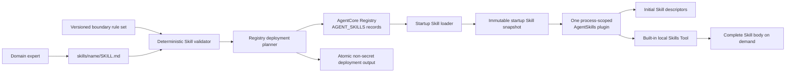
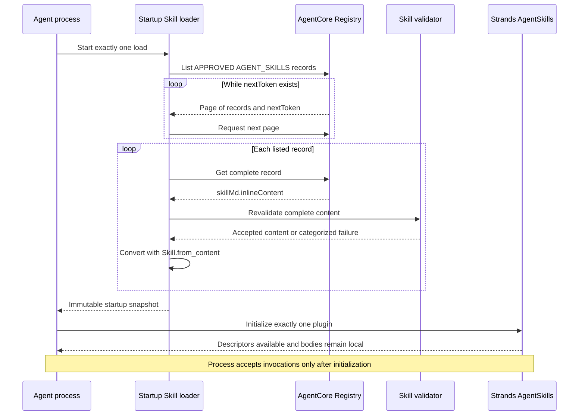
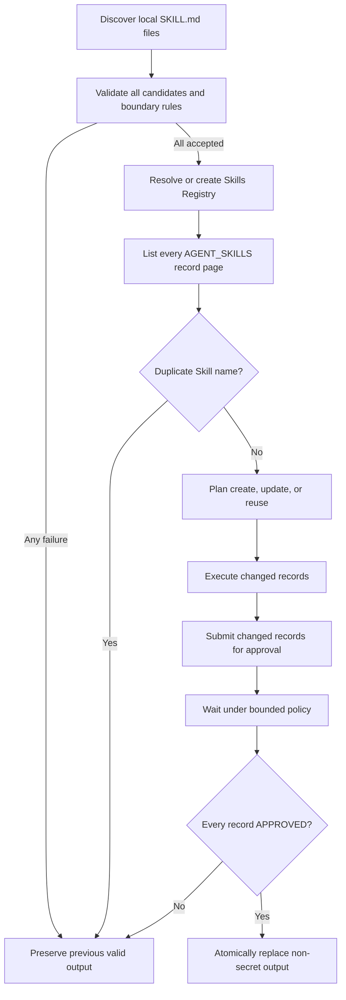

# Design Document: Dynamic Skills System

## Overview

The Dynamic Skills System is the Skills-only lifecycle for shared domain knowledge used by Sage. Domain experts author portable `skills/<skill-name>/SKILL.md` files. A deterministic validator accepts only structurally valid, boundary-safe files. The Registry deployment process publishes accepted files as governed AgentCore Registry `AGENT_SKILLS` records, submits changed records for approval, waits for `APPROVED`, and atomically retains a non-secret deployment manifest only after complete success.

Each agent process performs one startup load before accepting invocations. The loader lists every approved `AGENT_SKILLS` record across all pages, retrieves complete `skillMd.inlineContent`, revalidates it, converts accepted content with `Skill.from_content()`, and freezes the resulting Skills into one immutable process snapshot. Exactly one process-scoped Strands `AgentSkills` plugin is initialized from that snapshot. The plugin exposes Skill name-and-description descriptors in the initial context while keeping complete Skill bodies out of that context. When a request requires a Skill, the built-in local Skills Tool resolves the name against the process snapshot and returns the complete body on demand.

A running process never refreshes its snapshot and performs no Registry read during an invocation or Skill activation. Newly approved, updated, rejected, or deprecated Registry content becomes visible only when a new process starts and creates its own snapshot. This is **process-lifetime caching with restart visibility**.

### POC/MVP Implementation Decision

The POC intentionally uses the smallest working implementation. The existing `_fetch_skills_from_registry()` function in `agent/agent.py` is the startup loader, the module-level `_skills` list is the effective process-lifetime snapshot, and the module-level `_skills_plugin` is the single process-scoped `AgentSkills` plugin. This already provides the required POC behavior without introducing a `StartupSkillSnapshot` data class, a separate loader module, a planner, or an adapter layer.

The repository implementation is therefore considered POC-complete. A live Registry-to-agent smoke test is still needed for deployed-demo sign-off. Formal immutable snapshot models, shared strict validation and boundary rules, publication planning, atomic output replacement, and comprehensive lifecycle/property/integration tests are deferred production-hardening work and are not POC blockers.

### Goals

- Preserve local `SKILL.md` authoring with exact accepted source content.
- Reject malformed, non-canonical, unapproved-tool, or boundary-violating candidates deterministically before record mutation.
- Converge Registry publication to one logical `AGENT_SKILLS` record per Skill name.
- Treat `APPROVED` as the only successful publication and runtime-load status.
- Load all approved records exactly once per process, with complete pagination and categorized invalid-record handling.
- Initialize exactly one process-scoped `AgentSkills` plugin from an immutable startup snapshot.
- Preserve Strands progressive disclosure: descriptors first, complete bodies through the built-in local Skills Tool only when needed.
- Keep deployment output and warnings free of Skill content and other prohibited values.

### Scope Boundary

This design includes only Skill authoring, validation, Registry publication and approval, startup loading, process-lifetime caching, Strands progressive disclosure, Skills-specific deployment, and verification. All capabilities outside that lifecycle are out of scope.

### Research Findings and Design Constraints

- AgentCore Registry supports the `AGENT_SKILLS` descriptor type. Its Agent Skills descriptor contains `skillMd`, whose `inlineContent` carries Markdown content. This supports publishing the complete accepted `SKILL.md` without reconstruction. See [AgentSkillsDescriptor](https://docs.aws.amazon.com/bedrock-agentcore-control/latest/APIReference/API_AgentSkillsDescriptor.html) and [SkillMdDefinition](https://docs.aws.amazon.com/bedrock-agentcore-control/latest/APIReference/API_SkillMdDefinition.html).
- `ListRegistryRecords` supports `name`, `status`, and `descriptorType` filters combined with AND logic and returns a pagination token. The loader therefore requests `descriptorType=AGENT_SKILLS` and `status=APPROVED` and follows every `nextToken`. See [ListRegistryRecords](https://docs.aws.amazon.com/bedrock-agentcore-control/latest/APIReference/API_ListRegistryRecords.html).
- Registry record updates accept Agent Skills Markdown through `descriptors.agentSkills.skillMd.inlineContent`, so changed Skills update the existing logical record rather than creating a second record. See [UpdateRegistryRecord](https://docs.aws.amazon.com/bedrock-agentcore-control/latest/APIReference/API_UpdateRegistryRecord.html).
- `SubmitRegistryRecordForApproval` moves a record from `DRAFT` to `PENDING_APPROVAL`; registries with auto-approval may approve it automatically. Deployment must still poll and classify success only after observing `APPROVED`. See [SubmitRegistryRecordForApproval](https://docs.aws.amazon.com/bedrock-agentcore-control/latest/APIReference/API_SubmitRegistryRecordForApproval.html).
- Strands documents `AgentSkills` as accepting pre-built `Skill` instances, injecting available Skill metadata into the system prompt, and registering a built-in `skills` tool that activates complete instructions on demand. See [Strands Skills guide](https://strandsagents.com/docs/user-guide/concepts/plugins/skills/) and [AgentSkills API](https://strandsagents.com/docs/api/python/strands.vended_plugins.skills.agent_skills/).
- Registry API calls use the repository's existing `bedrock-agentcore-control` client and `scripts/deploy_registry.py`; startup integration remains in the agent layer. The design does not introduce infrastructure-as-code or a second Skill plugin.

## Architecture

### Component Flow



The authoring path ends at Registry approval. The runtime path begins from approved Registry records. Local authoring files are never a runtime fallback.

### Startup Sequence



### Architectural Invariants

1. A candidate is published only after deterministic validation against the same approved-tool set and versioned boundary rule set used for every candidate in that deployment.
2. The complete accepted decoded source is the Registry payload; frontmatter is not reconstructed and content is not normalized.
3. A deployment has one Registry, at most one logical record per Skill name, and no successful Skill until its record is `APPROVED`.
4. The deployment manifest changes only after every discovered candidate has one approved record.
5. A process has exactly one startup load, one immutable snapshot, and one `AgentSkills` plugin.
6. Runtime discovery and activation are local snapshot operations and never read the Registry.
7. Initial context contains descriptors, not bodies; recognized activation returns the complete cached body.
8. Registry changes affect only snapshots created by later process startups.

## Components and Interfaces

### 1. Skill Authoring Source

The source root is `skills/`. Discovery considers only files at `skills/<skill-name>/SKILL.md`, sorts paths lexicographically for deterministic processing, and treats each file as bytes until strict UTF-8 decoding succeeds.

A Skill file contains exactly one frontmatter block at byte-decoded text position zero:

```markdown
---
name: claims-workflow
description: Apply the shared claims-processing workflow.
allowed-tools:
  - get-claim-details
---

# Claims workflow

Complete shared instructions follow.
```

`allowed-tools` is optional. Its values authorize only references to names in the deployment's approved Data Tool name set; it does not provide data, credentials, or execution authority.

### 2. Deterministic Skill Validator

One shared validator is called by both deployment and startup loading. It has no Registry side effects.

```python
class SkillValidator(Protocol):
    def validate(
        self,
        *,
        source_path: Path,
        source_bytes: bytes,
        approved_tools: frozenset[str],
        boundary_rules: "BoundaryRuleSet",
    ) -> "SkillValidationResult":
        """Validate one candidate and return all applicable failures."""
```

Validation proceeds in dependency order while collecting every condition that remains applicable:

1. Decode the complete file with strict UTF-8 and no replacement.
2. Require one opening `---` at the start and one closing `---` for the sole frontmatter block.
3. Parse frontmatter as a YAML mapping, reject non-mappings, and report every duplicate metadata key as a separate validation failure.
4. Require trimmed, non-empty string `name` and `description` values.
5. Require `name` to match `^[a-z0-9]+(?:-[a-z0-9]+)*$` and equal the parent directory name.
6. Require non-whitespace Markdown after the closing delimiter.
7. If `allowed-tools` exists, require a list whose distinct string values all belong to `approved_tools`.
8. Apply every rule in the same immutable `BoundaryRuleSet` version to metadata and body and report each match.
9. On success, return the exact decoded source alongside parsed metadata and `boundary_clear=True`; do not reconstruct the source.

A decode failure makes text, frontmatter, YAML, metadata, body, tool, and content-boundary checks inapplicable. A missing frontmatter close makes YAML and all dependent checks inapplicable. Independent path checks remain applicable. This gives complete reporting without pretending a failed prerequisite succeeded.

### 3. Versioned Boundary Rule Set

The boundary rule set is a version-controlled, reviewable input to validation. It contains deterministic field constraints and prohibited-content markers for tenant-owned records or identifiers, credential material, and authorization logic. Rules use exact metadata-key checks and compiled regular expressions with stable identifiers; validation does not use a model, network call, or probabilistic classifier.

```python
@dataclass(frozen=True)
class BoundaryRule:
    rule_id: str
    category: Literal[
        "TENANT_DATA",
        "TENANT_SPECIFIC_IDENTIFIER",
        "CREDENTIAL_MATERIAL",
        "AUTHORIZATION_LOGIC",
    ]
    target: Literal["METADATA_KEY", "METADATA_VALUE", "BODY"]
    pattern: str

@dataclass(frozen=True)
class BoundaryRuleSet:
    version: str
    rules: tuple[BoundaryRule, ...]
```

Rules are applied in declared order and matches are returned in stable `(category, rule_id, location)` order. Failure details identify the source path, category, rule ID, and safe location only; they never copy the matching content. An accepted result records the rule-set version and that no rule matched.

### 4. Registry Deployment Process

The existing `scripts/deploy_registry.py` remains the Skills deployment entry point. It uses the repository's Python runtime and existing endpoint handling. Its phases are:

1. Discover and validate every candidate before any record mutation.
2. Resolve the configured Registry identifier and reuse it; create one Skills Registry only when no reusable Registry exists.
3. List the complete `AGENT_SKILLS` record set across all pages and group records by Skill name.
4. Fail before record mutation if any name has more than one existing logical record.
5. Build a deterministic publication plan:
   - create when no record exists;
   - update the one existing record when complete content or published metadata differs;
   - reuse without mutation when content and metadata are equivalent and status is `APPROVED`.
6. Execute create/update actions with `descriptorType=AGENT_SKILLS` and `descriptors.agentSkills.skillMd.inlineContent` equal to the exact accepted source.
7. Wait until each changed record becomes submittable, submit it for approval, and poll under the configured bounded wait policy.
8. Mark a Skill successful only after its record reaches `APPROVED`.
9. When all Skills succeed, write `scripts/registry_output.json` through a same-directory temporary file, flush it, and atomically replace the prior manifest.

Any validation, duplicate, create, update, submission, terminal-status, or timeout failure makes the deployment unsuccessful and leaves the previous valid manifest untouched. Registry mutations that completed before a later failure remain governed Registry state; the next deployment reconciles them idempotently by Skill name.

### 5. Registry Record Adapter

A narrow adapter isolates service request/response shapes from pure planning logic.

```python
class RegistryRecordAdapter(Protocol):
    def resolve_or_create_registry(self, configured_registry_id: str | None) -> "RegistryRef": ...
    def list_all_skill_records(self, registry_id: str) -> tuple["RegistryRecordSummary", ...]: ...
    def create_skill_record(self, registry_id: str, skill: "ValidatedSkill") -> "RegistryRecord": ...
    def update_skill_record(self, registry_id: str, record: "RegistryRecord", skill: "ValidatedSkill") -> "RegistryRecord": ...
    def submit_for_approval(self, registry_id: str, record_id: str) -> None: ...
    def get_record(self, registry_id: str, record_id: str) -> "RegistryRecord": ...
```

Pagination is implemented inside complete-list operations, not delegated to callers. The adapter exposes statuses but does not reinterpret them: only `APPROVED` satisfies publication or loading.

### 6. Startup Skill Loader

The startup loader runs exactly once while constructing the agent process and before the process accepts invocations.

```python
def load_startup_skills(
    *,
    registry_id: str,
    validator: SkillValidator,
    approved_tools: frozenset[str],
    boundary_rules: BoundaryRuleSet,
) -> "StartupSkillSnapshot":
    """Load one immutable snapshot from approved Registry Skills."""
```

Behavior:

- An absent or unresolved Registry identifier stops startup with a configuration error.
- Listing requests filter by `descriptorType=AGENT_SKILLS` and `status=APPROVED` and follow every `nextToken` before snapshot completion.
- Failure of any listing page stops startup; local files and prior-process content are not substituted.
- An empty complete listing creates an empty snapshot.
- Each summary is retrieved with `GetRegistryRecord`; the loader extracts complete `descriptors.agentSkills.skillMd.inlineContent`.
- The shared validator revalidates retrieved content. Accepted content is converted by `Skill.from_content()` exactly once.
- A record retrieval failure, missing inline content, validation failure, or conversion failure excludes only that record and emits a warning containing the record ID and stable failure category, never Registry content.
- After all convertible records are collected, duplicate resolved Skill names stop startup before plugin initialization.
- Successful completion freezes the complete collection into one snapshot.

### 7. Process-Scoped Strands Integration

The agent process constructs exactly one `AgentSkills` plugin from the startup snapshot and supplies that one plugin to the process's agent construction path. No invocation creates another plugin or reloads Skills.

```python
snapshot = load_startup_skills(...)
skills_plugin = AgentSkills(skills=list(snapshot.skills))
agent = Agent(..., plugins=[skills_plugin])
```

The mutable list conversion is only the constructor boundary required by the library; the authoritative snapshot remains immutable and is never replaced. The same rule applies to an empty snapshot: process startup still initializes exactly one plugin from zero Skills.

### 8. Progressive Disclosure and Local Activation

Strands `AgentSkills` owns discovery and activation:

- **Discovery:** the plugin exposes exactly one descriptor for each snapshot Skill. Each descriptor contains only the Skill name and description; complete bodies are absent from initial context.
- **Activation:** when a request requires an available Skill, the agent calls the built-in local `skills` tool with the Skill name before applying its instructions.
- **Recognized name:** the tool returns the complete body held by the process snapshot.
- **Unknown name:** the tool returns a descriptive not-found result and does not change the snapshot.
- **Activation failure:** the tool reports failure without changing the snapshot.
- **Isolation:** discovery and activation perform no Registry read and invoke no Data Tool.

Repeated activation of the same name within one process returns the same complete body. Registry approval changes have no effect until a new process creates a new snapshot.

### 9. Non-Secret Warnings and Deployment Output

Warnings use stable categories:

- `REGISTRY_CONFIGURATION`
- `LISTING_PAGE`
- `RECORD_RETRIEVAL`
- `MISSING_INLINE_CONTENT`
- `SKILL_VALIDATION`
- `SKILL_CONVERSION`
- `DUPLICATE_SKILL_NAME`

Record-level warnings contain only category and record ID. Deployment output contains only Registry identifiers and per-Skill name, record identifier, record reference, and final status. It excludes Skill content, bodies, prohibited boundary content, credentials, tokens, secret values, and authorization configuration.

## Data Models

### Validation Models

```python
@dataclass(frozen=True)
class ValidationFailure:
    code: str
    source_path: str
    category: str
    safe_location: str | None
    rule_id: str | None = None

@dataclass(frozen=True)
class ValidatedSkill:
    source_path: Path
    name: str
    description: str
    allowed_tools: tuple[str, ...]
    exact_content: str
    boundary_rule_set_version: str
    boundary_clear: Literal[True]

@dataclass(frozen=True)
class SkillValidationResult:
    accepted: ValidatedSkill | None
    failures: tuple[ValidationFailure, ...]
```

`accepted` and `failures` are mutually exclusive. Failure tuples are deterministically ordered. `exact_content` exists only for accepted Skills and is the payload sent to Registry publication.

### Publication Models

```python
RegistryStatus = Literal[
    "DRAFT",
    "PENDING_APPROVAL",
    "APPROVED",
    "REJECTED",
    "DEPRECATED",
    "CREATING",
    "UPDATING",
    "CREATE_FAILED",
    "UPDATE_FAILED",
]

@dataclass(frozen=True)
class RegistryRef:
    registry_id: str
    registry_arn: str

@dataclass(frozen=True)
class RegistryRecordSummary:
    name: str
    record_id: str
    record_arn: str
    record_version: str
    status: RegistryStatus

@dataclass(frozen=True)
class RegistryRecord:
    summary: RegistryRecordSummary
    description: str
    inline_content: str | None

@dataclass(frozen=True)
class PublicationAction:
    kind: Literal["CREATE", "UPDATE", "REUSE"]
    skill_name: str
    existing_record_id: str | None

@dataclass(frozen=True)
class PublicationPlan:
    registry: RegistryRef
    actions: tuple[PublicationAction, ...]
```

The planner compares canonical record metadata and exact inline content. It is pure and deterministic; the adapter performs mutations only after a complete valid plan exists.

### Deployment Manifest

```python
@dataclass(frozen=True)
class PublishedSkillRef:
    name: str
    record_id: str
    record_arn: str
    status: Literal["APPROVED"]

@dataclass(frozen=True)
class RegistryDeploymentOutput:
    registry_id: str
    registry_arn: str
    records: tuple[PublishedSkillRef, ...]
```

Records are sorted by Skill name before serialization so an unchanged successful deployment produces stable output.

### Runtime Snapshot

```python
@dataclass(frozen=True)
class LoadedSkill:
    record_id: str
    name: str
    description: str
    body: str
    skill: Skill

@dataclass(frozen=True)
class StartupSkillSnapshot:
    skills: tuple[Skill, ...]
    by_name: Mapping[str, LoadedSkill]
```

`by_name` is wrapped in an immutable mapping and contains the same unique names as `skills`. The snapshot belongs to one process and has no refresh or mutation operation.


## Correctness Properties

*A property is a characteristic or behavior that should hold true across all valid executions of a system-essentially, a formal statement about what the system should do. Properties serve as the bridge between human-readable specifications and machine-verifiable correctness guarantees.*

The prework reflection consolidated criteria that express the same lifecycle invariant. Each remaining property adds unique validation value. Pure validation, planning, loading, snapshot, and lookup logic runs with generated isolated inputs; live Registry operations are covered by focused integration tests rather than property loops.

### Property 1: Validation is deterministic, boundary-safe, and publication-safe

For all candidate paths, byte sequences, approved Data Tool name sets, and versioned Boundary Rule Sets, repeated validation with equal inputs returns the same ordered Applicable Validation Failures or the same accepted result. Acceptance occurs only when strict UTF-8 decoding, one leading frontmatter block, duplicate-free YAML mapping metadata, trimmed required strings, canonical parent-matching name, non-empty body, approved Allowed Tools, and zero boundary-rule matches all hold. Every accepted result preserves the complete decoded source exactly, and every rejected result identifies its source path, reports every applicable failure, and causes zero Registry Record mutation.

**Validates: Requirements 1.1, 1.2, 1.3, 1.4, 1.5, 1.6, 1.7, 1.8, 1.9, 1.10, 1.11, 1.12, 6.1, 6.2, 6.3, 6.4, 6.5, 6.8, 7.1, 7.8**

### Property 2: Registry publication converges safely

For all accepted Skill sets and existing Registry states without duplicate logical records, publication reuses a resolvable Registry or creates one when none exists, creates missing records, updates changed records, reuses equivalent approved records, and converges to one logical Registry Record per Skill name. Only `APPROVED` records count as successful; repeated equivalent publication performs no additional logical mutation; complete success atomically replaces the deployment output with non-secret approved references; and every partial failure preserves the previous valid output.

**Validates: Requirements 2.1, 2.2, 2.3, 2.4, 2.5, 2.6, 2.7, 2.8, 2.9, 2.10, 2.11, 2.12, 2.13, 2.14, 7.2, 7.3**

### Property 3: Startup snapshot contains exactly the valid approved Skills

For all finite paginated approved `AGENT_SKILLS` listings, startup follows every page, retrieves each listed record, and produces a snapshot containing exactly one `Skill.from_content()` result for each uniquely named record whose complete inline content is present and passes validation. An empty complete listing produces an empty snapshot; absent or unresolved Registry configuration, any listing-page failure, or duplicate valid Skill names stops startup before plugin initialization; and each independently invalid record is excluded with a warning containing only its record ID and failure category. Every successful startup creates exactly one snapshot and exactly one `AgentSkills` plugin before invocations are accepted.

**Validates: Requirements 3.1, 3.2, 3.3, 3.4, 3.5, 3.6, 3.7, 3.8, 3.9, 3.10, 3.11, 7.4, 7.5**

### Property 4: Process snapshots are immutable with restart-only visibility

For all agent processes, invocation sequences, activation sequences, and Registry additions, changes, or approval losses after startup, each process uses the same snapshot for every operation, performs no runtime Registry read, and returns the same complete body for repeated activation of a Skill name. For all later process starts, each new process receives only the independently loaded approved state visible to its own startup operation and cannot alter another process's snapshot.

**Validates: Requirements 4.1, 4.2, 4.3, 4.4, 4.5, 4.6, 4.7, 7.6**

### Property 5: Progressive disclosure exposes descriptors and activates bodies locally

For all startup snapshots, the initial agent context contains exactly one name-and-description descriptor per Skill and contains no complete Skill body. For any recognized Skill name, local activation returns its complete cached body; for any unrecognized name or failed activation, the result is descriptive and the snapshot remains unchanged. For all discovery and activation sequences, neither Registry nor a Data Tool is invoked.

**Validates: Requirements 5.1, 5.2, 5.3, 5.4, 5.5, 5.6, 5.7, 5.8, 5.9, 6.6, 6.7, 7.7**

## Error Handling

### Failure Policy

The system distinguishes startup-stopping failures from record-local failures and never substitutes ungoverned content.

| Failure | Phase | Scope | Required behavior |
|---|---|---|---|
| Strict UTF-8 decode failure | Validation | Candidate | Reject; report encoding category and path |
| Frontmatter/YAML/metadata/body/tool failure | Validation | Candidate | Report every applicable condition; perform no record mutation for the candidate |
| Boundary rule match | Validation | Candidate | Report safe rule category/ID; preserve existing approved content and prior manifest |
| Candidate batch contains any validation failure | Deployment preflight | Deployment | Stop before Registry Record mutation |
| Configured Registry resolves | Registry resolution | Deployment | Reuse it |
| No reusable Registry exists | Registry resolution | Deployment | Create one Skills Registry |
| Registry listing page fails | Publication | Deployment | Stop; preserve prior manifest |
| Duplicate logical record name | Publication planning | Deployment | Stop before record mutation; preserve prior manifest |
| Record create/update fails | Publication | Skill/deployment | Mark unsuccessful; preserve prior manifest |
| Changed record is not yet submittable | Approval | Skill | Poll under bounded policy; do not submit prematurely |
| Approval submission fails | Approval | Skill/deployment | Mark unsuccessful; preserve prior manifest |
| Record reaches terminal non-approved status | Approval | Skill/deployment | Mark unsuccessful; preserve prior manifest |
| Approval wait expires | Approval | Skill/deployment | Mark unsuccessful; preserve prior manifest |
| Manifest temporary write/replace fails | Output | Deployment | Report output failure; keep previous valid manifest whenever replacement did not complete |
| Registry identifier absent or unresolved | Startup | Process | Stop before plugin initialization or invocation acceptance |
| Approved listing page fails | Startup | Process | Stop without local or prior-process fallback |
| Individual record retrieval fails | Startup | Record | Exclude record; warn with ID and category only |
| Inline content is absent | Startup | Record | Exclude record; warn with ID and category only |
| Retrieved content fails validation | Startup | Record | Exclude record; warn with ID and category only |
| `Skill.from_content()` fails | Startup | Record | Exclude record; warn with ID and category only |
| Duplicate converted Skill name | Startup | Process | Stop before plugin initialization |
| Approved listing is empty | Startup | Process | Create empty snapshot and one empty `AgentSkills` plugin |
| Unknown activation name | Runtime | Activation | Return descriptive not-found; keep snapshot unchanged |
| Recognized activation fails | Runtime | Activation | Return categorized failure; keep snapshot unchanged |

### Approval Wait Policy

The wait policy is configuration with bounded attempts or deadline and bounded delay. Polling retries only non-terminal in-progress states. `APPROVED` succeeds; explicit rejected, deprecated, create-failed, or update-failed states fail immediately. Timeout fails without rewriting the prior deployment output. A later deployment reconciles any record left in an intermediate state.

### Safe Diagnostics

Errors and warnings may include source path, Registry ID, record ID, Skill name when already non-sensitive, operation, status, stable category, and boundary rule ID. They must not include Skill content, Skill bodies, matching prohibited text, credentials, tokens, secret values, or authorization configuration. Exception text from service or parsing libraries is categorized before logging so raw payloads cannot leak through generic exception formatting.

## Testing Strategy

The feature is suitable for property-based testing because its core behaviors are pure or modelable transformations over bytes, paths, metadata, rule sets, record states, pagination, snapshots, and activation lookups. Property tests are complemented by unit tests for concrete branches and integration tests for AgentCore Registry request/response behavior.

### Property Tests

Use `pytest` with Hypothesis and at least 100 generated examples per property. Each design property is implemented by one property-based test with a comment in this exact format:

```python
# Feature: dynamic-skills-system, Property N: <property title>
```

Generated property tests never call live AgentCore Registry. They use strict isolated fakes for Registry pages, status transitions, mutations, and call counts.

- **Property 1:** Generate arbitrary bytes, path/name pairs, frontmatter shapes, duplicate keys, metadata values, bodies, Allowed Tools sets, boundary rules, and multi-failure combinations. Verify deterministic results, applicability, exact accepted-content preservation, and zero mutation after rejection.
- **Property 2:** Generate accepted Skill sets, Registry states, record contents/metadata/statuses, duplicate states, status sequences, and injected failure points. Compare the publication plan with a simple reference model and verify convergence, idempotency, approval-only success, atomic-output gating, prior-output preservation, and marker exclusion.
- **Property 3:** Generate paginated listings, mixed record outcomes, conversion results, empty listings, duplicate names, and page failures. Verify exact snapshot membership, failure boundaries, safe warnings, and one plugin on successful startup.
- **Property 4:** Generate process starts, invocation/activation sequences, and post-start Registry changes. Verify snapshot identity, zero runtime Registry reads, repeated-body stability, process isolation, and restart-only visibility.
- **Property 5:** Generate snapshots with unique names, descriptions, and body markers plus recognized, unknown, and failing activation sequences. Verify exact descriptor projection, initial body exclusion, exact local body return, unchanged snapshots, and zero Registry/Data Tool calls.

### Unit Tests

- Strict UTF-8 failures and accepted Unicode examples.
- Leading/frontmatter delimiter boundaries, YAML non-mapping input, and duplicate metadata keys.
- Required metadata, canonical name regex, parent mismatch, whitespace-only bodies, and Allowed Tools validation.
- One fixture for each boundary category plus combined-match reporting and safe diagnostic formatting.
- Exact content preservation including line endings, trailing whitespace, comments, and YAML formatting.
- Pure create/update/reuse planning and duplicate logical-record rejection.
- Approval status classification, bounded polling, and timeout behavior.
- Atomic manifest replacement and byte-for-byte preservation of the previous manifest after every injected failure stage.
- Missing/unresolved Registry startup errors, empty snapshot, invalid-record exclusion, safe warnings, duplicate converted names, and conversion ordering.
- Exactly one process-scoped plugin for empty and non-empty snapshots.
- Descriptor-only initial context, recognized/unknown/failed activation, and repeated body equality.
- Static boundary checks confirming the Skills lifecycle has no interface that derives tenant data or authorization decisions from Skill content alone.

### AgentCore Registry Integration Tests

Use an isolated test Registry and uniquely named test records. Keep the suite small because it exercises an external service.

- Create or reuse one Registry and verify complete `AGENT_SKILLS` listing pagination.
- Create a record whose exact accepted source appears in `skillMd.inlineContent`.
- Update that same logical record and verify no duplicate name is created.
- Submit a changed draft for approval and observe the documented `DRAFT` to `PENDING_APPROVAL` behavior, with `APPROVED` required for success.
- Filter listing by `descriptorType=AGENT_SKILLS` and `status=APPROVED`.
- Retrieve complete inline content with `GetRegistryRecord` and convert it with `Skill.from_content()`.
- Run an unchanged deployment twice and verify record identity reuse and no second logical record.

Integration cleanup is limited to test resources created by the test run and is not part of the production deployment path.

### Strands Integration Tests

- Initialize `AgentSkills` from pre-built `Skill` instances produced by `Skill.from_content()`.
- Verify the plugin contributes one descriptor per Skill and excludes complete body markers from initial context.
- Invoke the built-in local Skills Tool for a recognized name and verify the complete body is returned.
- Verify unknown activation is descriptive and snapshot state remains unchanged.
- Instrument Registry and Data Tool fakes and verify zero calls during discovery and activation.

### Test-Suite Coverage Gate

A lightweight test inventory maps Requirements 7.1–7.8 to named tests. The gate fails when any required validation, publication, approval, loading, caching, progressive-disclosure, or boundary scenario has no mapped automated test. The gate is traceability verification, not a replacement for the tests themselves.

### Validation Commands

```bash
uv run pytest
```

Focused development runs may target the Skills validator, Registry deployment, startup loader, and AgentSkills integration test modules. No watch process is required.

## Skills Deployment Design

Deployment remains script-based and is limited to Skills resources.



### Deployment Inputs

- Region and optional reusable Registry identifier.
- Registry name used only when creation is required.
- Local `skills/` source root.
- Approved Data Tool name set.
- Versioned Boundary Rule Set.
- Approval polling deadline/attempts and delay.
- Existing `scripts/registry_output.json`, when valid.

### Deployment Output

`registry_output.json` contains only Registry ID/ARN and sorted approved Skill record names, IDs, ARNs, and statuses. It is valid only after complete deployment success. The writer validates the output schema and prohibited-field denylist before atomic replacement.

### Idempotency and Recovery

Skill name is the logical reconciliation key. Existing records are discovered from the complete listing rather than only from the prior local output. Equivalent approved records are reused; changed records are updated; duplicate names fail before mutation. Because the previous manifest is replaced only after complete approval, rerunning after a partial failure can safely reconcile intermediate Registry state without treating the partial run as valid deployment output.

### Startup Activation Boundary

Deployment approval does not mutate a running process. Operators make an approved change visible by starting a new process. The new process loads its own complete approved snapshot before serving; existing processes retain their original snapshots until they end.

## Requirements Traceability

| Requirement | Design coverage | Primary verification |
|---|---|---|
| 1. Skill Authoring and Validation | Skill Authoring Source; Deterministic Skill Validator; Validation Models | Property 1; validator unit tests |
| 2. Registry Publication and Approval | Registry Deployment Process; Registry Record Adapter; Publication Models; Skills Deployment Design | Property 2; Registry integration tests |
| 3. Startup-Time Approved Skill Loading | Startup Sequence; Startup Skill Loader; Runtime Snapshot | Property 3; loader unit and Registry integration tests |
| 4. Process-Lifetime Caching and Restart Visibility | Architectural Invariants; Process-Scoped Strands Integration; Startup Activation Boundary | Property 4; process lifecycle property tests |
| 5. Strands Progressive Disclosure | Process-Scoped Strands Integration; Progressive Disclosure and Local Activation | Property 5; Strands integration tests |
| 6. Shared-Knowledge Boundary | Versioned Boundary Rule Set; validator steps; Safe Diagnostics | Property 1 and Property 5; boundary fixtures and static checks |
| 7. Skills Lifecycle Verification | Complete Testing Strategy and Test-Suite Coverage Gate | Properties 1–5; coverage inventory |

Every acceptance criterion is covered by the referenced component and at least one property, unit, integration, static, or documentation check. No implementation task document is created or modified in this design phase.

## Implementation Guidance

- Keep `skills/<skill-name>/SKILL.md` as the only authoring convention.
- Keep shared validation logic callable from both `scripts/deploy_registry.py` and the startup loader; do not duplicate parsing or boundary rules.
- Keep the current Registry manifest path, `scripts/registry_output.json`, and replace it only atomically after complete success.
- Keep Registry service calls in the deployment/startup boundaries and pure logic in validators and planners.
- Keep startup loading before invocation acceptance and instantiate `AgentSkills` exactly once per process.
- Pass pre-built `Skill` objects created by `Skill.from_content()` to the plugin; do not point the production process at local authoring directories.
- Keep the built-in Skills Tool local to Strands. Do not add custom Skill routing or runtime Registry refresh.
- Use type hints on all Python signatures and Google-style docstrings on public functions.
- Preserve the repository's existing Python/script deployment conventions and required endpoint handling.

## Source Summary

- [AgentCore Registry `AgentSkillsDescriptor`](https://docs.aws.amazon.com/bedrock-agentcore-control/latest/APIReference/API_AgentSkillsDescriptor.html) — Registry representation of Agent Skills descriptors.
- [AgentCore Registry `SkillMdDefinition`](https://docs.aws.amazon.com/bedrock-agentcore-control/latest/APIReference/API_SkillMdDefinition.html) — inline Markdown content field used for complete accepted `SKILL.md` content.
- [AgentCore Registry `CreateRegistryRecord`](https://docs.aws.amazon.com/bedrock-agentcore-control/latest/APIReference/API_CreateRegistryRecord.html) — creation of a named Registry record with an Agent Skills descriptor.
- [AgentCore Registry `GetRegistryRecord`](https://docs.aws.amazon.com/bedrock-agentcore-control/latest/APIReference/API_GetRegistryRecord.html) — retrieval of a complete Registry record and its descriptors.
- [AgentCore Registry `ListRegistryRecords`](https://docs.aws.amazon.com/bedrock-agentcore-control/latest/APIReference/API_ListRegistryRecords.html) — record filters and paginated listing behavior.
- [AgentCore Registry `UpdateRegistryRecord`](https://docs.aws.amazon.com/bedrock-agentcore-control/latest/APIReference/API_UpdateRegistryRecord.html) — updating Agent Skills descriptor content on an existing record.
- [AgentCore Registry `SubmitRegistryRecordForApproval`](https://docs.aws.amazon.com/bedrock-agentcore-control/latest/APIReference/API_SubmitRegistryRecordForApproval.html) — draft submission and pending-approval transition.
- [Strands Skills guide](https://strandsagents.com/docs/user-guide/concepts/plugins/skills/) — discovery, activation, execution, metadata-first context, and on-demand complete instructions.
- [Strands `AgentSkills` API](https://strandsagents.com/docs/api/python/strands.vended_plugins.skills.agent_skills/) — pre-built Skill inputs and built-in local `skills` tool behavior.

Official documentation content is summarized and rephrased. Service behavior that depends on a deployed Registry remains covered by focused integration tests.