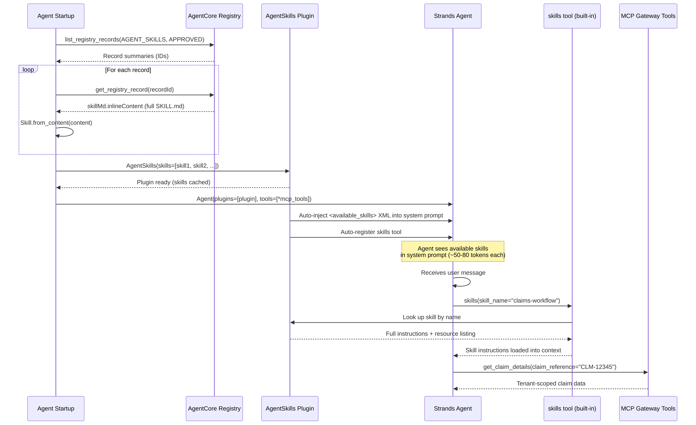
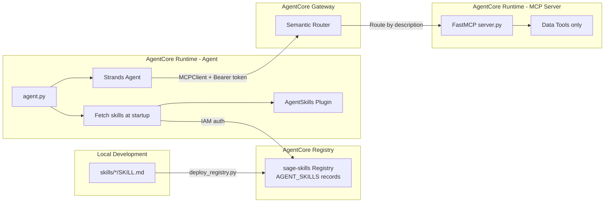

# Design Document: Dynamic Skills System

## Overview

The Dynamic Skills System replaces the current one-tool-per-skill pattern (`load_claims_workflow_context`, `load_premium_formulas_context` in `mcp_server/tools/context_tools.py`) with the Strands SDK `AgentSkills` plugin — a built-in progressive disclosure system that follows the [Agent Skills specification](https://agentskills.io/specification).

The plugin provides a three-level progressive disclosure architecture:

1. **Descriptor level** — lightweight skill summaries (~50–80 tokens each) automatically injected into the system prompt via an `<available_skills>` XML block.
2. **Body level** — full skill Markdown instructions (~2–5k tokens) loaded on-demand when the agent calls the built-in `skills` tool.
3. **Data level** — tenant-scoped business data retrieved via existing MCP tools (`get_product_info`, `get_claim_details`) through the AgentCore Gateway.

This design eliminates the need to register a new MCP tool for each skill file and removes the need for custom registry, prompt assembly, or tool registration code. Adding a skill means: create a `SKILL.md` file locally, run the deploy script to publish it to the AgentCore Registry, and restart the agent.

### Key Design Decisions

| Decision | Choice | Rationale |
|----------|--------|-----------|
| Skill engine | Strands `AgentSkills` plugin | Built-in progressive disclosure, follows Agent Skills spec, no custom code needed |
| Skill storage | AgentCore Registry (`AGENT_SKILLS` records) | Centralized governance, versioning, discoverable via Registry MCP endpoint |
| Skill format | `SKILL.md` with YAML frontmatter per Agent Skills spec | Industry standard, portable across frameworks, familiar to domain experts |
| Skill authoring | Local `skills/*/SKILL.md` directories | Domain experts edit locally; deploy script publishes to Registry |
| Registry auth | IAM | Reuses existing AWS credentials, simplest setup |
| Registry approval | Auto-approval enabled | PoC simplicity; production can switch to manual approval |
| Skill loading | Once at agent startup from Registry | Cached for process lifetime; no per-request latency |
| Prompt injection | Automatic by plugin (before each invocation) | No custom `build_system_prompt()` needed; refreshes on every call |
| On-demand loading | Built-in `skills` tool registered by plugin | No custom `load_skill` @tool needed |

## Architecture

### Component Interaction Diagram



### Deployment Topology



Skills are published to the Registry via `deploy_registry.py` and fetched at agent startup via IAM-authenticated API calls. The `skills` tool is a local Strands tool registered by the plugin — it never traverses the Gateway. MCP data tools continue to route through the Gateway.

## Components and Interfaces

### 1. AgentSkills Plugin (Strands SDK — no custom code)

The `AgentSkills` plugin from `strands` handles all skill management:

```python
from strands import Agent, AgentSkills, Skill

# Skills fetched from Registry at startup (see component 3)
skills = fetch_skills_from_registry(registry_id)

# Initialize plugin with Registry-fetched skills
plugin = AgentSkills(skills=skills)

# Plugin auto-registers the skills tool and injects <available_skills> XML
agent = Agent(
    system_prompt=base_prompt,
    plugins=[plugin],
    tools=[*mcp_tools],
)
```

**What the plugin provides automatically:**

| Capability | How |
|-----------|-----|
| Skill parsing | Reads SKILL.md frontmatter (name, description) and body |
| Prompt injection | Injects `<available_skills>` XML before each invocation |
| On-demand loading | Built-in `skills` tool returns full instructions |
| Runtime management | `set_available_skills()` / `get_available_skills()` for hot-swap |
| Session persistence | Tracks activated skills in `agent.state` |

### 2. Skill Data Model (Strands SDK `Skill` dataclass)

```python
from strands import Skill

# Load from filesystem
skill = Skill.from_file("./skills/claims-workflow")

# Parse from raw SKILL.md content (for Registry integration)
skill = Skill.from_content("""---
name: claims-workflow
description: Claims processing workflows, filing procedures, and SLAs.
---
# Claims Processing Workflow
...
""")

# Load all skills from parent directory
skills = Skill.from_directory("./skills/")
```

**Skill attributes:**

| Field | Type | Required | Description |
|-------|------|----------|-------------|
| `name` | `str` | Yes | Lowercase hyphenated identifier (1-64 chars) |
| `description` | `str` | Yes | What the skill does — appears in system prompt |
| `instructions` | `str` | Yes | Full Markdown body from SKILL.md |
| `path` | `Path | None` | No | Filesystem path (if loaded from disk) |
| `allowed_tools` | `list[str]` | No | Tool names the skill uses (informational) |
| `metadata` | `dict` | No | Additional key-value metadata |

### 3. Updated Agent Entrypoint (`agent/agent.py`)

The `invoke()` function changes to:

1. Fetch skills from the AgentCore Registry once at module level.
2. Initialize `AgentSkills` plugin with the fetched `Skill` instances.
3. Pass the plugin to the `Agent` constructor alongside MCP tools.

```python
from strands import Agent, AgentSkills, Skill

SKILL_REGISTRY_ID = os.environ.get("SKILL_REGISTRY_ID")

# Module-level initialization (once per process)
def _fetch_skills_from_registry(registry_id: str) -> list[Skill]:
    """Fetch all approved AGENT_SKILLS records from the AgentCore Registry."""
    client = boto3.client("bedrock-agentcore-control", region_name=REGION)

    # List all approved AGENT_SKILLS records
    records = client.list_registry_records(
        registryId=registry_id,
        descriptorType="AGENT_SKILLS",
        status="APPROVED",
    )["registryRecords"]

    # Fetch full content for each record
    skills = []
    for record in records:
        full = client.get_registry_record(
            registryId=registry_id,
            recordId=record["recordId"],
        )
        content = full["descriptors"]["agentSkills"]["skillMd"]["inlineContent"]
        skills.append(Skill.from_content(content))

    return skills

_skills = _fetch_skills_from_registry(SKILL_REGISTRY_ID)
_skills_plugin = AgentSkills(skills=_skills)

@app.entrypoint
async def invoke(payload: dict, context: RequestContext):
    user_message = payload.get("prompt", "Hello")
    # ... JWT tenant extraction (unchanged) ...

    with _make_mcp_client(tenant_id) as mcp_client:
        tools = mcp_client.list_tools_sync()
        agent = Agent(
            model=model,
            system_prompt=_load_base_prompt(),
            plugins=[_skills_plugin],
            tools=tools,
        )
        async for event in agent.stream_async(user_message):
            yield json.loads(json.dumps(event, default=str))
```

### 4. Registry Deploy Script (`scripts/deploy_registry.py`)

A new deploy script that:

1. Creates the `sage-skills` Registry with IAM auth and auto-approval.
2. Reads each `skills/*/SKILL.md` file from the local filesystem.
3. Publishes each as an `AGENT_SKILLS` record with the full SKILL.md content in `agentSkills.skillMd.inlineContent`.
4. Saves outputs (Registry ID, record ARNs) to `scripts/registry_output.json`.
5. Is idempotent — re-running updates existing records.

```python
# Simplified flow
client = boto3.client("bedrock-agentcore-control", region_name="us-east-1")

# 1. Create or reuse registry
registry_arn = client.create_registry(
    name="sage-skills",
    authorizerType="AWS_IAM",
    approvalConfiguration={"autoApproval": True},
)["registryArn"]

# 2. For each skill directory
for skill_dir in Path("skills").iterdir():
    skill_md = (skill_dir / "SKILL.md").read_text()
    client.create_registry_record(
        registryId=registry_id,
        name=skill_dir.name,
        description=extract_description(skill_md),
        descriptorType="AGENT_SKILLS",
        descriptors={
            "agentSkills": {
                "skillMd": {"inlineContent": skill_md}
            }
        },
    )
```

### 4. Skill Directory Structure

Each skill lives in its own directory under `skills/`:

```
skills/
├── claims-workflow/
│   ├── SKILL.md              # Frontmatter + full instructions
│   ├── scripts/              # Optional: executable scripts
│   ├── references/           # Optional: reference documents
│   └── assets/               # Optional: static files
└── premium-formulas/
    └── SKILL.md
```

### 5. Migration: Existing Skill Files

The two existing skill files are restructured from flat files to per-skill directories:

**Before:** `skills/claims_workflow.md` (flat file, no frontmatter)
**After:** `skills/claims-workflow/SKILL.md` (directory with frontmatter)

**`skills/claims-workflow/SKILL.md`** — frontmatter:
```yaml
---
name: claims-workflow
description: Claims processing workflows, filing procedures, status tracking, and SLAs.
allowed-tools: get_claim_details
---
```

**`skills/premium-formulas/SKILL.md`** — frontmatter:
```yaml
---
name: premium-formulas
description: Premium calculation formulas, pricing factors, discount rules, and rate tables.
allowed-tools: get_product_info
---
```

### 6. Deprecation of Context Tools and Custom SkillRegistry

After migration:
- `mcp_server/tools/context_tools.py` is removed (MCP server retains only data tools)
- `agent/skill_registry.py` is removed (replaced by Strands `AgentSkills` plugin)
- `tests/test_skill_registry.py` is removed (custom registry no longer exists)
- `register_context_tools()` call is removed from `mcp_server/server.py`

### 7. Updated System Prompt (`agent/prompts/system.md`)

The base prompt is simplified — skill-specific tool references are removed since the plugin handles skill discovery:

```markdown
You are Sage, the AI assistant for the Insurance Suite.

For domain questions (claims, premiums, products, workflows):
1. Check the <available_skills> section for relevant skills
2. ALWAYS call the `skills` tool to load skill instructions before answering
3. Then use data tools (get_claim_details, get_product_info) for specific information

For responses:
- Do NOT mention or describe the tools you are using. Simply provide the answer directly.
- Never guess policy numbers, amounts, or dates. Always retrieve them from data tools.
- Always respond in English unless the user writes in another language.
- Be concise and precise.
```

## System Prompt Token Budget

| Component | Estimated Tokens |
|-----------|-----------------|
| Base prompt (`system.md`) | ~120 |
| Plugin skill system instructions | ~50 (auto-injected) |
| Per-skill descriptor entry | ~50–80 |
| **Total (2 skills)** | **~270–330** |
| **Total (10 skills)** | **~670–970** |
| **Total (20 skills)** | **~1,170–1,770** |

The current system loads full skill bodies (~2–5k tokens each) into context via MCP tool calls every time. The new system defers this cost until the agent decides a skill is relevant, keeping the baseline prompt lean.

## Error Handling

### Plugin Behavior

| Error Condition | Behavior |
|----------------|----------|
| `skills` tool called with unknown name | Returns error message |
| Missing `name` field in frontmatter | Skipped with warning (or exception if `strict=True`) |
| Missing `description` field in frontmatter | Skipped with warning (or exception if `strict=True`) |
| Skill name doesn't match directory name | Warning logged (or exception if `strict=True`) |

### Registry Fetch Errors

| Error Condition | Behavior |
|----------------|----------|
| `SKILL_REGISTRY_ID` env var not set | Agent fails to start with clear error message |
| Registry not found (invalid ID) | `ResourceNotFoundException` — agent fails to start |
| IAM permissions insufficient | `AccessDeniedException` — agent fails to start |
| No approved AGENT_SKILLS records | Plugin initialized with empty skills list; agent starts but has no skills |
| Record content missing `skillMd` | Record skipped with warning |
| Network timeout to Registry API | Agent fails to start (retry logic can be added later) |

### Deploy Script Errors

| Error Condition | Behavior |
|----------------|----------|
| Registry already exists (name conflict) | Script reuses existing registry |
| Record already exists (name conflict) | Script updates existing record |
| No `skills/*/SKILL.md` files found | Script exits with warning |
| SKILL.md missing frontmatter | Script skips file with warning |

### Design Decision: Plugin strict mode

For the PoC, `strict=False` (default) is used — validation issues produce warnings rather than errors. For production, `strict=True` can be enabled to catch authoring mistakes early.

## Testing Strategy

### What Changes

The custom `SkillRegistry` and its property-based tests are removed. Testing now focuses on:

1. **Skill file migration** — verify existing skill content is preserved in the new directory structure
2. **Agent integration** — verify the plugin is wired correctly and the agent can load skills
3. **System prompt** — verify the base prompt references the `skills` tool correctly

### Unit Tests (pytest)

| Test | What it verifies |
|------|-----------------|
| Existing `claims-workflow` SKILL.md parses correctly | Migration preserved content (Req 4.1) |
| Existing `premium-formulas` SKILL.md parses correctly | Migration preserved content (Req 4.1) |
| Skill names follow hyphenated format | Authoring conventions (Req 6.3) |
| Base prompt references `skills` tool | Prompt updated correctly (Req 4.4) |
| `AgentSkills` plugin initializes with skills directory | Plugin wiring (Req 5.4) |
| `Skill.from_content()` works with Registry-style content | Registry integration (Req 7.6) |

### Integration Tests

- Agent tool list contains both `skills` (from plugin) and MCP tools (Req 5.1, 5.2)
- Full request flow preserved: JWT extraction → MCP client → streaming response (Req 5.3)
- Deploy script creates Registry and publishes records (Req 7.1, 7.2) — manual verification

### Test File Location

```
tests/
├── test_skills_migration.py    # Verify skill files parse correctly after migration
├── test_agent_integration.py   # Verify plugin wiring and agent behavior
└── conftest.py                 # Shared fixtures
```
