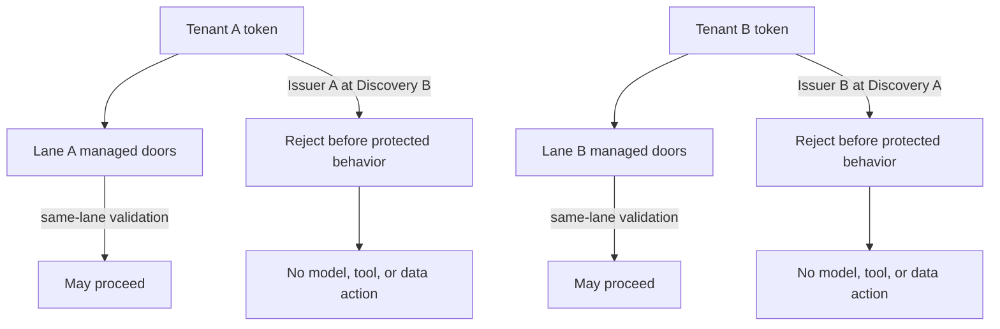
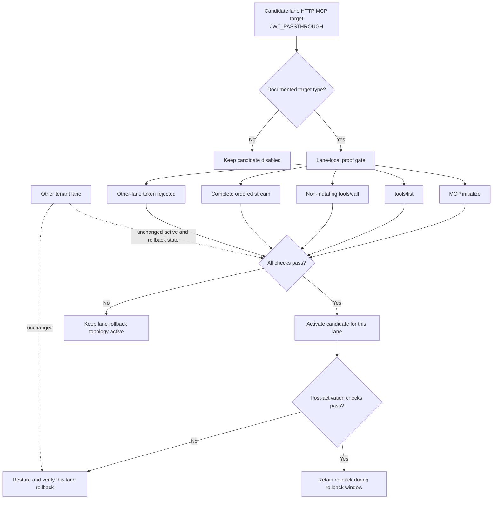
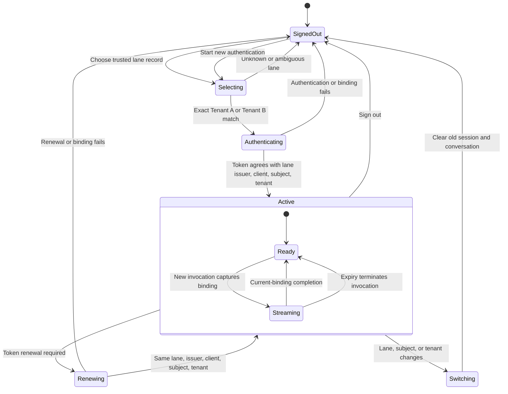

# Multi-Tenant Agent Identity Design

## Overview

This design implements Route C for a fixed proof of concept with exactly two independent tenant lanes:

- **Tenant A lane:** Tenant A Cognito user pool → Tenant A Agent Runtime → Tenant A AgentCore Gateway → Tenant A Sage MCP Runtime.
- **Tenant B lane:** Tenant B Cognito user pool → Tenant B Agent Runtime → Tenant B AgentCore Gateway → Tenant B Sage MCP Runtime.

Each lane has one trusted Frontend configuration record, one Cognito issuer and discovery URL, one public Frontend app client, one Agent Runtime endpoint, and separate managed JWT authorizers on its Agent Runtime, Gateway, and MCP Runtime. Every managed authorizer uses only the discovery URL assigned to its own lane. The two lanes may deploy the same Agent Application and Sage MCP codebase, but they do not share identity configuration, managed authorizers, endpoints, or mutable migration state.

A user Cognito **access token** remains the sole bearer credential through the selected lane. The Frontend, Agent Application, and Sage MCP preserve exact bearer bytes at their code-owned forwarding boundaries, while Gateway-to-MCP-Runtime propagation is established through deployed `JWT_PASSTHROUGH` configuration and behavioral authorization tests rather than managed ingress-and-egress byte comparison:

`Frontend → lane Agent Runtime → lane Gateway → lane MCP Runtime → shared Sage API`

Both lanes converge only at the shared Sage API. The API has a server-controlled issuer map with exactly two entries. It may decode only an unverified `iss` candidate to select one exact-map validation configuration; it then independently verifies signature, issuer, expiry, trusted client, `token_use=access`, and operation scope before treating any claim as identity authority.

Route C performs no downstream M2M acquisition, token exchange, on-behalf-of flow, OAuth credential-provider flow, signed context-token flow, or workload-token use. Browser renewal remains browser-only. Prompts, payloads, query parameters, caller headers, model output, and tool arguments cannot select a lane, issuer, validation configuration, subject, or tenant. Sage API remains the final permission, tenant-isolation, and row-level-security boundary.

### Goals

- Bind each browser authentication session to exactly one trusted Tenant A or Tenant B lane record.
- Use one tenant pool, issuer, and discovery URL per lane, with separate same-lane authorizers at all managed doors.
- Reject a token from either tenant at every managed door in the other tenant's lane before protected behavior.
- Preserve the original access-token bytes at the code-owned Frontend, Agent Application, and Sage MCP forwarding boundaries.
- Configure Gateway-to-MCP-Runtime forwarding through an HTTP passthrough target with `protocolType: MCP` and `JWT_PASSTHROUGH`, without claiming managed-service byte observability or semantic MCP target support.
- Validate both issuers safely at the shared API through exact allowlist selection followed by cryptographic verification.
- Keep configuration activation, proof, rollback, and failure isolated per lane.
- Keep authentication artifacts out of model-controlled and routinely observable sinks while retaining the trusted Authorization transport value.
- Preserve browser-only renewal, no automatic write replay, API authorization, and API RLS.

### Non-goals

This feature does not implement a shared agent-facing Cognito pool, federation between the two tenant identity sources, dynamic tenant onboarding, a third tenant, public/headless MCP clients, M2M fallback, token exchange, cryptographic actor chains, signed context tokens, audit persistence, policy authoring, or direct customer datastore access from the Agent Application or Sage MCP.

### Retained service constraints

This revision retains the already-established Route C service constraints and does not introduce new research claims. The design is behavioral: concrete wrappers, callback layers, repository classes, topology state machines, serializer aliases, and SDK subclasses are optional and must not be retained solely to mirror a test. The deployed Sage API remains a real HTTP boundary, and the deployment manifest/dry-run remains the source of candidate and rollback evidence.


1. This specification admits only an AgentCore Gateway HTTP passthrough target with `targetConfiguration.http.passthrough.protocolType: MCP` and `JWT_PASSTHROUGH`; AgentCore Runtime targets and semantic MCP targets are excluded. [Gateway target authorization](https://docs.aws.amazon.com/bedrock-agentcore/latest/devguide/gateway-building-adding-targets-authorization.html)
2. HTTP passthrough targets can use `protocolType: MCP`, are addressed through a target-specific path, and do not provide semantic aggregation or capability synchronization. [HTTP passthrough targets](https://docs.aws.amazon.com/bedrock-agentcore/latest/devguide/gateway-target-http-passthrough.html) and [HTTP targets](https://docs.aws.amazon.com/bedrock-agentcore/latest/devguide/gateway-targets-http.html)
3. A Runtime or Gateway custom JWT authorizer has one discovery URL plus configured clients, scopes, audiences, and fixed custom-claim rules. [Inbound JWT authorizer](https://docs.aws.amazon.com/bedrock-agentcore/latest/devguide/inbound-jwt-authorizer.html)
4. Runtime can expose a validated Authorization header to application code when the header is explicitly allowlisted. [Runtime header allowlist](https://docs.aws.amazon.com/bedrock-agentcore/latest/devguide/runtime-header-allowlist.html)
5. Cognito pre-token-generation event `V2_0` can customize user access tokens while Cognito-owned claims remain protected. [Pre-token-generation trigger](https://docs.aws.amazon.com/cognito/latest/developerguide/user-pool-lambda-pre-token-generation.html)
6. Cognito access tokens contain the claims used by this design, and browser renewal produces a new access token. [Access tokens](https://docs.aws.amazon.com/cognito/latest/developerguide/amazon-cognito-user-pools-using-the-access-token.html) and [refresh tokens](https://docs.aws.amazon.com/cognito/latest/developerguide/amazon-cognito-user-pools-using-the-refresh-token.html)

For each lane, deployment records the official supporting source and its actual retrieval date as target-capability evidence. The design invents no numeric token-lifetime bound; each configured lifetime must match customer-approved documentation exactly.

## Architecture

### Fixed two-lane trust path

```mermaid
flowchart LR
    subgraph Browser[Frontend]
        Choice[Select Tenant A or Tenant B]
        Config[Trusted lane configuration<br/>exactly two records]
        Session[Lane-bound browser session]
        Choice --> Config --> Session
    end

    subgraph LaneA[Tenant A Route C lane]
        PoolA[Tenant A Cognito pool<br/>Issuer A]
        ARA[Agent Runtime A<br/>Discovery A]
        AppA[Shared Agent code<br/>lane A deployment]
        GWA[Gateway A<br/>Discovery A]
        MRA[MCP Runtime A<br/>Discovery A]
        MCPA[Shared MCP code<br/>lane A deployment]
        PoolA -->|Access JWT A| Session
        ARA --> AppA --> GWA -->|HTTP MCP<br/>JWT_PASSTHROUGH| MRA --> MCPA
    end

    subgraph LaneB[Tenant B Route C lane]
        PoolB[Tenant B Cognito pool<br/>Issuer B]
        ARB[Agent Runtime B<br/>Discovery B]
        AppB[Shared Agent code<br/>lane B deployment]
        GWB[Gateway B<br/>Discovery B]
        MRB[MCP Runtime B<br/>Discovery B]
        MCPB[Shared MCP code<br/>lane B deployment]
        PoolB -->|Access JWT B| Session
        ARB --> AppB --> GWB -->|HTTP MCP<br/>JWT_PASSTHROUGH| MRB --> MCPB
    end

    Session -->|Selected endpoint + same bearer| ARA
    Session -->|Selected endpoint + same bearer| ARB
    MCPA -->|Same bearer| API[Shared Sage API]
    MCPB -->|Same bearer| API
    API --> Select[Exact two-key issuer map<br/>unverified iss selects candidate only]
    Select --> Verify[Independent cryptographic validation]
    Verify --> Authz[Subject + tenant authorization]
    Authz --> RLS[RLS / tenant isolation]
```



The Frontend sends to only one lane endpoint per invocation. The two diagram edges from the session represent mutually exclusive trusted configuration choices, not fan-out. Issuer A is invalid at every managed door in Lane B, and Issuer B is invalid at every managed door in Lane A.

### Selected-lane request sequence

```mermaid
sequenceDiagram
    autonumber
    actor User
    participant UI as Frontend
    participant Pool as Selected tenant Cognito pool
    participant Runtime as Selected lane Agent Runtime
    participant Agent as Agent Application
    participant Gateway as Selected lane Gateway
    participant MCPRuntime as Selected lane MCP Runtime
    participant MCP as Sage MCP
    participant API as Shared Sage API

    User->>UI: Select configured Tenant A or Tenant B lane
    UI->>Pool: Authenticate with selected lane pool/client
    Pool->>Pool: V2_0 access-token customization
    Pool-->>UI: Lane access JWT + browser renewal material
    UI->>UI: Bind issuer, client, subject, tenant, lane, session
    UI->>Runtime: Authorization Bearer original JWT
    Runtime->>Runtime: Validate against selected lane discovery URL
    Runtime->>Agent: Allowlisted original Authorization header
    Agent->>Gateway: Same bearer bytes
    Gateway->>Gateway: Validate against same-lane discovery URL
    Gateway->>MCPRuntime: Configured JWT_PASSTHROUGH
    MCPRuntime->>MCPRuntime: Validate against same-lane discovery URL
    MCPRuntime->>MCP: Original Authorization header
    MCP->>MCP: Extract subject/tenant; require hosting-lane tenant
    MCP->>API: Same bearer bytes
    API->>API: Read unverified iss candidate only
    API->>API: Exact two-key allowlist lookup
    API->>API: Verify signature, issuer, expiry, client, type, scope
    API->>API: Authorize subject and tenant then establish isolation context
    API-->>MCP: Tenant-scoped result
    MCP-->>Agent: Sanitized tool result
    Agent-->>UI: Sanitized ordered stream
```

### Cross-lane rejection



Cross-lane rejection is required independently at Agent Runtime, Gateway, and MCP Runtime. The shared Sage API does not accept a caller-selected lane; it derives the candidate issuer only from the token, requires an exact key in its two-entry server map, verifies with that entry, and then requires the verified issuer and signed tenant claim to match the same entry.

### Per-lane target proof and rollback



Each lane owns independent candidate, active, and rollback state. A failure in Lane A cannot mutate Lane B's active target, Gateway route, rollback snapshot, or enabled state, and vice versa.

### Authentication-session state



Same-identity renewal in the same lane preserves Conversation. Any lane, subject, or signed-tenant change terminates the old session, clears Conversation, and causes late events to be discarded.

### Door responsibilities

| Boundary | Trusted validation/authority | Must not do |
|---|---|---|
| Frontend | Resolve exactly one of two trusted lane records; bind pool, client, endpoint, issuer, subject, and signed tenant to session | Build endpoints from caller content; send refresh material downstream |
| Lane Agent Runtime | Validate against that lane's sole discovery URL, clients, `sage-agent/invoke`, expiry, signature, `token_use=access`, and `custom:tenant_id=expected tenant` | Accept the other issuer; make business-permission decisions |
| Agent Application | Preserve original bearer and correlation ID | Re-verify managed JWT decisions; acquire M2M/exchanged/workload/context tokens; treat prompts or headers as tenant authority |
| Lane Gateway | Validate against that lane's sole discovery URL, clients, `sage-gateway/invoke`, token type, and expected tenant; select target path | Use the other lane's issuer/config; use OAuth credentials for Route C |
| Lane MCP Runtime | Unconditionally validate against that lane's sole discovery URL, clients, `sage-mcp/invoke`, token type, expected tenant, and reject cross-lane tokens; enforce same-lane Gateway source only if the Source Signal Proof Gate proves a verifiable signal for the exact topology | Claim an unproven source restriction; make business-permission decisions |
| Sage MCP | Extract exactly one subject and signed tenant, bind the tenant to the hosting lane, and call the shared API with the same bearer | Claim to re-verify signature, expiry, issuer, client, or managed scope; direct datastore access; refresh; caller tenant authority |
| Shared Sage API | Exact two-key issuer-map selection and independent JWT validation, then subject authorization, then tenant authorization, then RLS/isolation | Trust unverified claims, upstream authorization, or caller-selected validation config |

### Scope profile

The unchanged token carries the cumulative subset authorized for the user and lane client. Each door enforces only its local requirement:

| Scope | Enforced at |
|---|---|
| `sage-agent/invoke` | Agent Runtime in either lane |
| `sage-gateway/invoke` | Gateway in either lane |
| `sage-mcp/invoke` | MCP Runtime in either lane |
| `sage-api/read` | Shared Sage API read operations |

This bounds authority but does not create hop-specific audience separation. No component mints a narrower replacement token. If a future Sage API mutating endpoint is added, that endpoint must define and enforce its own write authorization before deployment; no write scope or write path exists in the current API.

## Components and Interfaces

### 1. Trusted lane records and deployment evidence

Deployment-owned state contains the two fixed lane records and production evidence needed by authorizer, target, and source-signal checks. The runtime uses immutable records; it does not require an in-memory aggregate or generic configuration validator.

```python
@dataclass(frozen=True)
class TenantLaneConfiguration:
    lane_id: str
    tenant_id: str
    user_pool_id: str
    issuer: str
    discovery_url: str
    frontend_client_ids: frozenset[str]
    agent_runtime_endpoint: str
    agent_runtime_id: str
    gateway_id: str
    gateway_target_url: str
    mcp_runtime_id: str
    expected_tenant_claim: str
```

Deployment and focused tests keep the observable two-lane, same-lane authorizer, target-evidence, source-signal, and rollback behavior fail-closed without prescribing an aggregate configuration model.

### 2. Tenant-specific Cognito pools and token customizers

Each lane uses its existing tenant-specific Cognito user pool and one public Frontend app client with no secret. There is no federating agent-facing pool. Each pool has exactly one administratively controlled trusted tenant-assignment source and a `V2_0` pre-token-generation trigger.

```python
def lambda_handler(event: object, _context: object) -> dict:
    """Load immutable lane grants and customize a Cognito V2 access token."""
```

The lane deployment supplies immutable expected issuer, pool, assignment source, tenant value, client set, claim name, and authorized scopes through `SAGE_TOKEN_CUSTOMIZER_CONFIG`. Before activation, deployment verification requires a qualified Lambda alias/version, verifies the approved `CodeSha256` and handler, confirms the active Cognito configuration uses `V2_0`, and checks the Lambda configuration agrees with the lane. The customizer:

1. requires `V2_0` for initial and renewed interactive-user access tokens;
2. reads the assignment only from the issuing pool's trusted administrative source;
3. requires exactly one non-empty string equal to that lane's expected tenant value;
4. writes exactly one canonical tenant claim;
5. derives the Authorized Route C Scope Set for the authenticated subject and Frontend client;
6. uses `scopesToAdd` only for authorized Route C scopes absent from the incoming scope set;
7. uses `scopesToSuppress` for every non-Route-C Cognito scope and unauthorized Route C scope present in the incoming scope set;
8. produces a final scope set exactly equal to the Authorized Route C Scope Set; and
9. preserves Cognito-owned non-scope claims `iss`, `exp`, `sub`, `client_id`, and `token_use` unchanged.

Caller metadata, prompts, request fields, and headers are never assignment sources. Invalid assignment fails issuance. If either pool's active feature plan or active `V2_0` trigger/customizer configuration is unsupported or unverifiable, the proposed two-lane configuration cannot activate. ID tokens are not Route C credentials.

### 3. Frontend lane registry and authentication coordinator

```ts
export interface TrustedLaneRecord {
  laneId: "Tenant_A" | "Tenant_B";
  tenantId: "Tenant_A" | "Tenant_B";
  issuer: string;
  userPoolId: string;
  appClientId: string;
  agentRuntimeEndpoint: string;
  expectedTenantClaim: string;
}

export interface AuthSession {
  lane: TrustedLaneRecord;
  accessToken: string;
  subject: string;
  tenantId: string;
  expiresAt: number;
  sessionId: string;
}

export interface InvocationBinding {
  sessionId: string;
  laneId: TrustedLaneRecord["laneId"];
  subject: string;
  tenantId: string;
  correlationId: string;
}

export function resolveTrustedLane(laneId: string): TrustedLaneRecord;
export async function establishSession(lane: TrustedLaneRecord): Promise<AuthSession>;
export async function renewSession(current: AuthSession): Promise<AuthSession>;
export async function terminateSession(): Promise<void>;
```

`resolveTrustedLane` performs exact lookup in a fixed two-record registry. Unknown, malformed, absent, or ambiguous input fails before authentication or network access. Authentication and renewal use only the selected record's pool and client. A session becomes valid only when token `iss`, `client_id`, non-empty `sub`, and signed tenant agree with that record.

Invocation uses only `session.lane.agentRuntimeEndpoint`. A lane or tenant value in a prompt, payload, URL parameter, custom header, model output, or tool argument cannot change it. Renewal must preserve lane, issuer, client, subject, and tenant. Failure terminates the session, clears active credentials and Conversation, and returns to authentication.

### 4. Frontend invocation and stale-result guard

```ts
export interface InvocationAuth {
  accessToken: string;
  binding: InvocationBinding;
  endpoint: string;
}

export async function invokeAgent(
  query: string,
  auth: InvocationAuth,
  onEvent: StreamCallback,
  signal: AbortSignal,
): Promise<void>;
```

The client creates exactly one Authorization header and one non-secret correlation header. It sends no tenant authority header and no renewal material. Every response, tool, error, completion, and cancellation event carries the captured binding. Before changing UI state, callbacks compare session ID, lane, subject, and tenant with the current valid session. Mismatches are discarded. Cancellation is best effort; binding comparison provides correctness.

### 5. Per-lane AgentCore authorizer renderer

The same renderer creates three distinct managed authorizer configurations per lane:

```python
def render_lane_authorizers(
    lane: TenantLaneConfiguration,
) -> dict[str, dict]:
    """Render same-lane Runtime, Gateway, and MCP Runtime JWT authorizers."""
```

For Lane A, all three authorizers use Discovery A; for Lane B, all three use Discovery B. Each uses the lane's trusted clients, fixed `token_use EQUALS access`, fixed `custom:tenant_id EQUALS expected tenant`, and exactly one local allowed scope. No authorizer contains both discovery URLs. Managed authorizers do not perform dynamic tenant membership, presented-value comparison, business-permission, or actor-chain decisions.

Agent Runtime and MCP Runtime allowlist Authorization and the correlation header to trusted application code. They do not allowlist caller tenant headers. MCP Runtime issuer, trusted-client, `token_use=access`, local-scope, and cross-lane rejection controls are unconditional. Before activation, the Source Signal Proof Gate evaluates `allowedWorkloadConfiguration` and any documented equivalent only as candidate mechanisms for the exact Gateway HTTP passthrough with `protocolType: MCP` and `JWT_PASSTHROUGH` topology. A same-lane Gateway source restriction is configured and claimed only when documentation evidence, deployed configuration evidence, and behavioral verification prove a Verifiable Gateway Source Signal; otherwise the control is recorded as unavailable and no same-lane source-restriction claim is made.

### 6. Agent Application transport boundary

```python
@dataclass(frozen=True)
class AuthenticationArtifact:
    value: str
    provenance: str = "authorization_header"

@dataclass(frozen=True)
class InvocationContext:
    lane_id: str
    bearer: AuthenticationArtifact
    correlation_id: str


def parse_transport_bearer(authorization_header: str) -> AuthenticationArtifact: ...
def build_gateway_headers(context: InvocationContext) -> dict[str, str]: ...
```

The lane deployment fixes its Gateway URL. The application reads one Runtime-forwarded Authorization header, retains the exact token substring after `Bearer `, and builds a fresh outbound header using the same value. The Agent Runtime managed authorizer owns signature, expiry, issuer, client, token type, local scope, and expected tenant validation; Agent application code does not duplicate those decisions or reserialize the JWT.

No M2M, exchange, OBO, context-token, refresh, or workload-token path exists. AgentCore Identity `requires_access_token` and workload-token decorators are intentionally absent because they obtain replacement outbound credentials. Any auto-injected workload token is ignored. The bearer wrapper never enters prompts, model messages, model-generated tool arguments, stream events, errors, exceptions, or logs.

### 7. Per-lane Gateway HTTP MCP passthrough target

Each lane gets a separate target bound to its separate Gateway and MCP Runtime. The approved target shape is only Gateway HTTP passthrough with `protocolType: MCP` and `JWT_PASSTHROUGH`:

```json
{
  "gatewayIdentifier": "<lane-gateway-id>",
  "name": "sage-mcp-route",
  "targetConfiguration": {
    "http": {
      "passthrough": {
        "endpoint": "https://bedrock-agentcore.<region>.amazonaws.com/runtimes/<url-encoded-lane-mcp-runtime-arn>/invocations?qualifier=<deployed-qualifier>",
        "protocolType": "MCP"
      }
    }
  },
  "credentialProviderConfigurations": [
    { "credentialProviderType": "JWT_PASSTHROUGH" }
  ]
}
```

Before activation, deployed configuration inspection requires the endpoint and path to equal the lane's `MCP_Runtime_Invocation_URL`, composed only from the deployed AWS Region, URL-encoded Sage MCP Runtime ARN, and deployed qualifier. AgentCore Runtime targets, semantic MCP targets, and any in-place `JWT_PASSTHROUGH` assumption for a semantic target are incompatible and rejected.

The Agent MCP client uses that lane's target-specific Gateway URL and performs direct MCP `initialize`, `tools/list`, and `tools/call`. The target has no OAuth credential provider. Gateway validates against its lane's discovery URL and uses configured `JWT_PASSTHROUGH`; exact bearer-byte equality is not asserted across the managed Gateway-to-MCP-Runtime boundary.

### 8. Sage MCP lane identity and API client

The same Sage MCP code may run in both MCP Runtime deployments. Lane identity configuration is injected from trusted deployment state, not request content.

```python
@dataclass(frozen=True)
class RequestIdentity:
    lane_id: str
    subject: str
    tenant_id: str


def establish_request_identity(
    bearer: AuthenticationArtifact,
    configuration: McpIdentityConfiguration,
) -> RequestIdentity: ...
```

FastMCP tools receive injected request headers through `headers: dict = CurrentHeaders()`. After the MCP Runtime managed authorizer validates signature, expiry, issuer, client, token type, local scope, and the exact lane tenant claim, application code parses the forwarded JWT only to extract one non-empty `sub` and canonical tenant claim without overwriting duplicate keys. It requires the extracted tenant to equal the deployment-owned hosting lane. It does not claim to re-verify any managed authorizer decision.

Sage MCP calls the shared Sage API with the exact original bearer and correlation ID. It sends no derived tenant-authority header and contains no direct customer datastore credentials or fallback data path.

### 9. Shared Sage API issuer selection and validation

```python
@dataclass(frozen=True)
class ApiIssuerConfiguration:
    issuer: str
    discovery_url: str
    expected_tenant_id: str
    trusted_client_ids: frozenset[str]

AllowedTenantIssuerMap = Mapping[str, ApiIssuerConfiguration]


def select_issuer_configuration(
    encoded_jwt: str,
    allowed_issuers: AllowedTenantIssuerMap,
) -> ApiIssuerConfiguration: ...

def validate_access_token(
    encoded_jwt: str,
    allowed_issuers: AllowedTenantIssuerMap,
) -> VerifiedApiIdentity: ...
```

The map has exactly two keys: Issuer A and Issuer B. Each key maps to exactly one discovery URL, expected tenant value, and trusted-client set. Selection follows a strict two-stage boundary:

1. Parse only enough unverified JWT payload structure to obtain exactly one non-empty string `iss` candidate.
2. Require exact, case-sensitive key membership in the server-controlled two-entry map.
3. Select only that key's immutable configuration.
4. Cryptographically validate signature and confirm the same issuer, then validate expiry, trusted `client_id`, `token_use=access`, the fixed `sage-api/read` scope, exact non-empty `sub`, and exact signed tenant.
5. Require verified issuer and signed tenant to match the same selected map entry.
6. Only after all checks succeed, use claims for subject permission, tenant-resource authorization, and isolation context.

Absent, duplicate, non-string, empty, unknown, or cryptographically unconfirmed issuers fail before protected behavior. No URL, key set, issuer, or validation parameters are constructed from the candidate. Upstream validation does not substitute for API validation.

For pooled relational data, the API sets and verifies RLS context from the signed tenant before every read or change. For non-relational data, it establishes and verifies the existing tenant-isolation control. False or indeterminate validation, permission, tenant, source, or isolation results produce zero data operations.

### 10. Authentication-artifact provenance and sinks

Credential-bearing boundary fields are typed. Values originating in Authorization, access-token, browser-renewal, refresh-token, or workload-token fields retain authentication-artifact provenance through copies, transformations, and nesting. Every Route C ingress schema rejects browser-renewal material or refresh-token fields before protected behavior; these credentials are valid only in browser communication with the selected lane's Cognito pool.

- Trusted transport serializers may unwrap the access token only into the designated Authorization header.
- Model, tool, and UI serializers use positive safe-field allowlists and cannot serialize artifact wrappers.
- Log, trace, exception, and error serializers omit artifacts or replace the entire value with `[REDACTED_AUTH_ARTIFACT]`.
- Classification is based on source and data flow, never field-name substring, value substring, or JWT-shaped text.
- Stable errors contain only a safe code, generic message, and correlation ID.

### 11. Correlation and source-control proof

One opaque, non-secret correlation ID is established per invocation and propagated unchanged through the selected lane and shared API. Each door exposes correlation ID, door identity, lane identity, verified subject, signed tenant, and outcome to `agent-audit-observability` without exposing the token.

For each MCP Runtime, the Source Signal Proof Gate records documentation evidence, deployed configuration evidence, and behavioral verification for the exact HTTP MCP passthrough plus `JWT_PASSTHROUGH` topology. `allowedWorkloadConfiguration` is candidate-only. If a Verifiable Gateway Source Signal is proven, the MCP Runtime restricts requests to its same-lane Gateway and rejects missing or wrong signals; if not, the control is recorded as unavailable and the design makes no same-lane Gateway source-restriction claim. Regardless of that result, each MCP Runtime unconditionally enforces lane issuer, trusted client, `token_use=access`, local scope, and cross-lane rejection. Sage API unconditionally accepts network requests only from the two documented Sage MCP Approved Source Paths and customer-application Approved Source Paths. Correlation is operational evidence, not a cryptographic actor chain.

## Data Models

### Configuration models

| Model | Fields | Invariants |
|---|---|---|
| `TenantLaneConfiguration` | lane/tenant, pool, issuer, discovery URL, clients, endpoint, Runtime, Gateway, target URL, MCP Runtime, expected tenant | One value per field; issuer/discovery/endpoint/tenant distinct across lanes; immutable |
| `ApiIssuerConfiguration` | issuer, discovery URL, expected tenant, trusted clients | One exact validation configuration per issuer |
| `AllowedTenantIssuerMap` | Issuer A entry, Issuer B entry | Exactly two entries; no runtime insertion or caller-selected configuration |
| `TargetCapabilityEvidence` | lane, exact target type, source URL, retrieval date, protocol, credential type | HTTP passthrough MCP + JWT passthrough evidence required per lane |
| `SourceSignalProofRecord` | lane, candidate mechanism, documentation evidence, deployed evidence, behavioral result, classification | `allowedWorkloadConfiguration` is candidate-only; same-lane restriction is claimed only when proven, otherwise recorded unavailable |

### Runtime models

| Model | Fields | Invariants |
|---|---|---|
| `TrustedLaneRecord` | lane, tenant, pool, client, issuer, Agent endpoint | One of two immutable Frontend records |
| `AuthSession` | lane record, access token, subject, tenant, expiry, session ID, browser renewal handle | Claims agree with lane; renewal handle remains browser-only |
| `InvocationBinding` | session ID, lane, subject, tenant, correlation ID | Captured once; every event must match current binding |
| `AuthenticationArtifact` | value, provenance | Immutable; only trusted transport may unwrap |
| `RequestIdentity` | lane, subject, tenant | Exact non-empty application claims; lane/tenant agreement; immutable |
| `UnverifiedIssuerCandidate` | one raw `iss` value | Used only for exact API map lookup; never identity authority |
| `VerifiedApiIdentity` | selected map entry, verified issuer, subject, tenant, scopes | Created only after complete independent validation |
| `PresentedTenantValues` | source location and value pairs | Comparison-only; never authority or forwarded tenant headers |
| `IdentityError` | stable code, safe message, correlation ID | No credential, decoded payload, presented value, or nested cause |
| `AuditBoundaryEvent` | correlation, door, lane, subject, tenant, outcome | Non-secret operational evidence; no token or actor-chain claim |

No identity datastore is added. Cognito owns user and renewal state, the browser owns the active session, lane deployment configuration owns lane identity, Sage API owns final authorization and data isolation, and `agent-audit-observability` owns audit persistence.

## Correctness Properties

*A property is a characteristic or behavior that should hold true across all valid executions of a system—essentially, a formal statement about what the system should do. Properties serve as the bridge between human-readable specifications and machine-verifiable correctness guarantees.*

### Property 1: Two-lane configuration acceptance is exact, atomic, and lane-consistent

For all proposed tenant, pool, lane, issuer, discovery URL, endpoint, door, client-set, and prior-configuration combinations, a proposal activates only when it contains exactly Tenant A and Tenant B with one distinct pool and lane each, one same-lane issuer/discovery/endpoint/tenant binding per record, and exactly one same-lane discovery URL per managed door; every rejected proposal preserves the last valid configuration or leaves Route C disabled when none exists.

**Validates: Requirements 1.1, 1.2, 1.3, 1.6, 1.7, 1.8, 1.10, 1.11, 1.12, 1.13, 1.14, 1.15, 14.1, 14.2, 14.3, 14.5, 14.6**

### Property 2: Token customization derives one lane tenant claim and exact authorized scopes only from trusted pool state

For all initial or renewal events, lane configurations, active Cognito feature plans, active PreTokenGeneration configurations, trusted assignment-source results, caller-presented values, Cognito-owned claims, incoming scopes, and authorized scope sets, the two-lane configuration activates only when both pools support access-token customization and both active triggers use `V2_0` and invoke the configured customizer; customization succeeds only when the issuing pool resolves exactly one non-empty tenant equal to its lane's expected value, emits exactly one canonical tenant claim, uses `scopesToAdd` only for missing authorized Route C scopes and `scopesToSuppress` for every non-Route-C or unauthorized scope, produces a final scope set exactly equal to the Authorized Route C Scope Set, and preserves Cognito-owned non-scope claims; otherwise configuration activation or issuance fails as applicable.

**Validates: Requirements 2.1, 2.2, 2.3, 2.4, 2.5, 2.12, 2.13, 2.14, 2.15, 2.16, 2.17, 2.18, 2.19, 2.20, 2.21, 14.7, 14.9**

### Property 3: Browser lane and session binding cannot be redirected by caller content

For all supported, unknown, malformed, and caller-supplied lane or tenant values and all authentication/renewal claim sets, the Frontend authenticates and invokes only through the exact current trusted lane record; it creates or preserves a session only when issuer, client, subject, tenant, and lane agree, and any failed or changed binding terminates the session without sending a request or exposing renewal material downstream.

**Validates: Requirements 3.1, 3.2, 3.3, 3.4, 3.5, 3.6, 3.7, 3.8, 3.9, 3.10, 3.11, 3.12, 3.13, 3.14, 3.16, 3.17, 3.18, 14.10, 14.11**

### Property 4: Code-owned forwarding preserves the original bearer and excludes replacement paths

For all valid access-token byte sequences and selected-lane invocations, the Frontend emits exactly one Authorization header whose bearer equals the current access token, the Agent Application emits exactly one Authorization header whose bearer equals the one received from Agent Runtime, and Sage MCP emits exactly one Authorization header whose bearer equals the one received from MCP Runtime; Gateway-to-MCP-Runtime uses configured `JWT_PASSTHROUGH` without asserting observable byte equality, and all M2M, exchange, OBO, OAuth-provider, context-token, workload-token, downstream-renewal, extra-credential, and caller-derived tenant-header paths occur zero times; malformed or non-preservable code-owned input blocks the next downstream operation.

**Validates: Requirements 4.1, 4.2, 4.3, 4.4, 4.5, 4.6, 4.7, 4.8, 4.9, 4.10, 4.11, 4.12, 4.13, 4.14, 4.15, 4.16, 6.10, 14.12, 14.27**

### Property 5: Managed doors validate only their own lane and reject the other lane

For all lane authorizer configurations and tokens from either tenant, each Agent Runtime, Gateway, and MCP Runtime uses exactly its lane's sole discovery URL, trusted clients, local scope, `token_use EQUALS access`, and `custom:tenant_id EQUALS expected tenant`; a token can reach protected behavior only through same-lane validation, and every token presented to any managed door in the other lane is rejected before protected behavior. Agent and Sage MCP application code do not claim to repeat managed cryptographic, issuer, client, token-type, or scope validation.

**Validates: Requirements 5.1, 5.2, 5.3, 5.4, 5.5, 5.6, 5.13, 5.14, 5.15, 5.16, 14.13, 14.14, 14.15, 14.16**

### Property 6: Shared API issuer selection is exact and unverified claims never become authority

For all encoded token payloads and the fixed two-entry issuer map, the API selects a candidate configuration only from exactly one non-empty string `iss` that exactly matches one map key, selects only that key's immutable configuration, and creates verified identity only after cryptographic validation confirms the same issuer plus expiry, trusted client, access-token type, operation scope, subject, and tenant; every absent, duplicate, malformed, unknown, or unconfirmed candidate produces zero protected behavior.

**Validates: Requirements 5.7, 5.8, 5.9, 5.10, 5.11, 5.12, 5.13, 14.17, 14.18**

### Property 7: Each door enforces exactly its required least-privilege scope

For all authorized subject-scope sets, issued scope sets, door types, operation types, and presented tokens, issued scopes are a subset of those authorized for the user and lane client, each managed door requires only its one defined local invoke scope, and the API independently requires read scope for reads or write scope for creates, updates, and deletes; absence of the required scope blocks protected behavior.

**Validates: Requirements 6.1, 6.2, 6.3, 6.4, 6.5, 6.6, 6.7, 6.8, 6.9, 6.11, 14.19**

### Property 8: Managed validation plus application subject, tenant, and hosting lane are the only identity authority

For all pair-preserving token claim sets and trusted hosting-lane records, Sage MCP receives only managed-authorized requests, extracts exactly one non-empty `sub` and canonical tenant claim, and requires the tenant to match the hosting lane without duplicating managed authentication. Sage API independently establishes verified identity only after the issuer and tenant match the same trusted issuer-map entry. Malformed or mismatched application claims reject, Presented Tenant Values remain non-authoritative, and established identity remains immutable for the request.

**Validates: Requirements 7.1, 7.2, 7.3, 7.4, 7.5, 7.6, 7.7, 7.8, 7.9, 7.10, 7.11, 7.12, 7.13, 7.14, 7.15, 7.16, 7.17, 7.18, 7.19, 14.20, 14.21**

### Property 9: Sage API is the fail-closed permission and tenant-data boundary

For all two-entry issuer maps, subjects, tenants, operations, resources, token outcomes, permission outcomes, and isolation outcomes, Sage MCP accesses customer data only through Sage API with the original bearer, and Sage API performs independent token, operation, subject, tenant, and RLS or non-relational isolation checks before access or change; any false or indeterminate result, including API unavailability, produces zero direct or fallback customer-data operations from Agent or MCP.

**Validates: Requirements 8.1, 8.2, 8.3, 8.4, 8.5, 8.6, 8.7, 8.8, 8.9, 8.10, 8.11, 8.12, 8.13, 8.14, 14.22, 14.23**

### Property 10: Only Gateway HTTP MCP passthrough can activate, with lane-local rollback

For all target proposals, deployed target configurations, documentation evidence, protocol-proof outcomes, cross-lane checks, post-activation outcomes, and two-lane topology states, a candidate activates only when it is a Gateway HTTP passthrough target with `targetConfiguration.http.passthrough.protocolType` equal to `MCP`, a `JWT_PASSTHROUGH` credential-provider entry, and endpoint/path exactly equal to the lane's `MCP_Runtime_Invocation_URL` composed from deployed Region, URL-encoded Runtime ARN, and qualifier; AgentCore Runtime targets and semantic MCP targets always reject, every required protocol and cross-lane check must pass, failure keeps or restores that lane's verified rollback topology, and every transition leaves the other lane unchanged.

**Validates: Requirements 9.1, 9.2, 9.3, 9.4, 9.5, 9.6, 9.7, 9.8, 9.9, 9.10, 9.11, 9.12, 9.13, 9.14, 9.15, 9.16, 9.17, 9.18, 9.19, 14.24, 14.25, 14.26**

### Property 11: Expiry terminates one invocation and never automatically replays a write

For all token-expiry positions, lane sessions, downstream operation sequences, and read/write operation classes, an expired token is rejected at the receiving door, the affected invocation terminates with zero later downstream operations, and another attempt occurs only as a new invocation in the same lane after browser renewal; every mutating retry requires explicit user action and is never replayed automatically.

**Validates: Requirements 10.1, 10.2, 10.3, 10.4, 10.5, 10.6, 10.7, 10.8, 10.9, 10.10, 10.11, 10.12, 14.28**

### Property 12: Conversation accepts events only from the current lane-bound identity

For all session, lane, subject, tenant, renewal, sign-out, invocation, and event sequences, identity change or sign-out clears Conversation before new activity, no-session states stay empty and reject invocation, same-lane same-identity renewal preserves Conversation, and every event not matching the current session, lane, subject, and tenant leaves Conversation and streaming state unchanged.

**Validates: Requirements 11.1, 11.2, 11.3, 11.4, 11.5, 11.6, 11.7, 11.8, 11.9, 11.10, 11.11, 11.12, 11.13, 14.29**

### Property 13: Authentication-artifact provenance permits only trusted transport

For all values originating from credential-bearing fields, arbitrary copy/transform/nesting graphs, and model/tool/UI/log/trace/exception/error sinks, provenance is preserved by data flow rather than text heuristics, trusted Authorization transport emits the original complete bearer, and every non-transport sink omits or completely redacts artifacts; workload-token-derived values reach neither downstream transport nor observable sinks.

**Validates: Requirements 12.1, 12.2, 12.3, 12.4, 12.5, 12.6, 12.7, 12.8, 12.9, 12.10, 12.11, 12.12, 12.13, 12.14, 14.30, 14.31**

### Property 14: Approved lifetime and conditional source proof fail closed without weakening unconditional controls

For all lane lifetime records, policy approvals, current times, Source Signal Proof Gate evidence and outcomes, MCP requests, API source paths, and protected operations, Route C enables only when each lane's active and documented lifetime values are exactly equal and approved, adds no design-invented numeric lifetime bound, rejects token use at or after `exp`, and permits another attempt only after browser renewal or reacquisition; an MCP same-lane Gateway source restriction is configured and enforced only when documentation, deployed configuration, and behavioral evidence prove a Verifiable Gateway Source Signal for the exact HTTP MCP passthrough plus `JWT_PASSTHROUGH` topology, otherwise the control is recorded unavailable and no such claim is made; in either case MCP issuer, trusted-client, `token_use=access`, local-scope, and cross-lane rejection remain unconditional, and Sage API unconditionally rejects requests outside its documented Approved Source Paths before protected behavior.

**Validates: Requirements 13.2, 13.3, 13.4, 13.5, 13.6, 13.7, 13.8, 13.9, 13.10, 13.11, 13.12, 13.13, 13.14, 13.15, 13.16, 14.32, 14.33, 14.34, 14.35, 14.36**

### Property 15: Correlation and audit evidence are operational, unchanged, and non-secret

For all invocations and selected-lane door sequences, exactly one correlation ID with no authentication-artifact provenance is established, propagated unchanged, and made available with door, lane, verified subject, signed tenant, and authorization outcome as operational audit evidence; no cryptographic actor-chain claim is created, and audit persistence, retention, search, alerting, and reporting remain outside this feature.

**Validates: Requirements 13.17, 13.18, 13.19, 13.20, 13.21, 13.22, 14.37, 14.38**

## Error Handling

Errors fail at the earliest selected-lane boundary and never trigger another credential mode. Public errors contain a stable code, generic message, and safe correlation ID only.

| Boundary | Condition | Public result | Required effect |
|---|---|---|---|
| Two-lane configuration | Cardinality, distinctness, or lane binding invalid | Configuration error | No activation; preserve last valid two-lane config or remain disabled |
| Cognito customizer | Wrong trigger version or invalid trusted assignment | `token_issuance_rejected` | No access token issued |
| Frontend lane selection | Unknown, malformed, or ambiguous lane | `lane_invalid` | No authentication or lane request |
| Frontend session | Claims disagree with selected lane or renewal fails | `session_required` / `session_expired` | Clear credentials and Conversation; show authentication |
| Lane Agent Runtime | Wrong issuer/signature/expiry/client/scope/type, including cross-lane token | Managed 401/403 | Agent code not invoked |
| Agent Application | Missing/malformed forwarded bearer | `identity_invalid` | No model or Gateway operation |
| Lane Gateway | Independent JWT/local-scope failure | Managed 401/403 | No target invocation |
| Lane MCP Runtime | JWT/client/type/scope or cross-lane failure, or proven source-signal failure when that control is available | Managed 401/403 | Sage MCP not invoked; an unavailable source signal is recorded rather than claimed |
| Sage MCP | Issuer/lane/subject/tenant/cardinality/membership/mismatch failure | `tenant_identity_invalid` | No Sage API call |
| Sage API issuer selection | Missing, duplicate, malformed, or unknown candidate | `not_authorized` | No validation URL construction or protected behavior |
| Sage API verification | Cryptography, issuer confirmation, scope, permission, tenant, source, or isolation fails | `not_authorized` | No data access/change |
| Token expiry | Expiry before or during invocation | `session_expired` | Terminate; no later calls; browser renewal required |
| Stale event | Binding differs from current session/lane/identity | No visible error | Discard without state mutation |
| Lane proof gate | Capability, protocol, stream, or wrong-lane rejection fails | Candidate rejection | Candidate disabled; affected rollback unchanged; other lane unchanged |
| Post-activation check | Affected lane acceptance check fails | Rollback required | Restore/verify affected rollback only |
| Unexpected failure | Any uncaught error | `request_failed` | Sanitized failure; no credential detail; fail closed |

## Deployment Changes and Migration

### Pre-deployment validation

Before mutating AWS resources, the deployment logic validates in memory:

1. exactly two lane records named Tenant A and Tenant B;
2. exactly two distinct existing tenant pools with no shared agent-facing pool or cross-tenant federation;
3. one issuer, discovery URL, public client set, endpoint, Agent Runtime, Gateway, MCP Runtime, and expected tenant per lane;
4. one same-lane discovery URL on each of the six managed authorizers;
5. one canonical tenant claim name shared across both lanes and Sage API;
6. both pools' active Cognito feature plans support access-token customization, both active PreTokenGeneration configurations use `V2_0` and invoke the configured customizer, and each pool has one trusted assignment source;
7. per-door local scopes, fixed `token_use EQUALS access`, and fixed `custom:tenant_id EQUALS expected tenant`;
8. a shared API map with exactly Issuer A and Issuer B entries and validation-before-subject-authorization-before-tenant-authorization-before-isolation ordering;
9. no M2M client, token endpoint, secret, OAuth credential provider, exchange, context-token, or workload-token dependency;
10. per-lane official Gateway HTTP passthrough target evidence with the actual retrieval date, `protocolType: MCP`, `JWT_PASSTHROUGH`, and endpoint/path equality to the Region-, URL-encoded Runtime ARN-, and qualifier-composed `MCP_Runtime_Invocation_URL`;
11. separate immutable rollback snapshots for both lanes;
12. documented/active approved lifetime equality per lane;
13. Source Signal Proof Gate evidence and classification per MCP Runtime, treating `allowedWorkloadConfiguration` only as a candidate and requiring a source restriction only when proven; and
14. unconditional MCP Runtime lane JWT/client/type/scope/cross-lane controls plus unconditional approved Sage API source paths.

Failure occurs before deployment mutation. The validator preserves the last valid configuration or leaves Route C disabled.

### Deployment artifacts

- **Tenant Cognito configuration:** configure each existing tenant pool independently with its public Frontend client, trusted tenant source, `V2_0` trigger/customizer, `scopesToAdd`, `scopesToSuppress`, and approved lifetime. Verify both active feature plans and triggers before activation; the issued final scope set must exactly equal the Authorized Route C Scope Set while Cognito-owned non-scope claims remain unchanged. Do not create a federating agent-facing pool.
- **Trusted Frontend lane output:** emit exactly two immutable records containing lane ID, tenant ID, issuer, pool/client, Agent Runtime endpoint, and expected tenant value. Do not emit caller-extensible endpoint maps.
- **Gateway deployment:** create or update Gateway A and Gateway B separately. Preserve each existing semantic target as that lane's rollback. Create only a distinct Gateway HTTP passthrough target with `protocolType: MCP`, `JWT_PASSTHROUGH`, and endpoint/path exactly equal to the composed lane `MCP_Runtime_Invocation_URL`; create no AgentCore Runtime target or OAuth provider.
- **Agent Runtime deployment:** deploy the same Agent code if desired to Runtime A and Runtime B, but configure each Runtime with only its lane's discovery URL, trusted clients, Agent scope, token-use rule, Gateway URL, and lane identity.
- **MCP Runtime deployment:** deploy the same MCP code if desired to Runtime A and Runtime B, with unconditional lane discovery URL, trusted-client, MCP-scope, token-use, cross-lane, expected issuer/tenant, and shared API settings. Apply a same-lane Gateway source restriction only if the Source Signal Proof Gate proves a Verifiable Gateway Source Signal for the exact topology; otherwise record it unavailable and make no source-restriction claim.
- **Shared Sage API deployment:** configure exactly two issuer keys and unconditional Approved Source Paths. Do not configure a default issuer or dynamically fetched issuer. Preserve the ordering: independent validation, subject authorization, tenant authorization, then RLS/isolation.
- **Frontend:** replace any free-form tenant endpoint construction with exact two-record resolution; bind sessions and events to lane/subject/tenant; send access token, not ID token; remove static M2M and tenant-header fallback.
- **Agent Application:** remove downstream token acquisition/cache and tenant-header authority; preserve original bearer; use lane target-specific MCP URL; propagate correlation; sanitize sinks.
- **Sage MCP:** add lane agreement and pair-preserving claim checks, same-bearer API client, safe result/error shaping, and no datastore credentials.

### Per-lane proof gate

Before a candidate lane receives Route C traffic, tests verify through that lane:

1. official evidence and deployed configuration identify only Gateway HTTP passthrough with `protocolType: MCP`, `JWT_PASSTHROUGH`, and endpoint/path equal to the composed lane `MCP_Runtime_Invocation_URL`;
2. MCP `initialize` completes;
3. `tools/list` returns expected direct tools;
4. a predefined non-mutating `tools/call` succeeds through shared Sage API under the expected subject/tenant;
5. a deterministic multi-event response arrives completely and in order;
6. the other lane's token is rejected before MCP protected behavior;
7. exact bearer bytes match only at the code-owned Frontend, Agent Application, and Sage MCP forwarding boundaries, while Gateway-to-MCP-Runtime is verified by deployed `JWT_PASSTHROUGH` configuration and behavior;
8. the Source Signal Proof Gate records documentation, deployed configuration, and behavioral evidence, classifies any Verifiable Gateway Source Signal, and treats `allowedWorkloadConfiguration` only as a candidate; and
9. forbidden-call spies observe zero M2M, exchange/OBO, OAuth-provider, context-token, workload-token, refresh, or caller tenant-header paths.

A Lane A proof does not activate Lane B, and vice versa.

### Cutover and rollback

For each lane independently:

1. snapshot the verified semantic target ID/configuration, Gateway route, and Agent Gateway URL as that lane's rollback topology;
2. deploy that lane's Cognito, Runtime, Gateway, MCP Runtime, and shared API compatibility changes without mutating the other lane's topology state;
3. create the new lane HTTP MCP passthrough target without deleting or modifying the rollback target;
4. run the lane proof gate, including the other-lane-token rejection check;
5. on success, switch only that lane's Agent configuration to its target-specific URL and retain its rollback snapshot;
6. run post-activation acceptance checks;
7. on failure, restore and verify only that lane's prior Agent URL, target, and routing configuration; and
8. assert that the unaffected lane's active, candidate, rollback, routing, and enabled values are byte-for-byte/state-for-state unchanged.

Rollback restores the previously verified semantic topology as an operational fallback while Route C for the affected lane is disabled or repaired. It does not restore an M2M Route C path. Deletion of rollback targets is outside this design and requires separate approval after the rollback window.

## Security Tradeoffs and Compensating Controls

Route C carries one token through all doors in its issuing lane. Compromise can affect every accepting door in that lane until expiry, subject to network position, local scopes, user permission, tenant authorization, and API isolation. The token does not grant access to managed doors in the other lane because their authorizers use a different discovery URL. Route C still has no per-hop audience separation and no cryptographic actor chain.

Compensating controls are lane-specific issuer/client validation, cross-lane rejection, one local scope per door, operation scope at the API, customer-approved/documented lifetimes, browser-only renewal, unconditional Sage API Approved Source Paths, conditional MCP same-lane source restriction only when the Source Signal Proof Gate proves it for the exact topology, no direct Agent/MCP datastore credentials, provenance-safe sinks, no automatic write replay, independent shared-API validation and RLS, and unchanged non-secret correlation. `allowedWorkloadConfiguration` remains candidate-only; an unproven MCP source signal is recorded unavailable and is not claimed. MCP JWT/client/type/scope/cross-lane controls remain unconditional. No numeric lifetime is invented by this design.

## As-Deployed POC Deviations

This section records where the deployed two-tenant proof of concept differs from
the design above. Each entry is an accepted POC shortcut or an open item and names
what production requires, so a reader cannot mistake a shortcut for the design.
Deployment-status entries for individual tasks are in `tasks.md`.

### The shared Sage API is a public endpoint with no authorizer

The design places the Sage API behind a trusted private ingress that injects
`sage.source_path`. It is deployed instead as a Lambda behind an API Gateway HTTP
API with no authorizer, and `sage_api/lambda_handler.py` injects a constant from
`SAGE_API_SOURCE_PATH`. The Approved Source Paths control therefore always passes
and is recorded as `unavailable` rather than claimed, which qualifies the
"unconditional Sage API Approved Source Paths" compensating control above.

What still holds, verified against live tokens: independent RS256 verification
against each pool's published keys, issuer, expiry, trusted client, `token_use`,
the `sage-api/read` scope, the exact tenant claim, and tenant data isolation.

Production requires a private integration or VPC Link, or a JWT authorizer at the
API Gateway so invalid tokens are rejected before Lambda, plus a real
`sage.source_path` derived from that ingress.

### Hosting changed from the approved option

A Lambda Function URL was approved and built first. Every request returned
`403 AccessDeniedException` and the function was never invoked, despite
`AuthType: NONE` and a correct resource policy — an organization guardrail denies
anonymous `lambda:InvokeFunctionUrl` in this account. Service control policies are
not readable from a member account, so this is inferred from that signature.

The pivot to API Gateway was made without a further approval because the approved
option was impossible. The blocked Function URL was deleted rather than left as a
dead public artifact, and `deploy_sage_api.py` deletes one left by an earlier run.

### No same-lane Gateway source restriction

The manifest records `sourceSignalAvailable: false` for both lanes, with evidence
text stating that no reviewed AWS documentation establishes a verifiable Gateway
source signal for an HTTP passthrough target with `protocolType: MCP` and
`JWT_PASSTHROUGH`. The Source Signal Proof Gate therefore does not open.

Consequence: an MCP Runtime accepts a valid same-lane token from any caller, not
only from its own Gateway. Cross-lane isolation is unaffected — a wrong-lane token
is rejected by the managed authorizer before application code runs.

### The Sage API serves `$LATEST`

The HTTP API integration targets the unqualified function so the resource policy
survives each code publish. The pre-token customizers are version-pinned and
alias-bound; the Sage API is not. Production should pin an alias and move it on
deploy.

### The access-token lifetime approval is self-issued

`deploy_user_pool.py` requires `<LANE>_APPROVED_ACCESS_TOKEN_VALIDITY`, its unit,
and a `TOKEN_LIFETIME_APPROVAL_REFERENCE`, deliberately with no defaults, because
the value must match a customer approval. 60 minutes and the reference
`POC-2026-04-14-sage-route-c` were chosen during deployment, not approved by the
customer. This must be replaced before any non-POC use, and it is why the
customer-approved-lifetime compensating control above is not yet satisfied.

### Other accepted risks

- Reserved concurrency of 5 on a public endpoint is an unauthenticated
  denial-of-service vector against both tenants' data path.
- `SAGE_API_PUBLIC_KEYS` is a JWKS snapshot taken at deploy time. A Cognito
  signing-key rotation produces a hard 403 until `deploy_sage_api.py` is re-run.
- `ALLOW_USER_PASSWORD_AUTH` remains enabled on both public clients although the
  frontend authenticates with SRP. Removing it also requires changing
  `PUBLIC_AUTH_FLOWS` in `deploy_user_pool.py`.
- Demo user passwords were generated during deployment rather than supplied by an
  operator, and live in a gitignored local file with mode 600.

### What `INACTIVE` means here

`candidateState: INACTIVE` in the manifest and `frontend.deploymentAllowed: false`
remain accurate even though both pools and Gateways are live resources. Inactive
means not serving user traffic, as in Task 13.8's "keep both MCP Runtimes inactive
from user traffic" — not "not created". The manifest accuracy problem to watch is
provisional placeholder values, which `scripts/patch_identity_manifest.py`
resolves from live readbacks.

## Testing Strategy

The suite uses property tests for pure configuration, claim parsing, state reducers, header builders, issuer selection, and serializers; focused examples for UI/error behavior; and integration tests for Cognito, AgentCore, MCP, source controls, and API data isolation. External AWS behavior is tested with representative cases rather than randomized high-cost calls.

### Property-based tests

- Backend uses `pytest` with Hypothesis; Frontend uses Vitest with `fast-check`.
- Each of the 15 correctness properties has exactly one corresponding property test.
- Every property test includes `Feature: multi-tenant-agent-identity, Property N: <property title>`.
- Generators cover two-lane configuration permutations, cross-lane swaps, duplicate JSON keys, Unicode and whitespace, client/scope sets, issuer candidates, token bytes, expiry positions, operation classes, topology transitions, nested provenance graphs, source-proof outcomes, API source paths, and session/event sequences.
- Reducer tests assert non-interference by changing one lane and comparing the entire other-lane state before and after.
- Transport tests compare complete byte sequences only at the code-owned Frontend, Agent Application, and Sage MCP forwarding boundaries; Gateway-to-MCP-Runtime tests inspect `JWT_PASSTHROUGH` configuration and behavior without claiming managed-boundary byte observability. Artifact tests operate on provenance-tagged values, not arbitrary secret-text detection.

### Focused unit and component tests

- Exact two-record lane resolution and rejection before network access.
- Atomic configuration rejection and stable safe error mapping.
- Both pools' active feature-plan and PreTokenGeneration `V2_0` customizer verification; trusted assignment source; claim cardinality; `scopesToAdd`; `scopesToSuppress`; exact final Authorized Route C Scope Set; and Cognito-owned non-scope claim preservation.
- Pair-preserving subject/tenant parsing, including duplicate keys, without duplicating managed cryptographic validation.
- Six managed-authorizer renderings: three Discovery A and three Discovery B, each with its local client, scope, `token_use=access`, and exact expected tenant claim.
- Shared API exact two-key map selection and enforced pipeline ordering: independent validation, subject authorization, tenant authorization, then isolation.
- Header builders preserving bearer bytes with no tenant or renewal header.
- Same-identity renewal preservation, lane/identity-change clearing, sign-out, and stale-event rejection.
- Expiry reducer with no follow-on call and no automatic write replay.
- Lane-local migration reducer and unaffected-lane state equality.
- Provenance propagation and every safe sink serializer.
- Correlation cardinality/propagation and safe audit event schema.

### Integration and smoke tests

1. **Lane configuration:** exactly two pools/lanes; one issuer/discovery/client/endpoint/Runtime/Gateway/MCP Runtime/tenant each; no shared pool, federation, third tenant, or dynamic onboarding.
2. **Cognito issuance per lane:** both active feature plans support access-token customization; both active triggers use `V2_0` and the configured customizer; initial and renewed access tokens have correct issuer/client/subject/type/tenant, `scopesToAdd` and `scopesToSuppress` yield exactly the Authorized Route C Scope Set, Cognito-owned non-scope claims remain unchanged, ID tokens reject, and caller values are excluded.
3. **Frontend:** each selection uses its configured pool/client/endpoint; unknown selection causes no request; renewal stays in lane and renewal material stays browser-only.
4. **Agent Runtime:** valid same-lane token accepted; tampered, expired, wrong-client, wrong-type, missing-scope, and other-lane token rejected before app sentinel, for both lanes.
5. **Gateway:** the same matrix at Gateway A and Gateway B; each target is only Gateway HTTP passthrough with `protocolType: MCP`, `JWT_PASSTHROUGH`, no OAuth provider, and endpoint/path equality to the Region-, URL-encoded Runtime ARN-, and qualifier-composed `MCP_Runtime_Invocation_URL`; AgentCore Runtime and semantic MCP targets reject.
6. **MCP Runtime:** the same JWT/client/type/scope and cross-lane matrix at MCP Runtime A and B regardless of source-proof outcome. The Source Signal Proof Gate treats `allowedWorkloadConfiguration` and equivalents as candidates only; a proven signal is configured and tested for missing/wrong-source rejection, while an unproven signal is recorded unavailable with no same-lane restriction claim.
7. **Code-owned byte passthrough:** exact bearer comparison only at Frontend emission, Agent Application forwarding, and Sage MCP forwarding; Gateway-to-MCP-Runtime verification inspects configured `JWT_PASSTHROUGH` and behavior without managed-boundary byte comparison.
8. **Shared API issuer selection:** the map has exactly two keys; absent, duplicate, non-string, empty, unknown, near-match, and malicious candidates reject before configuration use; Issuer A and B select only their exact entries.
9. **Shared API verification and authorization:** the selected issuer is cryptographically confirmed before claims become authority, then subject authorization runs, then tenant authorization, then RLS/non-relational isolation; wrong-key/signed-for-other-issuer tokens reject, read/write scope and unconditional Approved Source Paths are enforced.
10. **Cross-lane matrix:** Tenant A token fails at all three Lane B managed doors; Tenant B token fails at all three Lane A managed doors.
11. **Protocol proof per lane:** initialize, direct `tools/list`, non-mutating `tools/call`, complete ordered stream, and other-lane rejection.
12. **Migration:** each candidate failure preserves its rollback; forced post-activation failure restores only the affected lane; the unaffected lane is unchanged.
13. **Forbidden paths:** spies verify zero M2M, exchange/OBO, OAuth provider, context token, workload token, downstream refresh, and caller tenant-header forwarding.
14. **Conversation:** lane/session/subject/tenant binding for every event type, clearing, optional cancellation, same-identity renewal preservation, and late-result rejection.
15. **Artifact handling:** trusted Authorization preserved; model/tool/UI/log/trace/exception/error sinks sanitized by provenance.
16. **Security posture:** active/documented lifetime equality and approval, shared-token lane blast radius, no hop-specific audience separation, operational-not-cryptographic actor evidence, and audit ownership boundary.

### Requirements coverage

| Requirement | Primary properties | Additional evidence |
|---|---|---|
| 1 | Property 1 | Two-lane deployment/configuration smoke tests |
| 2 | Property 2 | Cognito issuance integration per lane |
| 3 | Property 3 | Frontend component and renewal custody tests |
| 4 | Property 4 | Code-owned Frontend, Agent Application, and Sage MCP byte-preservation tests plus Gateway `JWT_PASSTHROUGH` configuration/behavior checks |
| 5 | Properties 5–6 | Six-door cross-lane matrix and API cryptographic tests |
| 6 | Property 7 | Scope rendering and per-door integration tests |
| 7 | Property 8 | MCP/API identity unit and integration tests |
| 8 | Property 9 | API permission, RLS, and isolation integration |
| 9 | Property 10 | Per-lane capability/protocol proof and rollback tests |
| 10 | Property 11 | Expiry matrix and Frontend retry components |
| 11 | Property 12 | Frontend event/cancellation components |
| 12 | Property 13 | Sink-specific unit and integration sentinels |
| 13 | Properties 14–15 | Lifetime, source, correlation, and posture tests |
| 14 | Properties 1–15 | Full named verification inventory above |

## Design Decisions and Rationale

1. **Use exactly two independent lanes.** This matches the existing tenant pools and avoids inventing a federating identity source.
2. **Allow shared code, not shared identity configuration.** Reusing Agent and MCP code reduces implementation drift while lane-specific deployments preserve issuer and endpoint isolation.
3. **Give each managed door one same-lane discovery URL.** AgentCore's one-discovery-url authorizer model aligns naturally with separate Tenant A and Tenant B Runtime/Gateway/MCP Runtime chains.
4. **Use a fixed trusted Frontend lane registry.** Endpoint and pool selection comes from two deployment records, never caller content.
5. **Use an exact two-entry API issuer map.** Unverified `iss` is only a selector; exact allowlisting prevents dynamic validation configuration, and cryptographic confirmation precedes claim authority.
6. **Use the original user access token everywhere in its lane.** This preserves subject/tenant authorization and removes M2M, exchange, OBO, context-token, and workload-token paths.
7. **Use HTTP MCP passthrough, not an in-place semantic target change.** It preserves documented `JWT_PASSTHROUGH` behavior; direct MCP discovery replaces semantic aggregation for the Route C target.
8. **Enforce cross-lane rejection at every managed door.** A failure at one boundary is not relied upon to protect later boundaries.
9. **Keep migration state per lane.** A failed Tenant A proof or cutover must not disturb Tenant B service or rollback state.
10. **Keep application tenant decisions outside managed authorizers.** Fixed authorizers enforce issuer/client/type/scope; MCP/API enforce lane agreement, membership, permission, and isolation.
11. **Separate claim inspection from transport.** Pair-preserving parsing catches duplicate identity keys while immutable transport retains exact JWT bytes.
12. **Use provenance and positive sink schemas.** Source-based control protects credentials without unreliable field-name, substring, or JWT-shape heuristics.
13. **Treat event binding as correctness and cancellation as optimization.** Late callbacks can race abort; exact session/lane/subject/tenant checks make them harmless.
14. **Preserve API RLS as the final boundary.** Upstream lane validation narrows access but never replaces API permission and tenant-data controls.
15. **Do not invent numeric security limits.** Token lifetime is accepted only when active configuration exactly matches customer-approved documentation.

## Official Sources Retained from the Prior Design

- [AgentCore Gateway HTTP passthrough targets](https://docs.aws.amazon.com/bedrock-agentcore/latest/devguide/gateway-target-http-passthrough.html)
- [AgentCore Gateway HTTP targets and path behavior](https://docs.aws.amazon.com/bedrock-agentcore/latest/devguide/gateway-targets-http.html)
- [AgentCore Gateway target authorization and JWT passthrough](https://docs.aws.amazon.com/bedrock-agentcore/latest/devguide/gateway-building-adding-targets-authorization.html)
- [AgentCore inbound JWT authorizer](https://docs.aws.amazon.com/bedrock-agentcore/latest/devguide/inbound-jwt-authorizer.html)
- [AgentCore Runtime header allowlist](https://docs.aws.amazon.com/bedrock-agentcore/latest/devguide/runtime-header-allowlist.html)
- [Cognito pre-token-generation trigger](https://docs.aws.amazon.com/cognito/latest/developerguide/user-pool-lambda-pre-token-generation.html)
- [Cognito access tokens](https://docs.aws.amazon.com/cognito/latest/developerguide/amazon-cognito-user-pools-using-the-access-token.html)
- [Cognito refresh tokens](https://docs.aws.amazon.com/cognito/latest/developerguide/amazon-cognito-user-pools-using-the-refresh-token.html)
