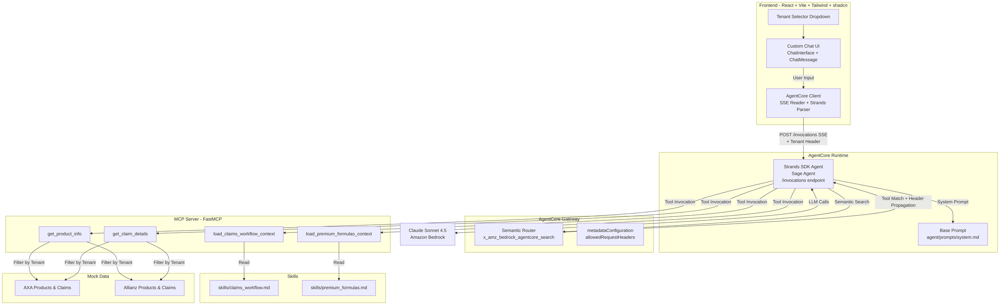
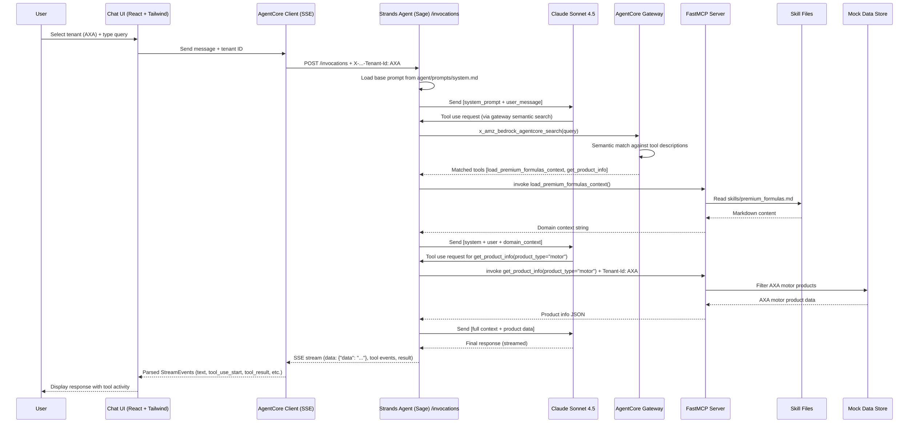
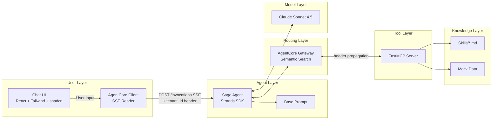

# Design Document: Sage AI Assistant

## Overview

Sage AI Assistant is a multi-tenant, domain-aware conversational agent for the Insurance Suite. The architecture follows a "minimal base prompt + dynamic context injection" pattern: a compact system prompt (~150 tokens) defines Sage's personality, while an AgentCore Gateway performs semantic search at runtime to route queries to the right context and data tools. This eliminates hardcoded routing logic and context bloat.

The system is built on three pillars:
1. **Strands SDK Agent** — Orchestrates the conversation loop, invokes tools, streams responses via `BedrockAgentCoreApp` SDK on AgentCore Runtime.
2. **AgentCore Gateway** — Semantically matches user queries to registered tools, propagates tenant headers.
3. **FastMCP Server** — Hosts all 4 tools (2 context + 2 data) on AgentCore runtime.

The frontend is a custom React application using Tailwind CSS and shadcn components that communicates directly with the Strands agent via streamable HTTP (SSE). This follows the [FAST (Fullstack AgentCore Solution Template)](https://github.com/awslabs/fullstack-solution-template-for-agentcore) pattern — the frontend reads SSE events from the `/invocations` endpoint and uses a Strands-specific parser to extract text chunks, tool activity, and lifecycle events. No intermediate protocol layer (AG-UI, CopilotKit) is needed.

Two demo tenants (AXA and Allianz) share domain skills but have isolated mock data, demonstrating multi-tenant isolation end-to-end.

### Key Design Decisions

| Decision | Rationale |
|----------|-----------|
| Minimal base prompt (~150 tokens) | Avoids context bloat; domain knowledge loaded on-demand via context tools |
| Agent instructs: never mention tools in responses | Tool activity is visible in the UI for demo observability; agent text should read naturally |
| AgentCore Gateway as classifier | Replaces a separate classifier model with built-in semantic search over tool descriptions |
| Single MCP server for all tools | Simplifies deployment; gateway has full visibility for routing |
| MCP server on port 8000 with `stateless_http=True` | AgentCore Runtime expects MCP protocol at port 8000; FastMCP 3.1.0+ requires `stateless_http=True` in `run()` |
| `CurrentHeaders()` for data tool header injection | FastMCP only injects HTTP request headers when `CurrentHeaders()` is the default value — `None` default does not trigger injection |
| Tenant ID via custom header | `X-Amzn-Bedrock-AgentCore-Runtime-Custom-Tenant-Id` propagated end-to-end; simple Phase 1 approach |
| Tenant change clears conversation | Prevents cross-tenant context leakage in the UI; implemented via `useEffect` on `tenantId` in `ChatInterface.tsx` |
| Skills as Markdown files | Decouples domain knowledge from code; editable without redeployment |
| Mock data in-memory dicts | Sufficient for demo; easily swappable with real backends |
| Custom React + SSE frontend (FAST pattern) | Direct SSE streaming from BedrockAgentCoreApp `/invocations`; no intermediate protocol layer; same endpoint works locally and on AgentCore; Cognito auth integrates naturally for Phase 2 |
| Vite + Tailwind + shadcn | Lightweight, fast dev server, production-ready components; hostable on AWS Amplify Hosting |
| JWT `allowedClients` (not `allowedAudience`) | Cognito M2M `client_credentials` tokens carry `client_id` claim but no `aud` claim — `allowedClients` is the correct validator |

## Architecture

### High-Level Architecture Diagram



### End-to-End Request Flow




## Components and Interfaces

### 1. Custom Chat Frontend (FAST Pattern)

**Responsibility:** Provides the user-facing chat interface with tenant selection and tool activity visibility, using direct SSE streaming from the Strands agent.

**Technology:** React 18+ with Vite, Tailwind CSS, and shadcn components. The frontend communicates directly with the Strands agent's `/invocations` endpoint via streamable HTTP (SSE). This follows the [FAST (Fullstack AgentCore Solution Template)](https://github.com/awslabs/fullstack-solution-template-for-agentcore) pattern.

**Streaming Architecture:** The frontend includes an `agentcore-client` library (adapted from FAST) that reads SSE events from the agent and parses them using a Strands-specific parser. The parser converts raw Strands events into typed `StreamEvent`s that the UI components consume.

```
Chat UI (React) → AgentCore Client (fetch + SSE reader) → POST /invocations → Strands Agent (BedrockAgentCoreApp)
```

**Interfaces:**

```typescript
// frontend/src/lib/agentcore-client/types.ts
// Typed stream events emitted by the Strands parser

export type StreamEvent =
  | { type: "text"; content: string }
  | { type: "tool_use_start"; toolUseId: string; name: string }
  | { type: "tool_use_delta"; toolUseId: string; input: string }
  | { type: "tool_result"; toolUseId: string; result: string }
  | { type: "message"; role: string; content: unknown[] }
  | { type: "result"; stopReason: string }
  | { type: "lifecycle"; event: string };

export type StreamCallback = (event: StreamEvent) => void;
export type ChunkParser = (line: string, callback: StreamCallback) => void;
```

```typescript
// frontend/src/lib/agentcore-client/client.ts
// AgentCore client — sends messages and reads SSE stream

const TENANT_HEADER = "X-Amzn-Bedrock-AgentCore-Runtime-Custom-Tenant-Id";

export async function invokeAgent(
  query: string,
  tenantId: string,
  onEvent: StreamCallback
): Promise<void> {
  const agentUrl = import.meta.env.VITE_AGENT_URL || "http://localhost:8080/invocations";
  const bearerToken = import.meta.env.VITE_AGENT_BEARER_TOKEN;

  const headers: Record<string, string> = {
    "Content-Type": "application/json",
    [TENANT_HEADER]: tenantId,
  };
  if (bearerToken) {
    headers["Authorization"] = `Bearer ${bearerToken}`;
  }

  const response = await fetch(agentUrl, {
    method: "POST",
    headers,
    body: JSON.stringify({ prompt: query }),
  });

  await readSSEStream(response, parseStrandsChunk, onEvent);
}
```

```typescript
// frontend/src/lib/agentcore-client/parsers/strands.ts
// Parses Strands SSE events into typed StreamEvents

export const parseStrandsChunk: ChunkParser = (line, callback) => {
  if (!line.startsWith("data: ")) return;
  const json = JSON.parse(line.substring(6).trim());

  // Text token: {"data": "Hello"}
  if (typeof json.data === "string") {
    callback({ type: "text", content: json.data });
  }

  // Tool use: {"current_tool_use": {...}, "delta": {"toolUse": {"input": "..."}}}
  if (json.current_tool_use) {
    if (json.delta?.toolUse?.input === "") {
      callback({ type: "tool_use_start", toolUseId: tool.toolUseId, name: tool.name });
    } else if (json.delta?.toolUse?.input) {
      callback({ type: "tool_use_delta", toolUseId: tool.toolUseId, input: json.delta.toolUse.input });
    }
  }

  // Tool result from user message
  if (json.message?.role === "user") {
    // Extract toolResult blocks → callback({ type: "tool_result", ... })
  }

  // Final result: {"result": {"stop_reason": "end_turn"}}
  if (json.result) {
    callback({ type: "result", stopReason: json.result.stop_reason || "end_turn" });
  }
};
```

**Key behaviors:**
- Tenant selector dropdown at session start; tenant ID sent as custom header on every request to the agent.
- Frontend sends POST to `/invocations` with `{ "prompt": "..." }` and reads the SSE response stream directly.
- Strands parser converts SSE `data:` lines into typed `StreamEvent`s (text, tool_use_start, tool_use_delta, tool_result, result, lifecycle).
- Chat interface renders streaming text with markdown formatting and inline tool call components.
- Tool activity display shows tool name, streaming input, and result for demo observability.
- Loading indicator driven by lifecycle events (init_event_loop → streaming → result).
- For Phase 2: Cognito JWT token sent via `Authorization` header (same pattern as FAST).
- Hosting: AWS Amplify Hosting for demo deployment.

### 2. Strands SDK Agent (Sage Agent)

**Responsibility:** Orchestrates the conversation loop — loads base prompt, calls the LLM, invokes tools via the gateway, and streams responses back.

**Technology:** Strands SDK (Python), Claude Sonnet 4.5 via Amazon Bedrock, `BedrockAgentCoreApp` SDK for HTTP serving.

**Interfaces:**

```python
# agent/agent.py — single file combining agent + server using BedrockAgentCoreApp SDK

import json
import os
import time
from pathlib import Path

import httpx
from bedrock_agentcore.runtime import BedrockAgentCoreApp, RequestContext
from mcp.client.streamable_http import streamablehttp_client
from strands import Agent
from strands.models.bedrock import BedrockModel
from strands.tools.mcp import MCPClient

app = BedrockAgentCoreApp()

_PROMPT_PATH = Path(__file__).parent / "prompts" / "system.md"
TENANT_HEADER = "X-Amzn-Bedrock-AgentCore-Runtime-Custom-Tenant-Id"

model = BedrockModel(model_id="us.anthropic.claude-3-5-sonnet-20241022-v2:0", region_name="us-east-1")

@app.entrypoint
async def invoke(payload: dict, context: RequestContext):
    """
    Process a user message with tenant context.
    - Reads payload["prompt"] for the user message
    - Reads tenant ID from RequestContext.request_headers
    - Creates a per-request MCPClient connecting to the AgentCore Gateway
    - Forwards tenant header to Gateway for propagation to MCP server
    - Streams response chunks via async generator
    """
    user_message = payload.get("prompt", "Hello")
    request_headers = context.request_headers or {}
    tenant_id = request_headers.get(TENANT_HEADER) or request_headers.get(TENANT_HEADER.lower())

    with _make_mcp_client(tenant_id) as mcp_client:
        tools = mcp_client.list_tools_sync()
        agent = Agent(model=model, system_prompt=_load_base_prompt(), tools=tools)
        async for event in agent.stream_async(user_message):
            yield json.loads(json.dumps(event, default=str))

if __name__ == "__main__":
    app.run()
```

**Note:** The `BedrockAgentCoreApp` SDK automatically handles the AgentCore Runtime contract — it exposes `/invocations` POST and `/ping` GET endpoints, manages streaming, and runs on port 8080. No separate FastAPI/uvicorn setup is needed. The agent and server are combined in a single `agent/agent.py` file.

**Tenant header propagation:** The agent reads `X-Amzn-Bedrock-AgentCore-Runtime-Custom-Tenant-Id` from `RequestContext.request_headers` and forwards it as a custom header on the MCPClient connection to the Gateway. The Gateway then propagates it to the MCP server via `metadataConfiguration.allowedRequestHeaders`.

**Tool invocation flow (Requirement 4 edge cases):** The agent's behavior depends on which tools the gateway returns:
- **Context + Data tool matched:** Agent invokes the context tool first (loads skill), then invokes the data tool with the enriched context. This is the primary demo flow.
- **Only Data tool matched:** Agent invokes the data tool directly without a preceding context tool call. This can happen for simple data lookups where the gateway determines no domain context is needed.
- **Only Context tool matched:** Agent responds using the loaded skill content alone, without invoking any data tool. This handles general domain questions that don't require tenant-specific data.
- **No tools matched:** Agent responds using only the base prompt. The gateway returns an empty tool set when no descriptions match with sufficient confidence.

### 3. AgentCore Gateway

**Responsibility:** Semantic routing layer that matches user queries to registered tools and propagates tenant headers to the MCP server.

**Configuration:**

```json
{
  "gatewayId": "sage-gateway",
  "targets": [
    {
      "name": "sage-mcp-server",
      "type": "MCP_SERVER",
      "endpointUri": "https://bedrock-agentcore.<region>.amazonaws.com/runtimes/<url-encoded-runtime-arn>/invocations",
      "credentialProviderConfigurations": [
        {
          "credentialProviderType": "OAUTH",
          "credentialProvider": {
            "oauthCredentialProvider": {
              "providerArn": "<token-vault-credential-provider-arn>",
              "grantType": "CLIENT_CREDENTIALS",
              "scopes": ["sage-mcp/tools"]
            }
          }
        }
      ],
      "metadataConfiguration": {
        "allowedRequestHeaders": [
          "X-Amzn-Bedrock-AgentCore-Runtime-Custom-Tenant-Id"
        ]
      }
    }
  ],
  "searchConfiguration": {
    "type": "SEMANTIC"
  }
}
```

**Key behaviors:**
- Performs `x_amz_bedrock_agentcore_search` over all registered tool descriptions.
- Returns matched tool identifiers to the agent for invocation.
- Propagates the tenant header to MCP server targets via `metadataConfiguration.allowedRequestHeaders`.
- Returns empty tool set when no tools match with sufficient confidence.
- Authenticates to the MCP runtime using OAuth client credentials (M2M) — the Gateway obtains a token from Cognito via the configured credential provider and passes it as a Bearer token to the MCP runtime's JWT inbound authorizer.

**Extensibility (Requirement 5):** The gateway's semantic search automatically includes any tool registered on the MCP server target. Adding a new skill requires only: (1) creating a new `skills/<topic>.md` file, (2) registering a corresponding `load_<topic>_context` tool on the FastMCP server with a descriptive tool description. The gateway will include the new tool in subsequent semantic searches without any changes to the base prompt, gateway configuration, or existing tool code. Removing a tool from the MCP server registration automatically excludes it from routing. The same pattern applies to data tools.

### 4. FastMCP Server

**Responsibility:** Hosts all 4 tools (2 context + 2 data) and exposes them via the Model Context Protocol.

**Technology:** FastMCP (Python), deployed on AgentCore runtime.

**Interfaces:**

```python
# mcp_server/server.py

from fastmcp import FastMCP

mcp = FastMCP("sage-mcp-server")

# --- Context Tools ---

@mcp.tool(
    description="Load claims processing workflow context. Use when the user asks about "
    "claim status, claim filing procedures, claim approval workflows, claim "
    "documentation requirements, or any claims-related processes."
)
def load_claims_workflow_context() -> str:
    """Reads and returns skills/claims_workflow.md content."""
    ...

@mcp.tool(
    description="Load premium calculation formulas and rules. Use when the user asks about "
    "premium calculations, pricing factors, discount rules, rate tables, "
    "or how insurance premiums are determined for any product type."
)
def load_premium_formulas_context() -> str:
    """Reads and returns skills/premium_formulas.md content."""
    ...

# --- Data Tools ---
# IMPORTANT: headers must use CurrentHeaders() as default, not None.
# FastMCP only injects HTTP request headers when CurrentHeaders() is the default value.

@mcp.tool(
    description="Retrieve product information and policy configuration details. Use when "
    "the user asks about specific insurance products, policy features, coverage "
    "options, or product-specific details for a given product type."
)
def get_product_info(product_type: str, headers: dict = CurrentHeaders()) -> dict:
    """
    Returns tenant-specific product configuration.
    Reads tenant_id from X-Amzn-Bedrock-AgentCore-Runtime-Custom-Tenant-Id header.
    """
    ...

@mcp.tool(
    description="Retrieve claim details by claim reference number. Use when the user asks "
    "about a specific claim status, claim history, claim amounts, or any details "
    "tied to a particular claim ID or reference number."
)
def get_claim_details(claim_reference: str, headers: dict = CurrentHeaders()) -> dict:
    """
    Returns tenant-specific claim details.
    Reads tenant_id from X-Amzn-Bedrock-AgentCore-Runtime-Custom-Tenant-Id header.
    """
    ...

if __name__ == "__main__":
    # Port 8000 required for AgentCore MCP protocol (not 8080).
    # stateless_http=True required for FastMCP 3.1.0+ on AgentCore.
    mcp.run(transport="streamable-http", host="0.0.0.0", port=8000, stateless_http=True)
```

**Tool description design:** Descriptions are crafted for semantic matching accuracy — each includes the domain area, key topics, and expected query patterns (Requirement 8).

### 5. Skill Files

**Responsibility:** Store domain knowledge as Markdown files, decoupled from tool code.

**Structure:**

```
skills/
├── claims_workflow.md      # Claims processing domain knowledge
└── premium_formulas.md     # Premium calculation formulas and rules
```

**Content contract:** Each skill is a self-contained Markdown document with domain instructions. Context tools read the file at invocation time (not cached), so updates take effect on the next call without redeployment.

### 6. Mock Data Store

**Responsibility:** Provides tenant-scoped demo data for data tools.

**Implementation:** In-memory Python dictionaries in `mcp_server/mock_data.py`.

```python
# mcp_server/mock_data.py

MOCK_DATA = {
    "axa": {
        "products": {
            "motor": {
                "name": "AXA Motor Insurance",
                "base_premium": 450.00,
                "coverage": ["liability", "collision", "comprehensive"],
                "discounts": ["no_claims_bonus", "multi_policy"],
                # ... additional AXA-specific fields
            }
        },
        "claims": {
            "CLM-12345": {
                "status": "under_review",
                "type": "motor_collision",
                "amount": 3200.00,
                "filed_date": "2025-01-15",
                "policyholder": "Policy Holder A",
                # ... additional claim fields
            }
        }
    },
    "allianz": {
        "products": {
            "motor": {
                "name": "Allianz Motor Protection",
                "base_premium": 520.00,
                "coverage": ["liability", "collision", "comprehensive", "roadside"],
                "discounts": ["safe_driver", "annual_payment"],
                # ... additional Allianz-specific fields
            }
        },
        "claims": {
            "CLM-5454": {
                "status": "approved",
                "type": "motor_theft",
                "amount": 15000.00,
                "filed_date": "2025-02-20",
                "policyholder": "Policy Holder B",
                # ... additional claim fields
            }
        }
    }
}
```


### Component Interaction Summary



### Project Directory Structure

```
sage-ai-assistant/
├── agent/
│   ├── prompts/
│   │   └── system.md           # Base prompt (~150 tokens)
│   └── agent.py               # BedrockAgentCoreApp entrypoint (agent + server combined)
├── mcp_server/
│   ├── server.py               # FastMCP server with all 4 tools
│   ├── mock_data.py            # Tenant-scoped mock data (AXA, Allianz)
│   └── tools/
│       ├── context_tools.py    # load_claims_workflow_context, load_premium_formulas_context
│       └── data_tools.py       # get_product_info, get_claim_details
├── skills/
│   ├── claims_workflow.md      # Claims processing domain knowledge
│   └── premium_formulas.md     # Premium calculation formulas and rules
├── frontend/                   # React + Vite + Tailwind + shadcn app
│   ├── package.json            # React, Tailwind, shadcn dependencies
│   ├── vite.config.ts          # Vite configuration with proxy for local dev
│   ├── index.html              # Vite entry point
│   ├── components.json         # shadcn/ui configuration
│   ├── src/
│   │   ├── App.tsx             # Root: tenant selector + chat interface
│   │   ├── main.tsx            # Vite entry
│   │   ├── components/
│   │   │   ├── ChatInterface.tsx  # Chat container: message list + input
│   │   │   ├── ChatMessage.tsx    # Single message: markdown + tool calls
│   │   │   ├── TenantSelector.tsx # Dropdown for AXA/Allianz
│   │   │   └── ToolActivity.tsx   # Inline tool call display (name, input, result)
│   │   └── lib/
│   │       └── agentcore-client/  # SSE streaming client (adapted from FAST)
│   │           ├── client.ts      # invokeAgent() — POST + SSE reader
│   │           ├── types.ts       # StreamEvent, ChunkParser, StreamCallback
│   │           ├── parsers/
│   │           │   └── strands.ts # Strands SSE event parser
│   │           └── utils/
│   │               └── sse.ts     # readSSEStream() — generic SSE line reader
│   └── .env.local              # VITE_AGENT_URL, VITE_AGENT_BEARER_TOKEN
├── scripts/
│   ├── deploy_mcp.sh           # Deploy MCP server to AgentCore runtime
│   ├── deploy_gateway.sh       # Create/update AgentCore Gateway
│   └── deploy_agent.sh         # Deploy agent to AgentCore runtime
├── pyproject.toml              # Python dependencies (managed by uv)
├── uv.lock                     # Locked dependency versions
└── README.md
```

## Data Models

### Request/Response Models

```python
# Shared data models used across components
# Note: CopilotKit handles the AG-UI protocol serialization/deserialization.
# These models are used internally by the Strands agent and MCP server.

from dataclasses import dataclass
from typing import Optional
from enum import Enum

class TenantId(str, Enum):
    AXA = "axa"
    ALLIANZ = "allianz"

# --- Tool Input/Output Models ---

@dataclass
class ProductInfo:
    """Output from get_product_info tool."""
    tenant: str
    product_type: str
    name: str
    base_premium: float
    coverage: list[str]
    discounts: list[str]
    details: dict  # Additional tenant-specific fields

@dataclass
class ClaimDetails:
    """Output from get_claim_details tool."""
    tenant: str
    claim_reference: str
    status: str
    type: str
    amount: float
    filed_date: str
    policyholder: str
    details: dict  # Additional tenant-specific fields

@dataclass
class ToolError:
    """Structured error response from MCP server."""
    tool_name: str
    error_type: str    # "not_found", "missing_skill", "invalid_tenant", "execution_error"
    message: str
```

### Gateway Configuration Model

```json
{
  "gatewayId": "sage-gateway",
  "description": "Semantic routing gateway for Sage AI Assistant",
  "targets": [
    {
      "name": "sage-mcp-server",
      "type": "MCP_SERVER",
      "endpointUri": "https://bedrock-agentcore.<region>.amazonaws.com/runtimes/<url-encoded-runtime-arn>/invocations",
      "authConfiguration": {
        "type": "OAUTH",
        "credentialProviderType": "OAUTH",
        "oauthCredentialProvider": {
          "providerArn": "arn:aws:bedrock-agentcore:<region>:<account>:token-vault/default/oauth2credentialprovider/<provider-name>",
          "grantType": "CLIENT_CREDENTIALS",
          "scopes": ["sage-mcp/tools"]
        }
      },
      "metadataConfiguration": {
        "allowedRequestHeaders": [
          "X-Amzn-Bedrock-AgentCore-Runtime-Custom-Tenant-Id"
        ]
      }
    }
  ],
  "searchConfiguration": {
    "type": "SEMANTIC"
  }
}
```

**Note:** AgentCore Gateway does not support `GATEWAY_IAM_ROLE` for MCP server targets — only `OAUTH` is supported. The MCP runtime must be configured with JWT inbound authorization to accept the OAuth tokens issued by the Gateway's credential provider.
```

### Tenant Header Flow

```
┌─────────────┐    ┌─────────────────┐    ┌──────────────────┐    ┌──────────────┐
│ Chat UI     │    │  Strands Agent  │    │ AgentCore GW     │    │  MCP Server  │
│ (React)     │    │                 │    │                  │    │              │
│ Sets header │───>│ Reads header    │───>│ Propagates via   │───>│ Reads header │
│ on POST     │    │ from request    │    │ metadataConfig   │    │ filters data │
│ /invocations│    │ context         │    │                  │    │ by tenant    │
└─────────────┘    └─────────────────┘    └──────────────────┘    └──────────────┘

Header: X-Amzn-Bedrock-AgentCore-Runtime-Custom-Tenant-Id: axa|allianz
```

### Authentication Models

#### Phase 1: IAM + OAuth M2M Authentication

```
Chat UI (React) → (SigV4 or Bearer Token) → AgentCore Runtime (Agent) → (SigV4) → AgentCore Gateway
                                                                                        ↓
                                                                              (OAuth M2M / Client Credentials)
                                                                                        ↓
                                                                                   MCP Server (JWT inbound auth)
                                                                              + Tenant header propagation
```

**Gateway → MCP Server auth flow:**
AgentCore Gateway does not support IAM/SigV4 for MCP server targets. Instead, it uses OAuth with client credentials grant (M2M):

1. A Cognito User Pool resource server is created with a custom scope (e.g., `sage-mcp/tools`).
2. A Cognito M2M app client is created with `client_credentials` grant type and the custom scope.
3. An AgentCore credential provider (token vault entry) is created with the M2M client ID, secret, and Cognito token endpoint.
4. The MCP runtime is deployed with JWT inbound authorization, configured to accept tokens from the Cognito User Pool.
5. The Gateway target is created with `credentialProviderType: OAUTH` pointing to the token vault credential provider.
6. At runtime, the Gateway obtains a client credentials token from Cognito and passes it to the MCP runtime.

Required IAM permissions:
- Agent runtime role: `bedrock-agentcore:InvokeGateway` permission for the gateway

#### Phase 2: JWT Authentication

```
Chat UI (React) → (JWT Bearer) → AgentCore Runtime → (SigV4 + Tenant Header) → Gateway → MCP Server
                    ↑                                          ↑
               Cognito User Pool                         Extract tenant_id
               (2 app clients:                           from JWT claims,
                AXA, Allianz)                            set as custom header
```

Cognito configuration:
- 1 User Pool with 2 App Clients (one per tenant)
- JWT claims include `custom:tenant_id`
- AgentCore Identity configured with credential provider for JWT validation

### Phase 2 Components

#### Cognito User Pool (Tenant Identity Provider)

**Responsibility:** Issues tenant-specific JWT tokens for Phase 2 authentication. Replaces the client-set custom header with a cryptographically verifiable tenant identity.

**Configuration:**

```json
{
  "userPoolName": "sage-tenant-pool",
  "appClients": [
    {
      "clientName": "sage-axa-client",
      "customAttributes": {
        "tenant_id": "axa"
      }
    },
    {
      "clientName": "sage-allianz-client",
      "customAttributes": {
        "tenant_id": "allianz"
      }
    }
  ],
  "tokenClaims": ["custom:tenant_id"]
}
```

**Flow:** Chat UI authenticates against the tenant-specific app client → receives JWT with `custom:tenant_id` claim → sends JWT as `Authorization` header on POST to `/invocations` → Sage Agent extracts `tenant_id` from JWT claims → sets it as the `X-Amzn-Bedrock-AgentCore-Runtime-Custom-Tenant-Id` header for gateway propagation. The custom header mechanism from Phase 1 is retained for gateway-to-MCP propagation; only the source of the tenant ID changes.

**AgentCore Identity:** Configured with a credential provider that validates JWT tokens from the Cognito User Pool. This enables AgentCore Runtime to accept JWT bearer tokens for inbound authentication.

#### Amazon Bedrock Guardrails (Out-of-Domain Handling)

**Responsibility:** Enforces out-of-domain query rejection as a managed guardrail policy, replacing the base prompt's static instruction that was intentionally removed in Phase 1.

**Configuration:**

```json
{
  "guardrailName": "sage-domain-guardrail",
  "topicPolicy": {
    "deniedTopics": [
      {
        "name": "out-of-domain",
        "description": "Questions not related to Insurance Suite products, claims, or premium calculations",
        "examples": [
          "What's the weather today?",
          "Tell me a joke",
          "What's the stock price of Apple?"
        ]
      }
    ]
  }
}
```

**Integration:** The Strands SDK agent is configured with the guardrail identifier. Bedrock applies the guardrail before and after model invocation, blocking out-of-domain queries with a managed response. This is more robust than a static prompt instruction because it uses a dedicated classification model and can be updated without changing the agent code or base prompt.


## Correctness Properties

*A property is a characteristic or behavior that should hold true across all valid executions of a system — essentially, a formal statement about what the system should do. Properties serve as the bridge between human-readable specifications and machine-verifiable correctness guarantees.*

### Property 1: Skill Content Round-Trip

*For any* skill file path and any valid Markdown content written to that file, invoking the corresponding context tool should return content identical to the file's current contents.

**Validates: Requirements 2.2, 2.4**

### Property 2: MCP Server Tool Invocation Correctness

*For any* registered tool name and valid input parameters, invoking the tool on the MCP server should return a non-error result that conforms to the tool's output schema (string for context tools, dict for data tools).

**Validates: Requirements 6.4**

### Property 3: MCP Server Error Response Structure

*For any* tool invocation that triggers a failure (missing skill, invalid tenant, nonexistent claim), the MCP server should return a structured error containing the tool name and a non-empty failure reason string.

**Validates: Requirements 6.5, 2.5**

### Property 4: Tenant Header Propagation from Frontend

*For any* tenant selected in the tenant selector dropdown, every outbound POST request from the AgentCore Client to the Strands agent should include the `X-Amzn-Bedrock-AgentCore-Runtime-Custom-Tenant-Id` header with a value exactly matching the selected tenant identifier.

**Validates: Requirements 7.2, 10.3, 12.5**

### Property 5: Agent Tenant Header Extraction

*For any* incoming HTTP request containing a valid `X-Amzn-Bedrock-AgentCore-Runtime-Custom-Tenant-Id` header value, the Sage Agent should extract and associate the correct tenant identifier with the session context.

**Validates: Requirements 7.3, 11.5**

### Property 6: Data Tool Tenant Isolation

*For any* tenant identifier and any data query (product type or claim reference), the data tool should return only records belonging to that tenant — every field in the response should reference the queried tenant, and no records from other tenants should be present.

**Validates: Requirements 7.5, 9.2, 9.3**

### Property 7: Cross-Tenant Data Rejection

*For any* claim reference that belongs to tenant A, invoking `get_claim_details` with tenant B's identifier should return a "not found" response, regardless of which tenants A and B are.

**Validates: Requirements 9.5**

### Property 8: Skill Tenant Independence

*For any* two distinct tenant identifiers, invoking the same context tool should return identical skill content — context tools are tenant-agnostic and always serve the same domain knowledge.

**Validates: Requirements 7.6**

### Property 9: Agent Streaming Response

*For any* valid chat request, the Sage Agent should produce a response as an async iterable of chunks, where each chunk conforms to the ChatResponseChunk schema (has a valid type and non-null content).

**Validates: Requirements 11.4**

### Property 10: JWT Tenant Claim Extraction

*For any* valid JWT token containing a `custom:tenant_id` claim, the Sage Agent should extract the tenant identifier from the token and produce the same value as would be sent via the custom header mechanism.

**Validates: Requirements 12.Phase2.1, 12.Phase2.3**

## Error Handling

### Context Tool Errors

| Error Condition | Behavior | Response |
|----------------|----------|----------|
| Skill file missing | Context tool catches `FileNotFoundError` | `ToolError(tool_name, "missing_skill", "Skill file not found: skills/{name}.md")` |
| Skill file unreadable (permissions) | Context tool catches `PermissionError` | `ToolError(tool_name, "missing_skill", "Cannot read skill: skills/{name}.md")` |
| Skill file empty | Context tool returns empty string | Empty string (valid — agent handles gracefully) |

### Data Tool Errors

| Error Condition | Behavior | Response |
|----------------|----------|----------|
| Missing tenant header | Data tool checks for header presence | `ToolError(tool_name, "invalid_tenant", "Tenant ID header is missing")` |
| Unknown tenant ID | Data tool checks against known tenants | `ToolError(tool_name, "invalid_tenant", "Unknown tenant: {tenant_id}")` |
| Claim not found for tenant | Data tool filters mock data | `ToolError(tool_name, "not_found", "Claim {ref} not found for tenant {tenant_id}")` |
| Product type not found for tenant | Data tool filters mock data | `ToolError(tool_name, "not_found", "Product type {type} not found for tenant {tenant_id}")` |

### MCP Server Errors

| Error Condition | Behavior | Response |
|----------------|----------|----------|
| Unknown tool name | FastMCP handles internally | MCP protocol error response |
| Tool execution exception | FastMCP catches unhandled exceptions | `ToolError(tool_name, "execution_error", str(exception))` |

### Agent-Level Errors

| Error Condition | Behavior | Response |
|----------------|----------|----------|
| Gateway unreachable | Strands SDK connection error | Agent responds with fallback message using base prompt only |
| LLM API error (Bedrock) | Strands SDK handles retries | Retry with exponential backoff; surface error to UI after max retries |
| No tools matched by gateway | Empty tool set returned | Agent responds using base prompt only (no domain context) |
| Streaming interrupted | Connection drop mid-stream | Frontend shows partial response with error indicator |

### Frontend Errors

| Error Condition | Behavior | Response |
|----------------|----------|----------|
| Agent unreachable | fetch() to `/invocations` fails or times out | Chat UI displays connection error message |
| SSE stream error | HTTP response not ok (4xx/5xx) | Chat UI shows error with HTTP status |
| Streaming response interrupted | SSE connection drop mid-stream | Chat UI shows partial response with error indicator |
| Invalid tenant selection | Should not occur (dropdown constrained) | Fallback to first tenant option |
| Bearer token expired (Phase 2) | AgentCore rejects request with 401 | Frontend prompts re-authentication via Cognito |

## Testing Strategy

### Dual Testing Approach

This feature requires both unit tests and property-based tests for comprehensive coverage:

- **Unit tests**: Verify specific examples, edge cases, integration points, and error conditions with concrete inputs.
- **Property-based tests**: Verify universal properties across randomly generated inputs to catch edge cases that example-based tests miss.

### Property-Based Testing Configuration

- **Library**: [Hypothesis](https://hypothesis.readthedocs.io/) (Python) for backend; [fast-check](https://fast-check.dev/) (TypeScript) for frontend.
- **Minimum iterations**: 100 per property test.
- **Each property test must reference its design document property** using the tag format:
  `Feature: sage-ai-assistant, Property {number}: {property_text}`
- **Each correctness property is implemented by a single property-based test.**

### Backend Tests (Python + Hypothesis)

#### Property Tests

| Property | Test Description | Generator Strategy |
|----------|-----------------|-------------------|
| Property 1: Skill Round-Trip | Write random Markdown to skill file, invoke context tool, assert output matches file content | `st.text()` for Markdown content |
| Property 2: Tool Invocation Correctness | Generate valid tool names and parameters, invoke on MCP server, assert non-error response with correct schema | Custom strategy for tool name + params |
| Property 3: Error Response Structure | Generate failure scenarios (missing files, bad tenants), invoke tools, assert error contains tool name and reason | Custom strategy for error conditions |
| Property 5: Agent Tenant Header Extraction | Generate valid tenant IDs in request headers, assert agent extracts correct value | `st.sampled_from(["axa", "allianz"])` + custom header builder |
| Property 6: Data Tool Tenant Isolation | Generate tenant ID + data query combos, invoke data tool, assert all results belong to queried tenant | `st.sampled_from(tenants)` × `st.sampled_from(product_types)` |
| Property 7: Cross-Tenant Data Rejection | Generate claim refs belonging to tenant A, invoke with tenant B, assert "not found" | Pairs of distinct tenants × claim refs |
| Property 8: Skill Tenant Independence | Generate pairs of tenant IDs, invoke same context tool for each, assert identical output | `st.sampled_from(tenants)` pairs |
| Property 9: Streaming Response | Generate valid chat requests, invoke agent, assert response is async iterable of valid chunks | `st.text(min_size=1)` for messages |
| Property 10: JWT Tenant Extraction | Generate JWT tokens with random tenant claims, assert extracted tenant matches claim value | Custom JWT builder strategy |

#### Unit Tests

| Test Area | Examples |
|-----------|----------|
| Base prompt validation | Verify prompt matches reference, token count ≤ 200, no domain keywords |
| Mock data structure | Verify AXA and Allianz have distinct products and claims |
| Tool registration | Verify all 4 tools are registered on MCP server |
| Skill file missing | Invoke context tool with nonexistent file, verify error message |
| Gateway config | Verify metadataConfiguration includes tenant header |

### Frontend Tests (TypeScript + fast-check)

#### Property Tests

| Property | Test Description | Generator Strategy |
|----------|-----------------|-------------------|
| Property 4: Tenant Header Propagation | Generate tenant selections, assert every POST request from AgentCore Client to Strands agent includes correct header | `fc.constantFrom("axa", "allianz")` |

#### Unit Tests

| Test Area | Examples |
|-----------|----------|
| Tenant selector rendering | Verify dropdown renders with AXA and Allianz options |
| AgentCore Client header injection | Verify invokeAgent() includes tenant header on POST to /invocations |
| Tool activity display | Verify tool_use_start and tool_result StreamEvents render inline |
| Loading state | Verify chat shows loading indicator during SSE streaming |
| Strands parser | Verify parseStrandsChunk correctly parses text, tool_use, tool_result, and result events |
| SSE reader | Verify readSSEStream correctly splits SSE lines and passes to parser |

### Integration Tests

| Scenario | Description |
|----------|-------------|
| AXA premium query | End-to-end: select AXA → ask premium question → verify context tool + data tool invoked → verify AXA-specific response |
| Allianz claim query | End-to-end: select Allianz → ask claim status → verify context tool + data tool invoked → verify Allianz-specific response |
| Cross-tenant isolation | Select AXA → query Allianz claim ID → verify "not found" response |
| No tool match | Ask off-domain question → verify agent responds with base prompt only |

## Implementation Decisions & Lessons Learnt

### Gateway → MCP Server Authentication: OAuth M2M Required

**Decision:** Use OAuth with client credentials grant (M2M) for Gateway → MCP Server authentication, with Cognito as the token issuer.

**Lesson:** AgentCore Gateway does not support `GATEWAY_IAM_ROLE` (IAM/SigV4) for MCP server targets — the API returns `"MCP server target only supports OAUTH credential provider type"`. IAM role auth is only supported for Lambda and API Gateway targets. For MCP server targets hosted on AgentCore Runtime, the supported auth methods are:
- **No authorization** (not recommended — runtime returns "Missing Authentication Token" since it requires auth by default)
- **OAuth with client credentials grant** (M2M) — the Gateway obtains a token from a Cognito resource server and passes it to the MCP runtime

This requires:
1. A Cognito resource server with a custom scope (e.g., `sage-mcp/tools`) on the existing User Pool
2. A Cognito M2M app client with `client_credentials` grant and the custom scope
3. An AgentCore credential provider (token vault entry) storing the client ID, secret, and Cognito discovery URL
4. The MCP runtime redeployed with JWT inbound authorization (authorizer config pointing to the Cognito User Pool discovery URL, with the M2M client ID as an allowed audience)
5. The Gateway target created with `credentialProviderType: OAUTH` and the token vault provider ARN

The `deploy_gateway.sh` script handles steps 1–5 automatically. The `deploy_mcp.sh` script handles step 4 (JWT inbound auth configuration).

**Reference:** [AWS docs — Gateway VPC Egress: MCP / AgentCore Runtime](https://docs.aws.amazon.com/bedrock-agentcore/latest/devguide/gateway-vpc-egress.html)

### Model Selection

**Decision:** Use `us.anthropic.claude-3-5-sonnet-20241022-v2:0` (cross-region inference profile) instead of `us.anthropic.claude-sonnet-4-5-20250929-v1:0`.

**Lesson:** Claude Sonnet 4.5 (`us.anthropic.claude-sonnet-4-5-20250929-v1:0`) has a streaming XML parsing bug when used via cross-region inference profiles with the Bedrock Converse API. On the first tool use in a conversation, Bedrock returns a malformed tool name with `" />` appended (e.g., `load_claims_workflow_context" />`). The Strands SDK catches this (`InvalidToolUseNameException`), replaces the name with `INVALID_TOOL_NAME`, and retries — so the second call always succeeds, but the first call shows an error in the UI. This is a known SDK issue ([strands-agents/sdk-python#1069](https://github.com/strands-agents/sdk-python/issues/1069)).

`us.anthropic.claude-3-5-sonnet-20241022-v2:0` does not exhibit this bug and should be used until the Sonnet 4.5 issue is resolved upstream.

**Note:** The bare model ID `anthropic.claude-sonnet-4-5-20250929-v1:0` (without `us.` prefix) is not supported for on-demand throughput — it requires an inference profile. Always use the `us.` prefixed cross-region profile.

### FastMCP outputSchema Compatibility

**Lesson:** FastMCP 3.x adds an `outputSchema` field to tool specs as part of the MCP specification. The Bedrock Converse API does not support `outputSchema` in tool definitions. When present, it can cause tool name corruption in Claude's responses.

**Workaround investigated:** Mutating `tool.mcp_tool.outputSchema = None` on each `MCPAgentTool` after `list_tools_sync()` — this works because `tool_spec` is a `@property` that rebuilds the dict on each call from the underlying Pydantic model, so `.pop()` on the returned dict has no effect; the mutation must target the model directly.

**Final decision:** The model switch to Claude 3.5 Sonnet v2 resolved the symptom, making the `outputSchema` workaround unnecessary. It was reverted to keep the code clean.
